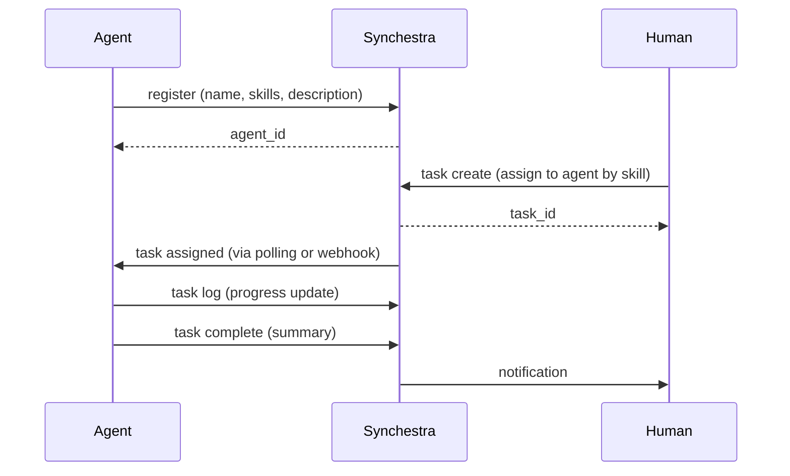

# Agent Coordination

**Summary:** Synchestra acts as a registry and router for AI agents. Agents declare what they can do (skills), and tasks can be assigned to the right agent based on capability and availability.

---

## Overview

An *agent* in Synchestra is anything that performs work: an AI model with tool-calling, a scripted automation, a human-operated CLI session. Agents register themselves, declare their skills, send heartbeats, and pick up or receive tasks.



---

## Agent Registration

Agents register on startup and deregister on shutdown. Registration is idempotent —  re-registering with the same name updates the existing record.

### CLI

```bash
synchestra agent register \
  --name "coder-agent-1" \
  --skills "go,typescript,docker" \
  --description "Writes and refactors Go and TypeScript code"
```

### API

```bash
POST /api/v1/agents
{
  "name": "coder-agent-1",
  "skills": ["go", "typescript", "docker"],
  "description": "Writes and refactors Go and TypeScript code"
}
```

See: [CLI agent docs](https://github.com/synchestra-io/synchestra-go/blob/main/docs/cli/agent.md) | [API agent docs](../api/agents.md)

---

## Skills

Skills are named capability definitions. They're strings at their simplest (`"go"`, `"typescript"`) but can reference a full [Skill](https://github.com/synchestra-io/synchestra-go/blob/main/docs/cli/skill.md) record with input/output schemas.

A task can be created with an `--agent` flag (direct assignment) or with a `--skill` hint to let Synchestra find a capable agent.

### Defining a skill

```bash
synchestra skill create \
  --name "go" \
  --description "Can write, test, and build Go code" \
  --input-schema '{"type": "object", "properties": {"repo_url": {"type": "string"}}}' \
  --output-schema '{"type": "object", "properties": {"pr_url": {"type": "string"}}}'
```

---

## Heartbeats

Agents send periodic heartbeats to signal they're alive and report their current status. If heartbeats stop, the agent is marked `offline` and tasks can be reassigned.

```bash
# Every 30 seconds from your agent loop:
synchestra agent heartbeat agent_abc123 \
  --status active \
  --current-task task_xyz789
```

---

## Task Assignment

Tasks can be assigned to a specific agent or routed by skill:

```bash
# Direct assignment
synchestra task create --title "Refactor auth module" --agent coder-agent-1

# Skill-based routing
synchestra task create --title "Refactor auth module" --skill go
```

When skill-based routing is used, Synchestra assigns the task to an `active` agent that declares the required skill. If multiple agents qualify, the least-loaded is chosen.

---

## Agent Lifecycle

```
unregistered
    ↓
registered (idle)
    ↓
active (working on a task)
    ↓
idle (task complete, waiting for next)
    ↓
offline (heartbeat timeout or explicit deregister)
```

An `offline` agent's in-progress tasks are flagged for review. Depending on your configuration, they can be automatically reassigned or held pending human action.

---

## Multi-Agent Patterns

Synchestra is well-suited to patterns like:

- **Specialist pipeline** —  Coder → Reviewer → Tester → Deployer, each as a separate agent
- **Fan-out** —  One orchestrator agent creates sub-tasks and assigns them to specialist agents
- **Redundant pool** —  Multiple identical agents registered for the same skill; work is distributed

See also: [Workflow Orchestration](workflow-orchestration.md) for pipeline patterns.

---

## Related

- [CLI: `synchestra agent`](https://github.com/synchestra-io/synchestra-go/blob/main/docs/cli/agent.md)
- [API: Agents](../api/agents.md)
- [API: Skills](../api/skills.md)
- [Feature: Workflow Orchestration](workflow-orchestration.md)
