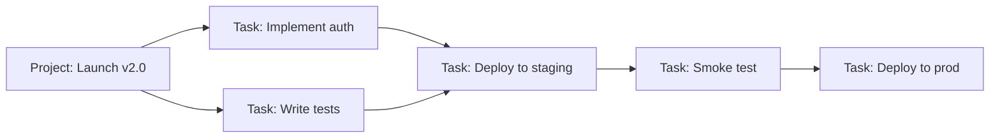
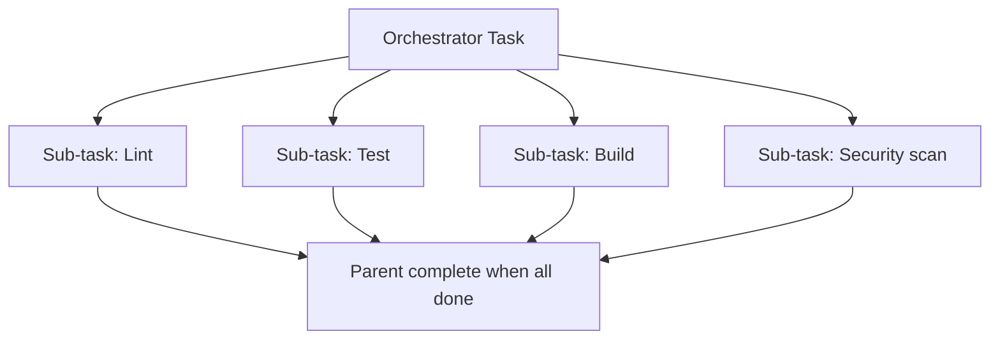

# Workflow Orchestration

**Summary:** Synchestra orchestrates multi-step, multi-agent workflows through task hierarchies, status-driven pipelines, and coordination primitives like fan-out and sequencing.

---

## Overview

A *workflow* in Synchestra is not a YAML file or a graph DSL — it's a tree of tasks, each assigned to an agent, each with a well-defined status that gates the next step. This keeps things simple: every agent just needs to know how to pick up a task and report back.



---

## Task Hierarchies

Every task can have a parent task (set via `--parent` at creation time). This creates a tree structure where:

- A **parent task** is in progress until all its sub-tasks are complete
- Sub-tasks can be created dynamically by agents during execution
- The parent task's status rolls up from sub-task completion

### Creating a parent task

```bash
synchestra task create \
  --title "Ship user authentication feature" \
  --project my-app \
  --criteria "Auth endpoints live in production and passing smoke tests"
```

### Spawning sub-tasks (from an orchestrator agent)

```bash
# The orchestrator agent creates sub-tasks and assigns them to specialists
synchestra task create \
  --title "Implement JWT middleware" \
  --parent task_parent_abc \
  --agent coder-agent \
  --criteria "JWT middleware passes unit tests"

synchestra task create \
  --title "Write auth integration tests" \
  --parent task_parent_abc \
  --agent tester-agent \
  --criteria "All integration tests green"
```

### Listing sub-tasks

```bash
synchestra task subtasks task_parent_abc
```

---

## Sequential Pipelines

For sequential workflows (step B starts only after step A is complete), the simplest pattern is an orchestrator agent that watches for task completion and creates the next task:

```bash
# Orchestrator waits for coder task to complete
synchestra task get task_code_abc123
# When status == complete:
synchestra task create \
  --title "Review PR for auth feature" \
  --parent task_parent_abc \
  --agent reviewer-agent
```

Or via the API, agents can poll:

```bash
GET /api/v1/tasks/task_code_abc123
# Poll until status == "complete", then trigger next step
```

---

## Parallel Fan-Out

For parallelisable work, create multiple sub-tasks simultaneously. Agents pick them up and work in parallel:



```bash
# Orchestrator creates parallel sub-tasks
for step in lint test build security-scan; do
  synchestra task create \
    --title "CI: $step" \
    --parent task_ci_abc \
    --skill "ci-$step"
done
```

---

## Status-Gated Transitions

Workflows advance based on task status. Common patterns:

| Pattern | Trigger | Action |
|---|---|---|
| Sequential | Task A reaches `complete` | Create Task B |
| Gate | Task A reaches `complete` | Unblock pending Task B |
| Escalate | Task A reaches `failed` | Create escalation task for human |
| Retry | Task A reaches `failed` | Re-create Task A with updated context |
| Rollback | Task A reaches `failed` | Create rollback task for previous step |

---

## Retry Patterns

Synchestra doesn't have built-in retry logic (keeping it simple), but it's straightforward to implement in an orchestrator agent:

```bash
MAX_RETRIES=3
ATTEMPT=0

while [ $ATTEMPT -lt $MAX_RETRIES ]; do
  TASK_ID=$(synchestra task create --title "Deploy to staging" --agent deployer-agent)
  
  # Wait for completion
  while true; do
    STATUS=$(synchestra task get $TASK_ID --field status)
    [ "$STATUS" = "complete" ] && break 2
    [ "$STATUS" = "failed" ] && break
    sleep 15
  done
  
  ATTEMPT=$((ATTEMPT + 1))
  synchestra task log $TASK_ID --message "Retry attempt $ATTEMPT of $MAX_RETRIES"
done
```

---

## Rules and Constraints

[Rules](../cli/rule.md) can be attached at any level (human, org, project, repo) and are surfaced to agents when they pick up tasks. Rules shape behaviour without hardcoding it into the workflow:

```bash
synchestra rule create \
  --name "no-direct-prod-deploy" \
  --content "Never deploy directly to production. Always deploy to staging first and wait for smoke tests." \
  --scope project \
  --scope-id proj_abc123
```

---

## Related

- [CLI: `synchestra task`](../cli/task.md)
- [API: Tasks](../api/tasks.md)
- [Feature: Agent Coordination](agent-coordination.md)
- [Feature: Human Steering](human-steering.md)
- [Feature: State Synchronization](state-synchronization.md)
