# Remote Task Dispatch Assessment

**Date:** 2026-07-22
**Scope:** `synchestra`, `synchestra-cloud`, `synchestra-vm`, `synchestra-servers`, `synchestra-hub`, `ai-plugin-synchestra`, Synchestra marketing decisions, SpecStudio skills, and the registered personal VM

## Executive Conclusion

Synchestra is not missing a remote-execution architecture. It has two substantial but disconnected foundations:

1. The standalone CLI implements a Git-backed task lifecycle with queued and claimed work.
2. The hosted/runtime repositories implement runner registration, authentication, sessions, credentials, container or process execution, model selection fields, logs, quotas, and cloud provisioning.

The missing product path is the durable vertical integration from an ad-hoc prompt or SpecScore target to a queued dispatch, an outbound worker lease, an isolated repository worktree, an agent process, and a pushed branch/result. The recommended work is therefore consolidation and integration, not a new scheduler or runtime from scratch.

## Product Boundary

General dispatch belongs to Synchestra. SpecStudio owns the single-project specification lifecycle and may optionally delegate approved Plan tasks to Synchestra, but must not own the queue or worker protocol.

This conclusion is supported by the current SpecStudio contracts:

- SpecStudio describes itself as the cockpit for one project from idea through shipped code.
- Its Autopilot chains skills inside the current agent session.
- Its detached background implementation feature explicitly excludes multi-machine, remote, scheduled, and delayed execution.
- Its Ship feature assigns scheduling and dispatch across runs to a separate orchestration layer.
- Public SpecScore positioning says no orchestrator is required and that SpecScore artifacts can be consumed by any orchestrator.

The human entry point should be a Synchestra plugin command such as:

```text
/dispatch @sonnet Update dal-go deps to latest
```

The command is a thin adapter over a deterministic Synchestra CLI/API operation. SpecStudio may later expose `implement --remote` by calling the same operation.

## Existing Implementation by Repository

| Repository | Reusable implementation | Missing connection |
|---|---|---|
| `synchestra` | Git task statuses and transitions, task enqueue/claim, state stores, CLI conventions, runner dispatch specification | Implemented runner/auth/session/dispatch CLI packages; correct run identity and remote configuration handling |
| `synchestra-cloud` | Hosts, runners, ACLs, sessions, messages, credentials, quotas, cloud providers, device flow, callbacks | Durable dispatch job, attempts, transactional leases, worker claim/heartbeat/result endpoints |
| `synchestra-vm` | Registered host, heartbeat/token rotation, Docker provisioning, runner quotas, JWT/WebSocket paths | Outbound dispatch lease loop, cancellation, crash recovery, canonical service activation |
| `synchestra-servers` | Runner-host API, repository initialization, session manager, agent/model/effort fields, Claude execution | Canonical task execution coordinator, repository/worktree path alignment, branch/result finalization |
| `synchestra-hub` | Runner/session management, model and effort controls, logs/session UI | Dispatch/task queue surface; not required for the first proof |
| `ai-plugin-synchestra` | Progressive-disclosure CLI wrapper skills and Claude command convention | Human-visible `/dispatch` command and runner dispatch reference |

## Concrete Integration Findings

### The cloud queue is not a task queue

`synchestra-cloud/internal/host/queue.go` redelivers chat messages after hosts reconnect. It has no dispatch target, job attempt, lease owner, lease expiry, heartbeat, retry, or terminal execution result.

### Session contracts have version drift

The current runner-host API requires agent, model, and effort on session start, while portions of the cloud and VM forwarding paths omit or hard-code them. Individual repository tests pass because they use internal fakes or pinned module versions; they do not prove the current cross-repository contract.

### Repository and worktree paths disagree

The classic VM path provisions `/workspace/<project>`, repository initialization clones into `/workspace/<project>/repos/<name>`, and the worktree manager expects the Git repository at `/workspace/<project>`. A coding session can therefore receive an empty directory rather than a worktree of the intended repository.

### Execution paths overlap

Three paths exist: the classic VM project container, the generic quota/JWT/WebSocket runner, and the cloud-host in-process adapter. The long-lived registered VM host should become the first canonical dispatch worker; the other runtimes should implement the same worker contract later rather than evolve separate queue semantics.

### The task lifecycle needs concurrency hardening

Task state already includes `planning`, `queued`, `claimed`, `in_progress`, `completed`, `failed`, `blocked`, and `aborted`. Before unattended remote execution, the claim run identity, abort-request persistence, configuration resolution, and optimistic conflict handling need to be reconciled. Operational dispatch leases should live in the Hub; Git task state remains the durable business/work state.

## Live VM Inventory

The personal VM is a suitable proof worker:

- Ubuntu host with 4 CPUs, approximately 8 GiB RAM, and Docker running.
- Claude Code is installed.
- Synchestra repositories and runner container images are present.
- The versioned XDG installation exists at `~/.local/share/synchestra/`.
- `current` points to server release `0.4.2`; `staged` points to `0.3.5`.
- `current/host/synchestra-host`, `current/agent/synchestra-agent`, and `current/channel/synchestra-channel` are installed.
- The host is already registered with `https://api.synchestra.io`.
- No Synchestra host process or service is currently running.

The shipped systemd unit expects a dedicated `synchestra` user and a system installation, while this VM has a user-scoped installation and credentials under `ai`. The proof should activate the existing host as an `ai` user service. System-wide installation normalization is a follow-up.

## Recommended Runtime Model

```mermaid
flowchart LR
    U["User or AI skill"] --> C["synchestra dispatch"]
    C --> H["Hub dispatch API"]
    H --> Q["Durable job and attempt records"]
    Q --> W["Registered host claims lease outbound"]
    W --> R["Clone or fetch repository"]
    R --> T["Isolated worktree and task branch"]
    T --> A["Resolved agent and model profile"]
    A --> V["Agent execution and validation"]
    V --> G["Commit and push branch"]
    G --> O["Result, logs, commit, status"]
```



The durable concepts remain separate:

- **Task:** desired work and business lifecycle, optionally backed by SpecScore/Git state.
- **Dispatch:** scheduling request, constraints, attempts, leases, retry and cancellation.
- **Session:** one concrete agent process and its transcript/log stream.

A task can have multiple dispatch attempts and sessions. An ad-hoc dispatch does not require a pre-existing task.

## Decisions Recommended by the Assessment

1. Put general queueing, matching, and leasing in Synchestra Hub.
2. Extend `synchestra-host`; do not introduce a fourth worker executable.
3. Have workers connect outbound and claim eligible jobs; do not require a public VM endpoint.
4. Support both ad-hoc repository prompts and SpecScore plan/task targets.
5. Make `fast`, `balanced`, and `large` stable profiles; persist requested and resolved model data.
6. Treat `@haiku`, `@sonnet`, and `@opus` as Claude-specific convenience selectors over those profiles.
7. Use deterministic routing first: explicit selector, target metadata, project rule, then balanced default.
8. Push a dedicated branch as the proof result; never merge or deploy automatically.
9. Make the Synchestra plugin the `/dispatch` owner; make SpecStudio integration optional.
10. Use the existing registered personal VM as the first end-to-end acceptance environment.

## Validation Performed

- `go test ./...` passed independently in `synchestra`, `synchestra-cloud`, `synchestra-vm`, and `synchestra-servers` during the assessment.
- The Hub unit suite passed 102 tests across 21 files.
- The Hub typecheck target currently has an Nx/TypeScript configuration error and a forced production build was observed to be flaky.
- Repository worktrees were clean before documentation work began.

Passing repository-local tests does not replace a vertical contract test. The MVP requires a test that submits a dispatch, leases it from a worker, executes against a temporary Git remote, and records a pushed result.

## Delivery Estimate

| Milestone | Focused engineering effort |
|---|---:|
| Contract reconciliation and vertical test harness | 2–4 days |
| Durable queue, CLI, worker lease loop, and one agent adapter | 5–8 additional days |
| Personal VM proof with branch/result reporting | 1–3 additional days |
| Production hardening, retries, scoped credentials, observability | 10–18 additional days |

The first useful proof is therefore approximately 7–12 focused engineering days when executed as parallel, dependency-aware work.

## Outstanding Questions

1. Should an ad-hoc dispatch automatically create a Synchestra task, or remain a dispatch-only record unless the user requests task linkage? The MVP keeps it dispatch-only.
2. Should a worker reject an unavailable exact model selector or use a configured fallback? The MVP should reject unless fallback is explicitly configured.
3. Should the proof push directly using the VM user's GitHub credentials or request a short-lived GitHub App token? Existing credentials are acceptable for the personal proof; short-lived credentials are required before broader use.
