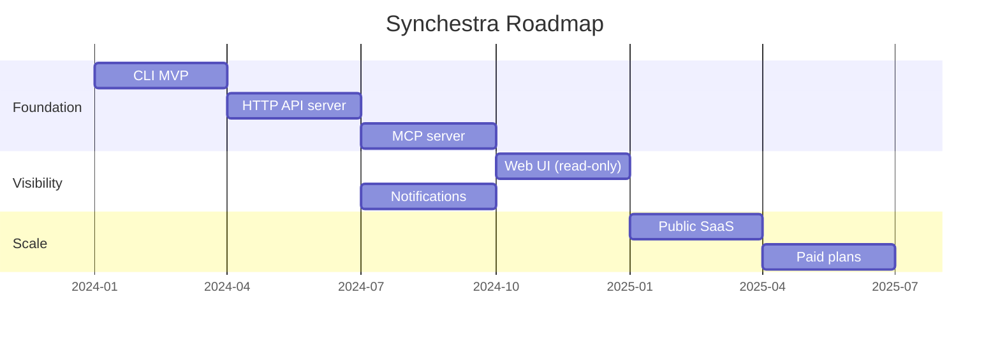

# Roadmap

Synchestra started as a personal tool to scratch a very specific itch. The plan is to keep it honest: build what's genuinely needed, ship it, and let real usage drive what comes next.

---

## Guiding Principles

- Ship working software, not roadmap theatre
- Self-hosted must always be free and fully featured
- The CLI and API should be stable; don't break agent integrations
- The web UI is a layer on top —  not a dependency

---

## Phases

---

## Phase 1 —  CLI MVP

The baseline: a working CLI and local server that an agent can actually use.

- [ ] `synchestra task` —  create, list, update, complete, fail, log
- [ ] `synchestra agent` —  register, heartbeat, deregister
- [ ] `synchestra project` —  create, list, get
- [ ] `synchestra repo` —  add, list, link
- [ ] `synchestra skill` —  create, list
- [ ] `synchestra rule` —  create, list
- [ ] `synchestra status` —  system and task view
- [ ] SQLite backend for zero-config local use
- [ ] Config file and env var support

---

## Phase 2 —  HTTP API Server

Make Synchestra accessible to agents written in any language, running anywhere.

- [ ] Full REST API for all resources (`/api/v1/`)
- [ ] Bearer token authentication with scoped access
- [ ] Token management via CLI and API
- [ ] Pagination on list endpoints
- [ ] Optimistic locking to prevent race conditions
- [ ] Structured error responses

---

## Phase 3 —  MCP Server 🔄 In Progress

First-class support for AI models that speak MCP (Claude, and growing).

- [ ] MCP server bundled in the `synchestra server` binary
- [ ] Full tool coverage: all task and agent operations
- [ ] MCP authentication integration
- [ ] Claude integration guide and examples
- [ ] MCP-specific error handling and retries

---

## Phase 4 —  Web UI 🗓 Planned

A real-time dashboard for humans to watch, steer, and understand what their agents are doing.

- [ ] Live task board (Kanban-style, auto-refreshing)
- [ ] Agent status panel with heartbeat indicators
- [ ] Task detail view with full history timeline
- [ ] Rules editor
- [ ] Project and repo management
- [ ] Mobile-friendly layout

*Tech: Nx, TypeScript, React. Reads from the same API agents use.*

---

## Phase 5 —  Notifications 🔄 In Progress

Get notified when things go wrong (or right) without polling.

- [ ] Telegram notifications (task_failed, task_blocked, agent_offline)
- [ ] Webhook push for external system integration
- [ ] Email notifications
- [ ] Configurable per-project notification rules
- [ ] Notification history and replay

---

## Phase 6 —  Public SaaS 🗓 Planned

A hosted version for people who don't want to run their own server.

- [ ] Managed infrastructure (not your problem)
- [ ] Free tier: single user, limited tasks/month
- [ ] Web UI included
- [ ] Same API as self-hosted (no lock-in)
- [ ] Import/export for migrating to/from self-hosted

---

## Phase 7 —  Paid Plans 🗓 Planned

When teams and businesses want more.

- [ ] Team plan: multiple users, shared orgs, audit logs
- [ ] Pro plan: higher limits, priority support, SLA
- [ ] Enterprise: custom retention, SSO, dedicated infra
- [ ] Usage-based billing for API calls (not tasks —  tasks are always free)

---

## What's Not on the Roadmap

Explicitly **not** planned:

- **Our own agent runtime.** We're a coordination layer, not a framework. Use LangChain, Autogen, CrewAI, raw API calls —  whatever works. Synchestra is the glue, not the glue factory.
- **Visual workflow builder.** Workflows are code. YAML-based pipeline builders have their place but Synchestra workflows are just tasks + agents + code.
- **Built-in LLM calls.** No prompts, no model APIs, no vendor lock-in from our side.

---

## Contributing

The roadmap is shaped by real use. If something on here is blocking your work, open an issue. If something you need isn't here, open an issue. We'd rather hear about it than guess.

[GitHub Issues →](https://github.com/synchestra-io/synchestra-go/issues)
