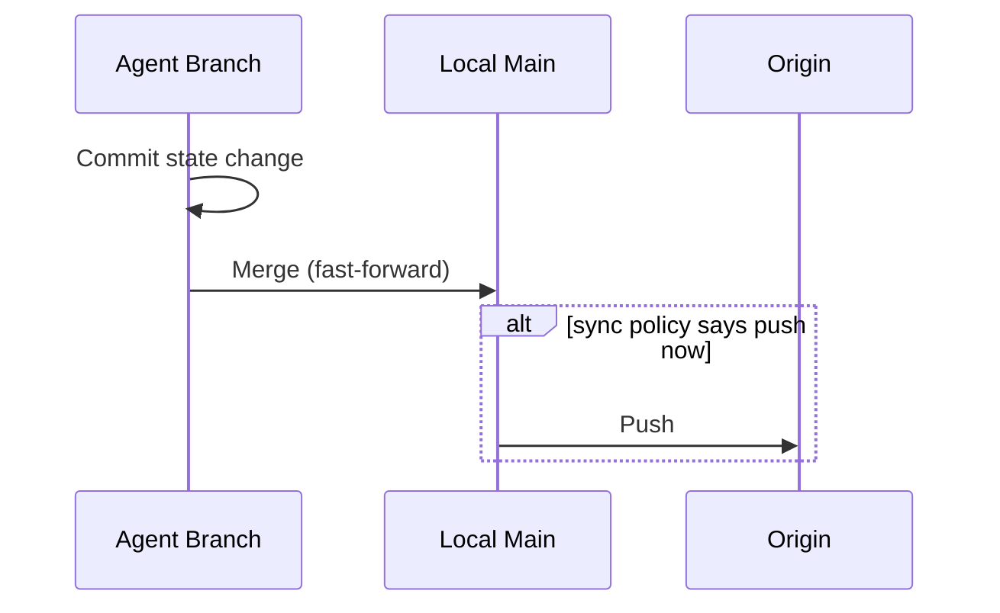
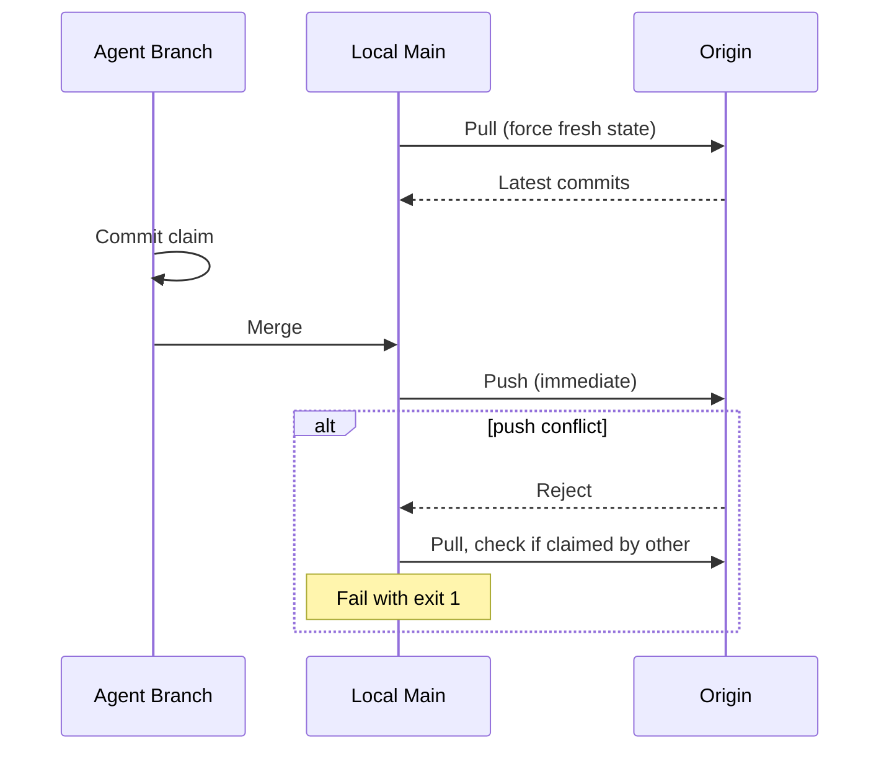

# State Sync Commands & Sync Policy

## Summary

Three new CLI commands under `synchestra state` for manual state repository synchronization, plus a configurable sync policy that governs when automatic pull/push happens during normal operations.

### Key decisions

- **`synchestra state pull/push/sync`** — repo-level commands, always immediate, policy-unaware
- **Sync policy** in `synchestra-state-repo.yaml` under `sync:` with separate `pull`/`push` settings
- **Policy values:** `on_commit`, `on_interval=<duration>`, `on_session_end`, `manual`
- **Agent branching:** all repo types use `agent/<run-id>` branches, merge to main
- **Contended operations** (`task claim`) always force immediate round-trip regardless of policy
- **Environment overrides** (in `~/.synchestra.yaml` or `synchestra-server.yaml`) can only be stricter than project baseline

## Motivation

The current spec hardcodes sync behavior: every mutating command does pull → commit → push, every read does pull first. This works for distributed setups but is wasteful for the common case of a single VM running all agents locally. The performance cost of a remote round-trip on every operation adds up at scale.

Additionally, there is no CLI mechanism to manually trigger sync — in local-only setups, users would need to `cd` into the state repo and run `git pull/push` directly, which defeats the purpose of the CLI abstraction.

## Sync Policy Configuration

### Location

**Project-level (baseline):** `synchestra-state-repo.yaml`

```yaml
sync:
  pull: on_commit
  push: on_commit
```

**Environment-level (override):** `~/.synchestra.yaml` or `synchestra-server.yaml`

```yaml
sync:
  pull: on_interval=1m
  push: on_interval=5m
```

Environment overrides can only be **stricter** (more frequent) than the project baseline, never looser.

### Policy values

| Value | Meaning |
|-------|---------|
| `on_commit` | After every merge to local main |
| `on_interval=<duration>` | On a timer (e.g., `5m`, `30s`) |
| `on_session_end` | When agent session ends |
| `manual` | Only via explicit `synchestra state pull/push/sync` |

**Defaults:** Both `pull` and `push` default to `on_commit` — safest for correctness.

### Strictness ordering

For environment overrides: `on_commit` > `on_interval` > `on_session_end` > `manual`. An environment can move up this scale (stricter), never down (looser).

**Comparing `on_interval` values:** A shorter interval is stricter. `on_interval=30s` is stricter than `on_interval=5m`. When the project baseline is `on_interval=5m`, an environment can override to `on_interval=30s` or `on_commit`, but not to `on_interval=10m` or `on_session_end`.

**Cross-category comparison:** `on_commit` is always the strictest. Any `on_interval` value (regardless of duration) is stricter than `on_session_end`, which is stricter than `manual`.

### Contended operations

`task claim` always forces an immediate pull+push round-trip regardless of policy, to preserve optimistic locking via git's push-or-fail semantics.

## Command Group: `synchestra state`

Three subcommands. All are policy-unaware — they execute immediately and unconditionally. They are manual escape hatches, not governed by the sync policy.

### `synchestra state pull`

Pulls latest changes from origin to local main.

```
synchestra state pull [--project <id>]
```

**Behavior:**
1. Fetch from origin
2. Fast-forward local main
3. Rebase active agent branches onto updated main (if any)

**Exit codes:**
- `0` — success
- `1` — merge conflict
- `3` — project not found

**Output:** Human-readable status to stdout (e.g., "Pulled 3 commits from origin", "Already up to date").

### `synchestra state push`

Pushes local main to origin.

```
synchestra state push [--project <id>]
```

**Behavior:**
1. Merge any pending agent branch commits to local main
2. Push local main to origin

**Exit codes:**
- `0` — success
- `1` — push conflict (suggests running `synchestra state sync`)
- `3` — project not found

**Output:** Human-readable status to stdout.

### `synchestra state sync`

Full round-trip — pull then push.

```
synchestra state sync [--project <id>]
```

**Behavior:**
1. Pull from origin (same as `state pull`)
2. Push to origin (same as `state push`)
3. On conflict during push: pull again, re-merge, retry

**Exit codes:**
- `0` — success
- `1` — unresolvable conflict
- `3` — project not found

**Output:** Human-readable status to stdout.

### Shared behavior

- All three accept `--project` (autodetectable from CWD via `synchestra-spec-repo.yaml`). The CLI resolves the spec repo config to the state repo path using the `state_repo` field in `synchestra-spec-repo.yaml`. When run from within the state repo directory itself, the CLI detects `synchestra-state-repo.yaml` and resolves the project directly.
- All three are safe to run at any time — they don't interfere with in-progress agent operations because agents work on separate branches
- Exit code `1` (conflict) always leaves the repo in a clean state — the operation is aborted, no partial changes are applied. The user can inspect and resolve manually or retry with `state sync`.

## Git Branching Model for State Repo

### Branch naming

Each agent operates on a dedicated branch:

```
agent/<run-id>
```

Where `<run-id>` is the same identifier passed to `task claim --run`. This gives each agent session its own branch, traceable back to the task run.

### Operation flow

For a typical mutating operation (e.g., `task complete`):



1. Commit on `agent/<run-id>`
2. Checkout main
3. Merge `agent/<run-id>` (fast-forward if possible)
4. If sync policy says push now → push main to origin
5. Checkout `agent/<run-id>`

### Conflict during merge to local main

Another local agent may have merged to main concurrently. Resolution:
- Pull main (local)
- Rebase `agent/<run-id>` onto main
- Retry merge
- State repo changes are small and scoped to different files (different task directories), so conflicts should be rare

### Conflict during push to origin

Another environment pushed to origin. Resolution:
- Pull origin → local main
- Rebase and retry push
- If the conflict affects the same task (e.g., two environments both completing the same task), fail with exit `1`

### Branch cleanup

Agent branches are deleted after the agent session ends, after final merge to main.

### Contended operations (`task claim`)

Forces the full round-trip regardless of policy:



## Store Interface Changes

### New types

```go
type SyncPolicy string

const (
    SyncOnCommit     SyncPolicy = "on_commit"
    SyncOnInterval   SyncPolicy = "on_interval"
    SyncOnSessionEnd SyncPolicy = "on_session_end"
    SyncManual       SyncPolicy = "manual"
)

type SyncConfig struct {
    Pull         SyncPolicy
    PullInterval time.Duration // used when Pull is SyncOnInterval
    Push         SyncPolicy
    PushInterval time.Duration // used when Push is SyncOnInterval
}
```

### Updated StoreOptions

```go
type StoreOptions struct {
    SpecRepoPaths []string
    StateRepoPath string
    Sync          SyncConfig // replaces GitStoreOptions.SyncMode
}
```

`GitStoreOptions.SyncMode` (the `sync`/`local` enum) is removed entirely.

`RunID` is not part of `StoreOptions` — it is a git-specific concern. The git backend accepts it via `GitStoreOptions`:

```go
type GitStoreOptions struct {
    StoreOptions
    RunID string // agent branch: agent/<run-id>
}
```

Other backends (SQLite, PostgreSQL) may use different agent identity mechanisms (e.g., connection-scoped session IDs).

### New StateSync sub-interface

Following the existing hierarchical composition pattern (`Store.Task()`, `Store.Chat()`, `Store.Project()`), sync operations are accessed via a `StateSync` sub-interface:

```go
type StateSync interface {
    Pull(ctx context.Context) error
    Push(ctx context.Context) error
    Sync(ctx context.Context) error // pull + push
}

type Store interface {
    Task()    TaskStore
    Chat()    ChatStore
    Project() ProjectStore
    State()   StateSync
}
```

Backend implementations without a remote concept (e.g., future SQLite for single-host) would return a no-op `StateSync` implementation.

## Impact on Existing Specs

### `spec/features/state-store/backends/git/README.md`

- Remove `SyncMode` enum and `GitStoreOptions.SyncMode`
- Replace with reference to `SyncConfig` on `StoreOptions`
- Update sync protocol description to reflect agent branch → merge to main → push model
- Add `Pull()`, `Push()`, `Sync()` to method mapping table

### `spec/features/state-store/README.md`

- Add `StateSync` sub-interface and `Store.State()` accessor to the `Store` interface
- Add `SyncConfig` to `StoreOptions`
- Document that `SyncConfig` replaces the git-specific `SyncMode`
- Remove references to file-level locking for local concurrency — the agent branching model (`agent/<run-id>`) replaces it; each agent writes to its own branch, and contention is resolved during merge to main

### `spec/features/cli/README.md`

- Add `state` to the command groups table
- Update "Git mechanics" section to reference sync policy instead of hardcoded pull/push behavior
- Add `state pull/push/sync` to the command-environments matrix (`command-environments.md`)

### `spec/architecture/repository-types/state-repo/README.md`

- Add `sync:` block with `pull` and `push` fields to the `synchestra-state-repo.yaml` schema

### Task command specs (all subcommands under `spec/features/cli/task/`)

- Replace hardcoded "pull from remote" / "push to remote" language with "syncs according to project sync policy"
- `task claim` spec explicitly notes that it overrides the policy with an immediate round-trip

### No new `_args` files needed

The `state` commands only use the existing `--project` global arg. No command-specific args beyond what's already defined.

## Decisions Required Before Implementation

- **Interval timer implementation:** How should `on_interval` be implemented? A background goroutine in the store? A separate process? The store holding a timer? This affects the store's lifecycle (`Open`/`Close`) and threading model.
- **`on_session_end` trigger mechanism:** Should this be triggered by the store's `Close()` method, or does the CLI need to explicitly call `Push()` on shutdown? This affects the contract between the CLI and the store.

## Outstanding Questions

- Should `synchestra state` have an `info` subcommand to show current sync policy, last pull/push timestamps, and pending local commits?
- Should there be a `synchestra state status` command that shows sync health (e.g., "3 local commits unpushed, last pull 2m ago")?
