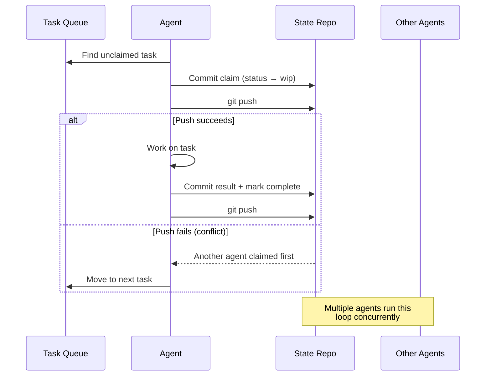

# Agent Coordination Flow

```mermaid
sequenceDiagram
    participant Q as Task Queue
    participant A as Agent
    participant R as State Repo
    participant B as Other Agents

    A->>Q: Find unclaimed task
    A->>R: Commit claim (status → wip)
    A->>R: git push
    alt Push succeeds
        A->>A: Work on task
        A->>R: Commit result + mark complete
        A->>R: git push
    else Push fails (conflict)
        R-->>A: Another agent claimed first
        A->>Q: Move to next task
    end
    Note over B,R: Multiple agents run this<br>loop concurrently
```
