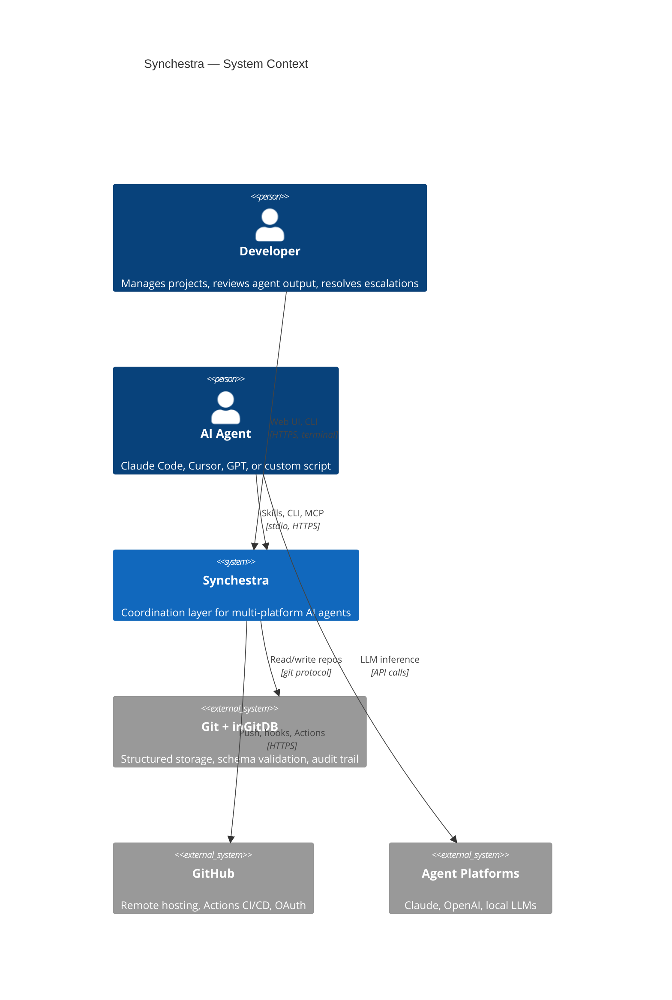

# C4 System Context

```mermaid
C4Context
    title Synchestra — System Context

    Person(dev, "Developer", "Manages projects, reviews agent output, resolves escalations")
    Person(agent, "AI Agent", "Claude Code, Cursor, GPT, or custom script")

    System(synchestra, "Synchestra", "Coordination layer for multi-platform AI agents")

    System_Ext(git, "Git + inGitDB", "Structured storage, schema validation, audit trail")
    System_Ext(github, "GitHub", "Remote hosting, Actions CI/CD, OAuth")
    System_Ext(platforms, "Agent Platforms", "Claude, OpenAI, local LLMs")

    Rel(dev, synchestra, "Web UI, CLI", "HTTPS, terminal")
    Rel(agent, synchestra, "Skills, CLI, MCP", "stdio, HTTPS")
    Rel(synchestra, git, "Read/write repos", "git protocol")
    Rel(synchestra, github, "Push, hooks, Actions", "HTTPS")
    Rel(agent, platforms, "LLM inference", "API calls")

    UpdateLayoutConfig($c4ShapeInRow="3", $c4BoundaryInRow="1")
```
