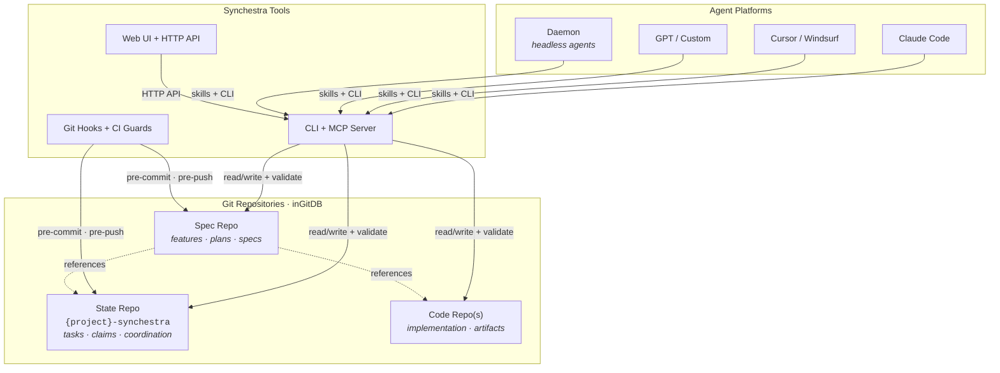

# System Architecture

```mermaid
graph TB
    subgraph Agents["Agent Platforms"]
        CC[Claude Code]
        CU[Cursor / Windsurf]
        GPT[GPT / Custom]
        DA[Daemon<br><i>headless agents</i>]
    end

    subgraph Tools["Synchestra Tools"]
        CLI[CLI + MCP Server]
        WEB[Web UI + HTTP API]
        HOOKS[Git Hooks + CI Guards]
    end

    subgraph Repos["Git Repositories  ·  inGitDB"]
        STATE["State Repo<br><code>{project}-synchestra</code><br><i>tasks · claims · coordination</i>"]
        SPEC["Spec Repo<br><i>features · plans · specs</i>"]
        CODE["Code Repo(s)<br><i>implementation · artifacts</i>"]
    end

    CC & CU & GPT & DA -->|skills + CLI| CLI
    CLI -->|read/write + validate| STATE & SPEC & CODE
    WEB -->|HTTP API| CLI
    HOOKS -->|pre-commit · pre-push| STATE & SPEC
    SPEC -.->|references| STATE
    SPEC -.->|references| CODE
```
