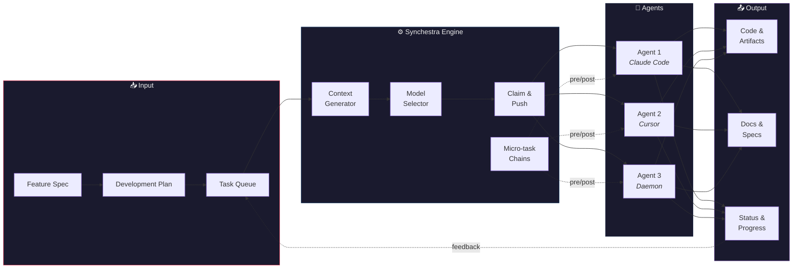

# How Work Flows Through Synchestra

```mermaid
flowchart LR
    subgraph Input["📥 Input"]
        SPEC[Feature Spec]
        PLAN[Development Plan]
        QUEUE[Task Queue]
    end

    subgraph Engine["⚙️ Synchestra Engine"]
        direction TB
        CONTEXT[Context<br>Generator]
        MODEL[Model<br>Selector]
        CLAIM[Claim &<br>Push]
        MICRO[Micro-task<br>Chains]
    end

    subgraph Agents["🤖 Agents"]
        direction TB
        A1[Agent 1<br><i>Claude Code</i>]
        A2[Agent 2<br><i>Cursor</i>]
        A3[Agent 3<br><i>Daemon</i>]
    end

    subgraph Output["📤 Output"]
        ARTIFACTS[Code &<br>Artifacts]
        DOCS[Docs &<br>Specs]
        STATUS[Status &<br>Progress]
    end

    SPEC --> PLAN --> QUEUE
    QUEUE --> CONTEXT
    CONTEXT --> MODEL --> CLAIM
    CLAIM --> A1 & A2 & A3
    MICRO -.->|pre/post| A1 & A2 & A3
    A1 & A2 & A3 --> ARTIFACTS & DOCS & STATUS
    STATUS -.->|feedback| QUEUE

    style Input fill:#1a1a2e,stroke:#e94560,color:#eee
    style Engine fill:#1a1a2e,stroke:#0f3460,color:#eee
    style Agents fill:#1a1a2e,stroke:#16213e,color:#eee
    style Output fill:#1a1a2e,stroke:#533483,color:#eee
```
