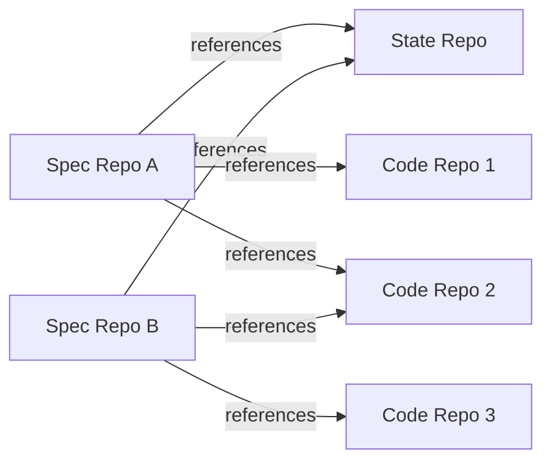

# Git Repository Types

Synchestra operates with three kinds of Git repositories. Each has a distinct role, commit cadence, and audience. The separation ensures that product intent, coordination state, and implementation remain independently manageable — with different access patterns, permissions, and lifecycle characteristics.

## Overview

| Repository type | What it holds | Who writes to it | Commit cadence |
|---|---|---|---|
| **[Spec repository](spec-repo/README.md)** | Requirements, architecture, documentation, `synchestra-spec-repo.yaml` | Humans, agents (reviewed) | Low — deliberate, reviewed changes |
| **[State repository](state-repo/README.md)** | Tasks, claims, coordination state, workflow artifacts | Synchestra CLI, agents (automated) | High — frequent machine commits |
| **[Code repository](code-repo/README.md)** | Implementation and source code, `synchestra-code-repo.yaml` | Developers, agents | Medium — feature branches, PRs |

## Contents

| Directory | Description |
|---|---|
| [spec-repo/](spec-repo/README.md) | Spec repository definition and rules |
| [state-repo/](state-repo/README.md) | State repository definition and rules |
| [code-repo/](code-repo/README.md) | Code repository definition and rules |

### spec-repo/

The spec repository is the source of truth for what should be built. Contains feature specifications, architecture documents, product documentation, and the `synchestra-spec-repo.yaml` project configuration. Changes are deliberate and reviewed.

### state-repo/

The state repository is the coordination hub — task queue, assignments, workflow artifacts. Written primarily by the CLI and agents, it accumulates commits rapidly and must always be a dedicated, separate repository.

### code-repo/

Code repositories hold the implementation — source code, tests, configuration, infrastructure definitions. Synchestra does not dictate their internal structure beyond a config file and branch naming convention.

## How They Connect

The **spec repository** is the anchor. Its `synchestra-spec-repo.yaml` defines the project and references the other repositories:

```yaml
# synchestra-spec-repo.yaml (in the spec repo root)
title: Acme Platform
state_repo: https://github.com/acme/acme-synchestra
repos:
  - https://github.com/acme/acme-api
  - https://github.com/acme/acme-web
  - https://github.com/acme/acme-infra
```

The **state repository** contains `synchestra-state-repo.yaml` listing all spec repos that share this state repo:

```yaml
# synchestra-state-repo.yaml (in the state repo root)
spec_repos:
  - https://github.com/acme/acme
  - https://github.com/acme/acme-rehearse
```

**Code repositories** contain `synchestra-code-repo.yaml` listing all spec repos they implement:

```yaml
# synchestra-code-repo.yaml (in the code repo root)
spec_repos:
  - https://github.com/acme/acme
```

Spec and code repos have a **many-to-many** relationship: one spec can be implemented by multiple code repos, and one code repo can implement multiple specs. Similarly, multiple spec repos can share a single state repo.



## Combining Repositories

For smaller projects, the spec and code repos can be combined into a single repository. Both `synchestra-spec-repo.yaml` and `synchestra-code-repo.yaml` live at the root alongside `spec/`, `docs/`, and the source code. The state repo remains separate.

```
acme/                             # Combined spec + code repo
  synchestra-spec-repo.yaml
  synchestra-code-repo.yaml
  spec/
    features/
      ...
  docs/
    ...
  src/                            # Source code
    ...

acme-synchestra/                  # State repo (always separate)
  synchestra-state-repo.yaml
  tasks/
    ...
```

What **cannot** be combined: the state repo. Even for the simplest projects, coordination state belongs in its own dedicated repository.

## Typical Workflow

See [Spec-to-Execution Pipeline](../spec-to-execution.md) for the full lifecycle with diagrams.

1. Human or agent reads a **spec** from the spec repo to understand what to build.
2. Agent claims a **task** in the state repo via `synchestra task claim`.
3. Agent creates a `synchestra/{task-slug}` branch in the relevant **code repo(s)**.
4. Agent implements the feature, commits, and pushes.
5. Agent marks the task complete in the **state repo** via `synchestra task complete`.

## Outstanding Questions

- How should the CLI resolve which project a code repo belongs to if the developer is working in the code repo and hasn't explicitly set `--project`? (The code repo's `synchestra-code-repo.yaml` lists spec repos, which in turn reference the state repo.)
