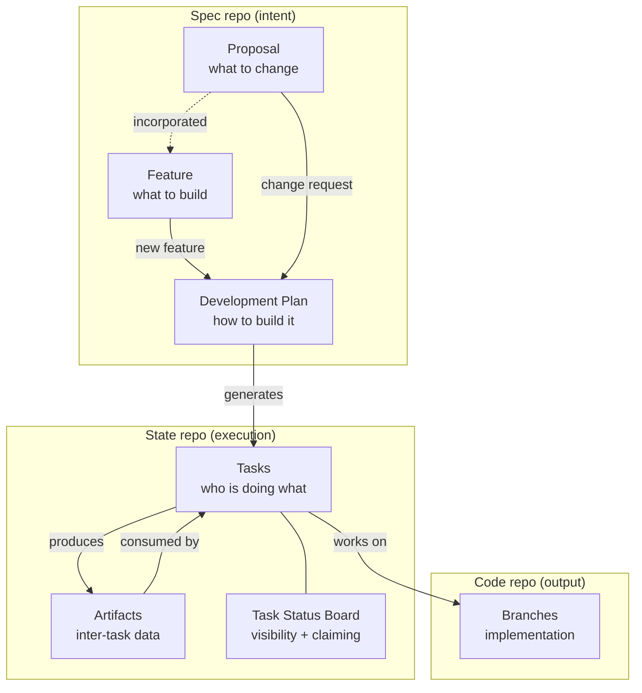
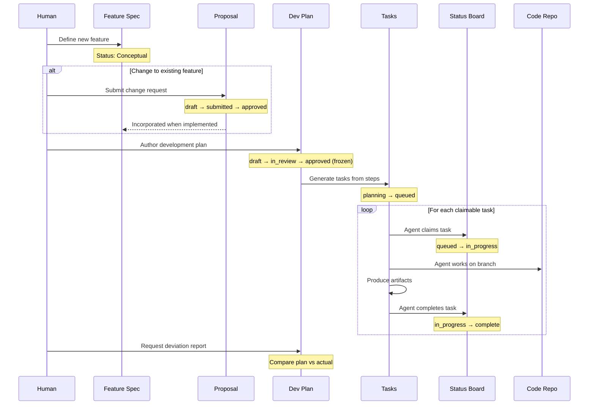
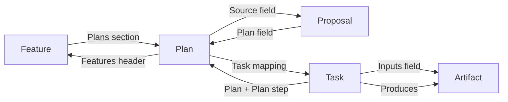
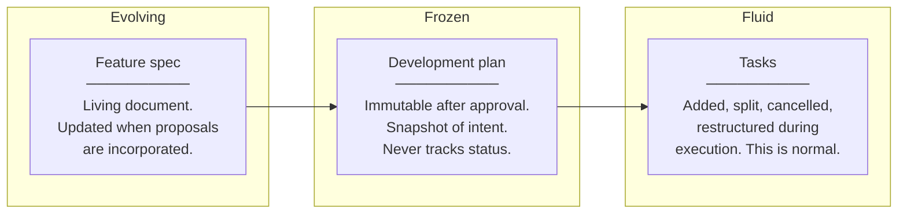
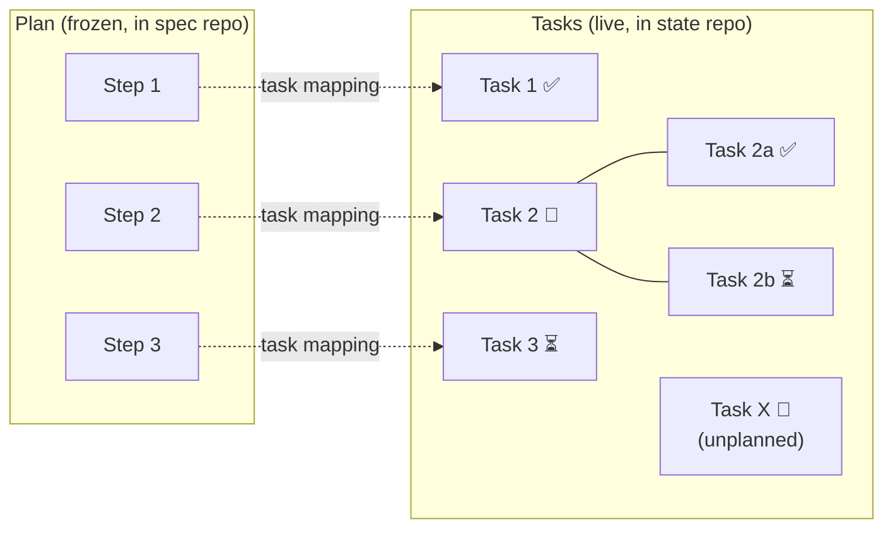
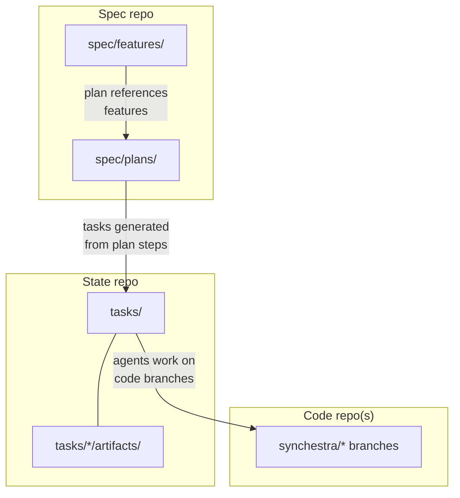

# Spec-to-Execution Pipeline

How product intent becomes running work in Synchestra.

Synchestra's architecture separates three concerns — **what** to build, **how** to build it, and **who is building it right now** — across distinct artifacts and repositories. This document shows how they connect.

## The three layers

Each layer has a different **mutability profile**:

| Layer            | Artifact          | Mutability          | Repository |
|------------------|-------------------|---------------------|------------|
| Intent (what)    | Feature spec      | Versioned, evolving | Spec       |
| Intent (what)    | Proposal          | Versioned until incorporated | Spec |
| Approach (how)   | Development plan  | Immutable once approved | Spec   |
| Execution (who)  | Tasks             | Highly fluid        | State      |
| Execution (who)  | Artifacts         | Write-once per task | State      |
| Output           | Code branches     | Standard git flow   | Code       |

## End-to-end lifecycle

A complete cycle from idea to retrospective:

## Artifact relationships

Each artifact type references its neighbors, creating a navigable chain:

Every link is bidirectional or navigable in both directions. You can start at any node and trace the full chain:

- **From a feature:** see its plans, which show tasks, which show artifacts and code branches
- **From a task:** see its plan step, which shows the plan, which shows the feature and acceptance criteria
- **From a plan:** see both the original intent (feature/proposal) and the execution state (tasks + derived status)

## Status and mutability

The three core artifacts have fundamentally different mutability rules, and this is by design:

**Why this matters:**
- Features **evolve** because the product definition changes over time. Proposals are the mechanism for controlled evolution.
- Plans are **frozen** because reviewers need a stable document to approve, and retrospectives need a fixed reference to compare against.
- Tasks are **fluid** because real execution always deviates from the plan. Agents discover complexity, humans reprioritize, parallel work gets restructured. Freezing tasks would fight reality.

The development plan bridges these two worlds. It is the last frozen artifact before execution begins — the point where intent crystallizes into a reviewable, approvable approach.

## Derived status: no duplication

Plans do not track task status. Instead, Synchestra derives a progress view on the fly by mapping plan steps to their linked tasks:

The derived view shows:
- **Step 1:** complete (Task 1 is done)
- **Step 2:** in progress (Task 2 has sub-tasks, one done, one queued)
- **Step 3:** queued (Task 3 hasn't started)
- **Unplanned:** Task X exists but wasn't in the original plan

One source of truth (tasks), two views (flat plan progress for humans, deep task tree for agents).

## Repository boundaries

The spec repo holds everything about **intent and approach** (features, proposals, plans). The state repo holds everything about **execution** (tasks, artifacts, status boards). Code repos hold the **output** (implementation on branches). This separation ensures that high-frequency machine commits (task claims, status transitions) never pollute the spec or code history.

## Outstanding Questions

None at this time.
