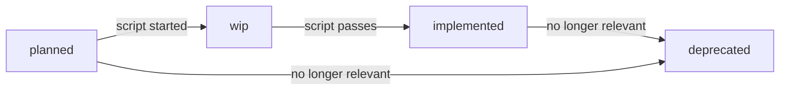

# Feature: Acceptance Criteria

**Status:** Conceptual

## Summary

Acceptance criteria are the contract between what a feature promises and what the system actually delivers. In Synchestra, each AC is a standalone markdown file — readable by product owners, auditable by reviewers, and executable by the [test runner](../testing-framework/test-runner/README.md). ACs live alongside the features they verify, carry their own lifecycle, and compose into [test scenarios](../testing-framework/test-scenario/README.md) for end-to-end validation. Write an AC once; reference it from any number of test flows.

## Problem

Feature specs describe desired behavior. Development plans list acceptance criteria as inline bullet points. But today, these two worlds are disconnected:

- **Specs promise, nothing verifies.** A feature says "creating a project writes `synchestra-spec.yaml` to the spec repo." There is no structured artifact that turns that sentence into an executable check. The gap between intent and proof is filled by hope and manual testing.
- **Verification logic is duplicated.** The assertion "deleted project does not appear in the list" lives in a Go unit test, a shell script in CI, and prose in three different plan steps. When the behavior changes, some of these get updated. The rest silently drift.
- **Nobody knows the coverage picture.** Which features have automated verification? Which acceptance criteria are still prose-only? Which were implemented six months ago and never updated? Without a lifecycle, there is no answer — only archaeology.

Acceptance criteria as first-class artifacts solve all three: each AC is addressable, versioned, executable, and tracked through a status lifecycle from `planned` to `implemented`.

## Behavior

### AC file location

Each feature defines its acceptance criteria in an `_acs/` subdirectory:

```
spec/features/{feature}/_acs/
  README.md             ← AC index for this feature
  {ac-slug}.md          ← individual AC
```

The `_acs/` directory uses the reserved `_` prefix convention — it is not a sub-feature and is excluded from the feature index and Contents table.

### AC file format

Each AC is a self-contained markdown file. Everything needed to understand and execute the criterion lives in one place:

```markdown
# AC: creates-spec-config

**Status:** implemented
**Feature:** [cli/project/new](../README.md)

## Description

After `synchestra project new`, `synchestra-spec.yaml` exists in the spec repo
with the correct title and state_repo fields.

## Inputs

| Name | Required | Description |
|---|---|---|
| spec_repo_path | Yes | Path to the spec repository |
| expected_title | Yes | Expected project title |

## Verification

```bash
test -f "$spec_repo_path/synchestra-spec.yaml"
title=$(grep 'title:' "$spec_repo_path/synchestra-spec.yaml" | head -1 | sed 's/title: *//')
test "$title" = "$expected_title"
```

## Scenarios

| Scenario | Step |
|---|---|
| [project-lifecycle](../../../tests/project-lifecycle.md) | verify-configs |
```

**Why markdown, not code?** Because the audience is broader than developers. Product owners can read the Description and Inputs table to confirm "yes, this is what I meant." Testers can review the Verification script to check edge cases. AI agents can parse the structure without language-specific tooling. And developers can execute it as-is — no compilation, no framework, just a script.

### Supported languages

Verification scripts are not limited to bash. The code block's language annotation determines the interpreter:

| Language | Annotation | Interpreter | Best for |
|---|---|---|---|
| Bash | `` ```bash `` | `bash -c` | File checks, CLI invocations, simple assertions |
| Python | `` ```python `` | `python3 -c` | Complex assertions, JSON/YAML parsing, data validation |
| SQL | `` ```sql `` | Database CLI (`psql`, `sqlite3`, etc.) | Schema verification, data state checks, query result assertions |
| Starlark | `` ```starlark `` | Starlark interpreter | Hermetic, sandboxed verification with no filesystem side effects |

Bash is the default and the most common choice — it maps naturally to CLI-driven verification. Python is available when assertions require structured data manipulation that would be unwieldy in bash. SQL verifies database schema and data state — schema existence, row counts, constraint validation, and data integrity after migrations or workflow steps. Starlark provides a deterministic, sandboxed alternative for verification logic that must be side-effect-free and reproducible.

The runner detects the language from the code fence annotation. **The annotation is mandatory** — a code block without a language annotation is a validation error. This eliminates ambiguity and makes every script's execution environment explicit.

A single AC file uses one language. If a feature needs both a bash check and a Python check, those are two separate ACs — keeping each focused and testable independently.

### AC identification

ACs are identified by their feature path and slug — the same pattern used for features themselves:

| AC path | Identifier |
|---|---|
| `spec/features/cli/project/new/_acs/creates-spec-config.md` | `cli/project/new/creates-spec-config` |
| `spec/features/cli/project/remove/_acs/not-in-list.md` | `cli/project/remove/not-in-list` |

This path-based ID is used in test scenario references, plan step cross-links, CLI output, and reporting.

### AC statuses

| Status | Description |
|---|---|
| `planned` | AC is described but has no verification script yet |
| `wip` | Verification script is being written or tested |
| `implemented` | Verification script exists and passes |
| `deprecated` | AC is no longer relevant (feature changed or removed) |



A `planned` AC is not a failure — it is a signal. It tells the team "we know what to verify but haven't automated it yet." The Outstanding Questions mechanism ensures these don't silently accumulate.

### Mandatory AC section in feature READMEs

Every feature README must include an **Acceptance Criteria** section. This is not optional — it forces every feature author to think about verifiability at spec time, not as an afterthought.

When ACs are defined:

```markdown
## Acceptance Criteria

| AC | Description | Status |
|---|---|---|
| [creates-spec-config](_acs/creates-spec-config.md) | synchestra-spec.yaml created in spec repo | implemented |
| [creates-state-config](_acs/creates-state-config.md) | synchestra-state.yaml created in state repo | implemented |
```

When no ACs are defined yet:

```markdown
## Acceptance Criteria

Not defined yet.
```

The "Not defined yet." state triggers a mandatory Outstanding Question: "Acceptance criteria not yet defined for this feature." This ensures missing ACs are visible — not forgotten.

### Relationship to development plan ACs

Feature ACs and plan ACs serve different audiences and have different lifecycles:

| AC type | Lives in | Answers | Lifecycle |
|---|---|---|---|
| **Feature AC** | `spec/features/{feature}/_acs/` | "Does this feature work correctly?" | Evolves with the feature; long-lived |
| **Plan-level AC** | `spec/plans/{plan}/README.md` (inline or `_acs/` subdir) | "Were this plan's goals achieved?" | Frozen with the plan; immutable |
| **Plan step-level AC** | Within each plan step | "Was this step's deliverable produced?" | Frozen with the plan; immutable |

Plan step ACs may *reference* feature ACs — for example, "the feature AC `cli/project/remove/not-in-list` must pass after this step." But they are not the same artifact. Feature ACs are the long-lived, canonical verification units. Plan ACs are scoped to a single implementation effort and frozen on approval.

When generating tasks from a plan, both plan step ACs and any referenced feature ACs are copied into the task description. Agents know exactly what "done" looks like before they write a line of code.

### Validation rules

Validation tooling (lint/pre-commit) enforces consistency:

1. Every feature README has an `## Acceptance Criteria` section
2. If the section says "Not defined yet.", the Outstanding Questions section includes the corresponding question
3. Every `.md` file in `_acs/` (except README.md) is listed in the feature README AC table
4. Every entry in the feature README AC table has a corresponding `.md` file in `_acs/`
5. AC slugs are lowercase, hyphen-separated, and unique within the feature

These rules keep the AC index and the actual files in sync — no phantom entries, no orphaned files.

## Interaction with Other Features

| Feature | Interaction |
|---|---|
| [Feature](../feature/README.md) | Features gain a mandatory Acceptance Criteria section and `_acs/` directory convention. The feature spec defines the structural rules; this feature defines what goes inside. |
| [Development Plan](../development-plan/README.md) | Plan step ACs may reference feature ACs. Plan-level ACs follow the same format but are frozen with the plan. |
| [Testing Framework](../testing-framework/README.md) | Test scenarios reference ACs via table syntax. The test runner resolves and executes verification scripts. |
| [Outstanding Questions](../outstanding-questions/README.md) | Missing ACs surface as outstanding questions, keeping them visible until addressed. |

## Acceptance Criteria

Not defined yet.

## Outstanding Questions

- Acceptance criteria not yet defined for this feature.
- Should the `Scenarios` back-reference table in AC files be manually maintained or auto-generated by the test runner?
- Should there be a `synchestra ac list` CLI command for listing ACs across features, or is `synchestra feature info` sufficient?
