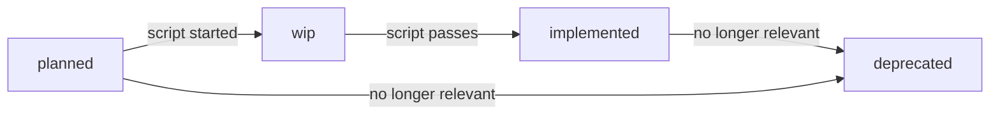

# Feature: Acceptance Criteria

**Status:** Conceptual

## Summary

Acceptance criteria (ACs) are first-class, individually addressable artifacts that define verifiable conditions a feature or plan step must satisfy. Each AC is a separate markdown file with a status, description, typed inputs, and a bash verification script. ACs bridge the gap between prose specifications and executable validation.

## Problem

Synchestra features describe desired behavior in prose, and development plans list acceptance criteria inline as bullet points. But there is no structured, reusable unit of verification:

- **No executable link from spec to test.** "This feature should do X" has no corresponding "this script verifies X."
- **No reuse.** The same assertion ("project appears in list after creation") is re-described in multiple plans, features, and test scenarios. Without a canonical, addressable unit, each context re-implements or re-states the check.
- **No lifecycle tracking.** There is no way to know which acceptance criteria have verification scripts, which are still prose-only, and which are outdated.

## Behavior

### AC file location

Each feature can define acceptance criteria in an `_acs/` subdirectory:

```
spec/features/{feature}/_acs/
  README.md             <- AC index for this feature
  {ac-slug}.md          <- individual AC
```

The `_acs/` directory uses the reserved `_` prefix convention — it is not a sub-feature and is excluded from the feature index and Contents table.

### AC file format

Each AC is a separate `.md` file:

```markdown
# AC: {ac-slug}

**Status:** {status}
**Feature:** [{feature-name}](../README.md)

## Description

What this AC verifies — one to three sentences.

## Inputs

| Name | Required | Description |
|---|---|---|
| input_name | Yes | What this input represents |
| optional_input | No | Optional context |

## Verification

```bash
# Bash script that exits 0 on success, non-zero on failure.
# Inputs are available as environment variables: $input_name, $optional_input
test -f "$input_name/expected-file.yaml"
```

## Scenarios

| Scenario | Step |
|---|---|
| [project-lifecycle](../../../tests/project-lifecycle.md) | verify-configs |

(Or: "(None yet.)" if no scenarios reference this AC.)
```

### AC identification

ACs are identified by their feature path and slug:

| AC path | Identifier |
|---|---|
| `spec/features/cli/project/new/_acs/creates-spec-config.md` | `cli/project/new/creates-spec-config` |
| `spec/features/cli/project/remove/_acs/not-in-list.md` | `cli/project/remove/not-in-list` |

### AC statuses

| Status | Description |
|---|---|
| `planned` | AC is described but has no verification script yet |
| `wip` | Verification script is being written/tested |
| `implemented` | Verification script exists and passes |
| `deprecated` | AC is no longer relevant |



### Mandatory AC section in feature READMEs

Every feature README must include an **Acceptance Criteria** section. When ACs are defined, it contains a summary table:

```markdown
## Acceptance Criteria

| AC | Description | Status |
|---|---|---|
| [creates-spec-config](_acs/creates-spec-config.md) | synchestra-spec.yaml created in spec repo | implemented |
| [creates-state-config](_acs/creates-state-config.md) | synchestra-state.yaml created in state repo | implemented |
```

When no ACs are defined yet, the section states:

```markdown
## Acceptance Criteria

Not defined yet.
```

And the Outstanding Questions section must include a corresponding question: "Acceptance criteria not yet defined for this feature."

### Relationship to development plan ACs

Feature ACs and plan ACs are different artifacts with different lifecycles:

| AC type | Lives in | Answers | Lifecycle |
|---|---|---|---|
| **Feature AC** | `spec/features/{feature}/_acs/` | "How do we verify this feature works correctly?" | Evolves with the feature; long-lived |
| **Plan-level AC** | `spec/plans/{plan}/README.md` (inline or `_acs/` subdir) | "How do we verify this plan's goals were achieved?" | Frozen with the plan; immutable |
| **Plan step-level AC** | Within each plan step | "How do we verify this step's deliverable?" | Frozen with the plan; immutable |

Plan step ACs may *reference* feature ACs (e.g., "the feature AC `cli/project/remove/not-in-list` must pass after this step"), but they are not the same artifact. Feature ACs are the long-lived, canonical verification units. Plan ACs are scoped to a specific implementation effort.

When generating tasks from a plan, both plan step ACs and any referenced feature ACs are copied into the task description, giving agents clear verification targets.

### Validation rules

Validation tooling (lint/pre-commit) should check:

1. Every feature README has an `## Acceptance Criteria` section
2. If the section says "Not defined yet.", the Outstanding Questions section includes the corresponding question
3. Every `.md` file in `_acs/` (except README.md) is listed in the feature README AC table
4. Every entry in the feature README AC table has a corresponding `.md` file in `_acs/`
5. AC slugs are lowercase, hyphen-separated, and unique within the feature

## Interaction with Other Features

| Feature | Interaction |
|---|---|
| [Feature](../feature/README.md) | Features gain a mandatory Acceptance Criteria section and `_acs/` directory convention. The feature spec defines the structural rules; this feature defines what goes inside `_acs/`. |
| [Development Plan](../development-plan/README.md) | Plan step ACs may reference feature ACs. Plan-level ACs follow the same format but are frozen with the plan. |
| [Testing Framework](../testing-framework/README.md) | Test scenarios reference ACs via table syntax. The test runner resolves and executes AC verification scripts. |
| [Outstanding Questions](../outstanding-questions/README.md) | Missing ACs are surfaced as outstanding questions in the feature README. |

## Acceptance Criteria

Not defined yet.

## Outstanding Questions

- Acceptance criteria not yet defined for this feature.
- Should AC verification scripts be bash-only, or should the format support other interpreters via a shebang or language annotation?
- Should the `Scenarios` back-reference table in AC files be manually maintained or auto-generated by the test runner?
- Should there be a `synchestra ac list` CLI command for listing ACs across features, or is `synchestra feature info` sufficient?
