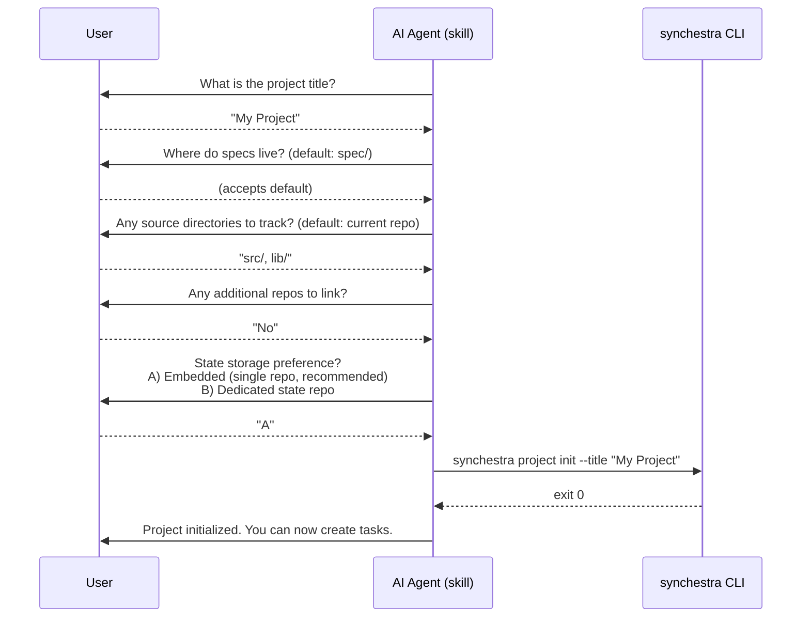

# Feature: Project Setup Skill

**Status:** Draft

## Summary

The project-setup skill is a conversational AI agent skill that guides users through configuring a new Synchestra project. It gathers project topology information through a series of questions, then executes the appropriate CLI commands (`synchestra project init` or `synchestra project new`) to set up the project. This replaces the need for users to understand Synchestra's configuration model upfront — the skill asks what it needs and handles the rest.

## Problem

Synchestra supports multiple project topologies: single-repo with embedded state, dedicated spec repo with separate state repo, and multi-repo configurations with code repos linked to a spec repo. New users don't know which topology fits their project, and the configuration files (`synchestra-spec-repo.yaml`, `synchestra-state-repo.yaml`) require understanding concepts like state branches, worktree paths, and spec roots before the user has any experience with the system.

The result is that onboarding requires reading documentation before running a single command. This is the opposite of the zero-friction experience Synchestra aims to provide.

## Design

### Conversational Flow

The skill operates as a guided conversation, not a single command invocation. It asks questions, validates answers, and builds up a project configuration before executing any CLI commands.



### Information Gathered

| Question | Purpose | Default | Maps to |
|---|---|---|---|
| Project title | Display name for the project | README heading or directory name | `--title` flag |
| Spec directory | Where specification files live | `spec/` | `spec_root` in config |
| Source directories | Directories containing implementation code | Repository root | `source_dirs` in config |
| Additional repos | Other git repos to link as code repos | None | `synchestra project code add` calls |
| State storage | Embedded (worktree) or dedicated repo | Embedded | `project init` vs `project new` |

### CLI Commands Used

The skill translates gathered information into CLI commands:

**Option A — Embedded state (single repo, default settings):**

```bash
synchestra project init --title "<title>"
```

This is the [config-less mode](../../embedded-state/README.md#config-less-mode) path. Task commands work immediately after init.

**Option B — Dedicated state repo:**

```bash
synchestra project new --title "<title>" --spec-root "<spec_root>"
```

Followed by, for each additional repo:

```bash
synchestra project code add <repo-url>
```

### Verification

After executing commands, the skill verifies success by running:

```bash
synchestra project info
```

If `project info` exits `0` and shows the expected configuration, the skill confirms success to the user. If it fails, the skill reports the error and suggests corrective actions.

## Trigger Conditions

The skill activates when:

- A user asks to "set up Synchestra" or "initialize a project"
- A user asks about project configuration or topology
- An agent detects no Synchestra configuration in the current repository and the user wants to start using task management
- A user asks "how do I get started with Synchestra?"

## Dependencies

- [embedded-state](../../embedded-state/README.md) — config-less mode and `project init` behavior
- [cli/project/init](../../cli/project/init/README.md) — the `project init` command spec
- [cli/project/new](../../cli/project/new/README.md) — the `project new` command spec
- [project-definition](../../project-definition/README.md) — repository types and layout conventions
- [agent-skills](../README.md) — skill format and distribution

## Outstanding Questions

None at this time.
