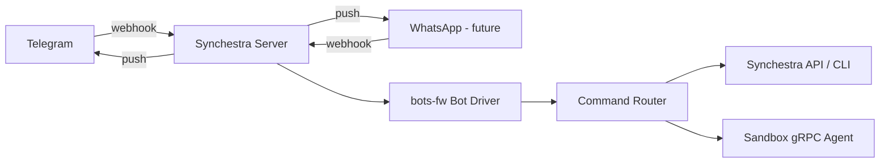

# Feature: SynchestraBot

**Status:** Conceptual

## Summary

A first-party messenger bot embedded in the Synchestra server that provides project management, sandbox container control, prompt relay to in-container agents, and bidirectional notifications. Telegram is the initial platform; the platform-agnostic architecture supports future expansion to WhatsApp and other messengers.

## Problem

The CLI, web UI, and TUI all require a dedicated terminal or browser session. For lightweight, frequent operations -- checking a task's status, sending a quick prompt to an agent, getting notified when a container crashes -- users need a channel that fits into their existing communication flow. A messenger bot puts Synchestra in the same app where teams already coordinate, making it possible to steer agents from a phone or while context-switched into another tool.

## Behavior

### Platform Architecture

SynchestraBot is built on [bots-go-framework/bots-fw](https://github.com/bots-go-framework/bots-fw) and [bots-go-framework/bots-fw-telegram](https://github.com/bots-go-framework/bots-fw-telegram). The framework provides:

- **Platform abstraction** -- a single bot driver with per-platform webhook handlers, allowing new messengers to be added without rewriting command logic.
- **Webhook-based** -- Telegram (and future platforms) deliver updates via webhooks registered on the Synchestra server's HTTP router.

The bot webhook handler is registered on the Synchestra server's HTTP router alongside the REST API. No separate process or deployment is needed.



### Authentication and Linking

Users must link their messenger account to their Synchestra identity before using the bot. The linking flow:

1. User sends `/start` to SynchestraBot in Telegram.
2. Bot responds with a one-time linking URL pointing to the Synchestra web UI (or a CLI command alternative).
3. User authenticates with Synchestra and confirms the link.
4. Bot receives confirmation and stores the `messenger_user_id -> synchestra_user_id` mapping.
5. Subsequent messages are authorized against the linked Synchestra identity.

Unlinking is available via `/unlink`. A user can link multiple messenger accounts to the same Synchestra identity.

### Conversation Model

- **Private chat only** -- the bot operates in one-on-one conversations. Group/channel support is out of scope.
- **Sticky active project** -- users set an active project; all subsequent commands and prompts target that project until explicitly switched. On first interaction after linking, the bot prompts the user to select a project if they have more than one.

### Command Categories

#### 1. Synchestra Commands

Platform-level operations that mirror CLI semantics.

| Command | Description |
|---|---|
| `/projects` | List all accessible projects |
| `/project <name>` | Switch active project |
| `/project` | Show current active project |
| `/tasks` | List tasks for active project (mirrors `synchestra task list`) |
| `/task <id>` | Show task detail/status |
| `/help` | List available commands |

#### 2. Container Management

Control the active project's sandbox container.

| Command | Description |
|---|---|
| `/container start` | Start the project's sandbox container |
| `/container stop` | Gracefully stop the container |
| `/container restart` | Restart the container |
| `/container status` | Show container state (running, stopped, etc.) |
| `/container shutdown` | Shut down and remove the container |

#### 3. Prompt Relay

Any message that is not a recognized command is treated as a prompt and forwarded to the active project's container agent.

- **Simple prompts** are relayed directly to the sandbox agent via gRPC, and the response is streamed back to the user as Telegram messages.
- **Complex workflows** (detected by the agent or triggered by explicit syntax, e.g., `/chat create-proposal ...`) route through the [chat](../chat/README.md) feature, creating a server-managed conversation that produces Synchestra artifacts.

The bot maintains conversational context per project so follow-up messages are coherent without repeating the full prompt.

### Notifications (Bot-to-User)

The bot proactively pushes notifications to linked users. This replaces and extends the existing Telegram notification configuration in the self-hosting config.

| Event | Description |
|---|---|
| `task_completed` | A task in the user's project completed |
| `task_failed` | A task failed |
| `task_blocked` | A task is blocked and needs attention |
| `agent_needs_input` | The agent in the container is waiting for user input |
| `container_started` | Container started successfully |
| `container_stopped` | Container stopped (expected or unexpected) |
| `container_crashed` | Container terminated unexpectedly |

Users can configure which events they receive via `/notifications` settings (per-project granularity). Notifications include actionable context -- task IDs, error summaries, and inline keyboard buttons for common follow-up actions (e.g., "View Task", "Restart Container").

### Response Formatting

- Bot responses use Telegram's MarkdownV2 formatting for code blocks, task IDs, and status labels.
- Long outputs (e.g., task lists, agent responses) are paginated or collapsed with "Show more" buttons using Telegram inline keyboards.
- Streaming agent responses are sent as message edits to avoid flooding the chat.

### Error Handling

- If no project is active and a command requires one, the bot prompts the user to select a project.
- If the target container is not running, container commands return a clear status message and suggest `/container start`.
- If the linked Synchestra account loses access to a project, the bot notifies the user and clears the active project.
- Network/server errors are reported with a retry suggestion.

### Configuration

The bot is configured in the Synchestra server configuration:

```yaml
bots:
  synchestra_bot:
    telegram:
      enabled: true
      token: ${TELEGRAM_BOT_TOKEN}  # or inline
      webhook_path: /bot/tg         # default
```

Future platforms are added as sibling keys under `synchestra_bot` (e.g., `whatsapp`).

### Interaction with Other Features

- **[sandbox](../sandbox/README.md)** -- container lifecycle commands map to the sandbox orchestrator API. Prompt relay uses the sandbox gRPC agent.
- **[chat](../chat/README.md)** -- complex workflows create chat sessions anchored to the active project. The bot acts as the transport layer for the chat's conversational interface.
- **[api](../api/README.md)** -- Synchestra commands (projects, tasks) use the internal API, same as the web UI and CLI.
- **[state-store](../state-store/README.md)** -- user-messenger linking and notification preferences are persisted via the state store.
- **[global-config](../global-config/README.md)** -- server-level bot configuration (tokens, enabled platforms).

## Acceptance Criteria

Not defined yet.

## Outstanding Questions

- Should the bot support Telegram inline mode (responding to `@SynchestraBot` queries in any chat) for quick lookups like task status?
- What is the rate limiting strategy for prompt relay to prevent abuse or accidental token burn?
- Should notification preferences sync with any existing notification configuration, or is the bot its own independent notification channel?
- How should the bot handle concurrent prompts to the same container (queue, reject, or allow parallel)?
- Should the linking flow support team-level linking (e.g., a shared Telegram group linked to a project) in a future iteration, or is that covered by the "group support" extension?
