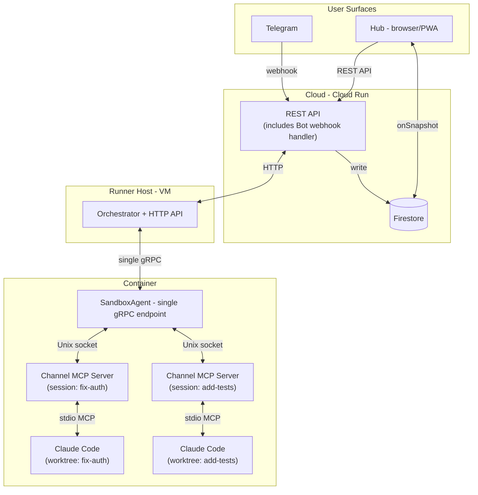
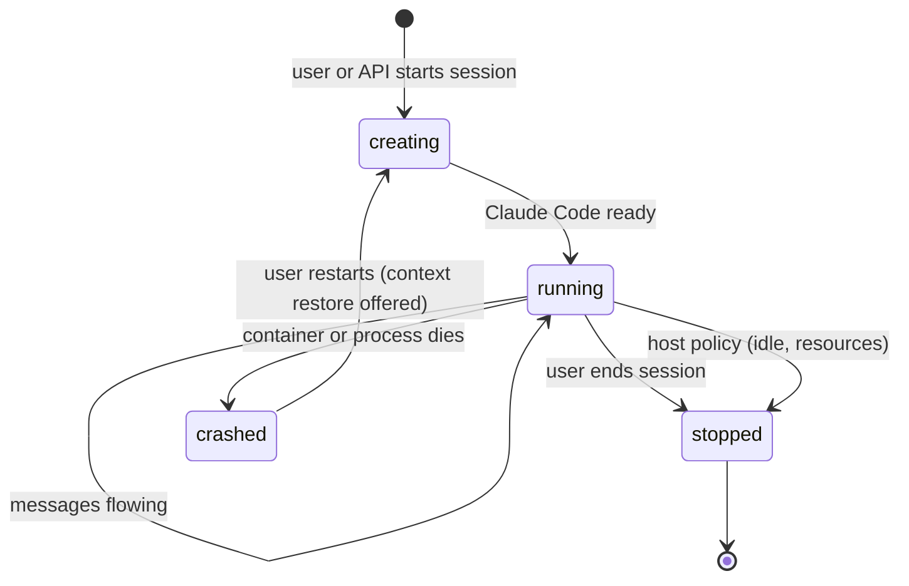
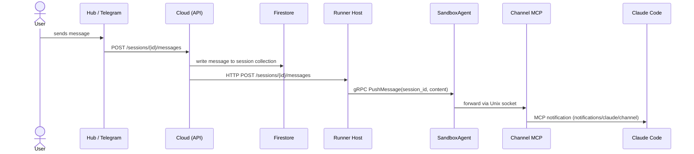
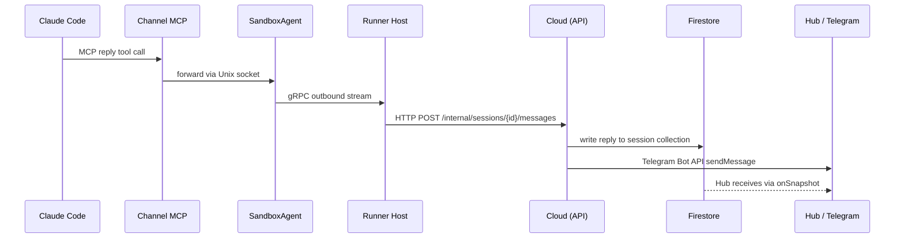

# Feature: Channels

**Status:** Conceptual

## Summary

Channels provide bidirectional, real-time messaging between users and Claude Code instances running inside sandbox containers on remote runners. Users interact from the Hub (browser) or Telegram; messages flow through the Synchestra cloud layer to the runner host, into the container, and reach Claude Code via a local MCP channel server. Replies flow the reverse path.

The feature spans multiple layers of the platform: cloud API, Firestore persistence, runner host routing, sandbox agent gRPC extensions, and an in-container MCP channel server that implements the [Claude Code channels protocol](https://code.claude.com/docs/en/channels-reference).

## Problem

Synchestra can orchestrate AI agents inside sandbox containers, but users have no way to interact with a running Claude Code instance from outside the terminal where it was launched. This creates three gaps:

1. **No remote interaction** --- Users managing agents from the Hub or a mobile device cannot send messages to or receive replies from Claude Code running on a remote runner.
2. **No permission relay** --- Claude Code blocks on tool-approval prompts that nobody can answer because the user is not at the container's terminal.
3. **No message persistence** --- If the user disconnects (closes the Hub tab, loses network), in-flight messages are lost. There is no durable record of the conversation for context restoration.

## Behavior

### Architecture overview



### Key entities

- **Session** --- 1:1 with a Claude Code instance. Identified by a Synchestra-owned `session_id` that also serves as the git worktree name. An optional `session_title` provides a human-readable display label.
- **Channel MCP server** --- A Go binary spawned by Claude Code as a subprocess inside the container. Bridges the Claude Code MCP channel protocol to the sandbox agent over a Unix socket. Identified by the `SYNCHESTRA_SESSION` environment variable.
- **Sandbox agent** --- Single gRPC endpoint per container. Routes messages to the correct channel MCP server by session ID. Extended with messaging and session management RPCs.
- **Cloud** --- Stateless API layer (Cloud Run). Receives messages, writes to Firestore, forwards to runner host via HTTP. The Telegram bot webhook handler is one of its API endpoints.
- **Runner host** --- VM with a public IP address. Registers with the cloud and re-registers every 60 seconds (heartbeat + IP change detection). Manages container lifecycle and maintains a single gRPC connection per container.

### Session types

Every Claude Code execution is a session. Interactive and non-interactive sessions differ only by configuration, not architecture:

| Parameter | Interactive session | Non-interactive session |
|---|---|---|
| Channel MCP server | Started, real-time messaging | Not started |
| User interaction | Bidirectional via channels | None during execution |
| Prompt delivery | Via channel messages | CLI argument |
| Exit behavior | Runs until user stops or timeout | Exits when task completes |

### Session lifecycle



**Starting a session:**

1. User requests a session (via Hub, Telegram, or API), optionally provides a session ID and title.
2. Cloud assigns the session ID (user-provided or generated), writes session record to Firestore.
3. Cloud resolves which runner host should run the session (initially single host; placement logic is future work).
4. Cloud sends an HTTP request to the runner host to start the session (the host's HTTP API is an internal contract between cloud and host, not the public-facing Cloud API).
5. Host creates the git worktree (worktree name = session ID), starts Claude Code with `SYNCHESTRA_SESSION={session_id}`.
6. If interactive: Claude Code spawns the channel MCP server, which connects to the sandbox agent via Unix socket and registers with its session ID.
7. Host confirms ready to cloud.
8. Cloud updates session status in Firestore; user sees "session ready."

**Stopping a session:**

1. Stop triggered by: user request, host policy (idle timeout, resource eviction, maintenance), or API call.
2. Cloud (or host, if host-initiated) signals Claude Code to shut down gracefully.
3. Channel MCP server disconnects; sandbox agent removes the routing entry.
4. Host reports session ended to cloud.
5. Cloud updates Firestore status; applies retention policy to message history.

**Crash recovery:**

1. Host detects Claude Code or container crash.
2. Host notifies cloud.
3. Cloud updates Firestore session status.
4. User sees "session crashed" in Hub or receives Telegram notification.
5. User can start a new session. Synchestra offers to restore context from the Firestore message history.

### Message flows

#### Inbound: User to Claude Code



#### Outbound: Claude Code to User



### Message persistence and delivery

Firestore is the source of truth for all chat messages in both directions.

**Write path (both directions):**

1. Message arrives at cloud (from Hub, Telegram, or runner host).
2. Cloud writes to the Firestore session messages collection.
3. If destination is the runner host: cloud delivers via HTTP POST.
4. If destination is the user: Telegram receives via Bot API; Hub receives via Firestore onSnapshot.

**Offline handling:**

- **Host unreachable:** Cloud stores message in Firestore. On next heartbeat (host re-registers), cloud retries delivery of queued messages in order.
- **Hub tab closed:** Messages accumulate in Firestore. When user reopens Hub, onSnapshot picks up all missed messages. The onSnapshot subscription also serves as a delivery receipt for messages the user sent.
- **Host crashes mid-session:** Session is lost. Queued undelivered messages and full conversation history remain in Firestore for context restoration when starting a new session.

**Message retention:**

Conversation history (both directions) is persisted in Firestore. Cleanup occurs on intentional session end or according to a configurable retention policy.

### Permission relay

Permission relay uses the same message transport as regular chat. When Claude Code opens a tool-approval prompt, the channel MCP server receives a `permission_request` notification and forwards it through the standard outbound path. The user's verdict (allow/deny) flows back through the standard inbound path.

From the Synchestra infrastructure perspective, permission requests and verdicts are regular messages with specific `meta.type` values. No separate routing or protocol is needed.

In Telegram, permission prompts are rendered as inline keyboard buttons (Allow / Deny). In Hub, they are rendered as a UI component within the chat view.

### Multiple concurrent sessions

A user can run multiple concurrent sessions, each on a separate git worktree within the same container or across containers:

- Each session has a unique `session_id` (= worktree name).
- Each interactive session has its own channel MCP server process, identified by `SYNCHESTRA_SESSION`.
- The sandbox agent maintains a routing table: `session_id -> Unix socket path`.
- The channel MCP server registers itself on first connection to the agent by providing its session ID.

### Runner host registration

The runner host registers with the cloud on startup and re-registers every 60 seconds:

- Registration provides: `host_id`, `endpoint_url` (public HTTP), `capabilities`.
- Cloud stores the record in Firestore (cached for fast lookups).
- Cloud marks a host as offline if no heartbeat arrives within 2 or more TTL intervals.
- Host is responsible for detecting its own IP changes and re-registering immediately.

This aligns with the [runner](../runner/README.md) feature's lifecycle model (Registered -> Online -> Offline).

## gRPC proto additions

New RPCs added to the existing `synchestra.sandbox.v1.SandboxAgent` service for session management and messaging:

```protobuf
// ---- Session management ----

// Start a Claude Code session on a worktree
rpc StartSession(StartSessionRequest) returns (StartSessionResponse) {}

// Stop a running session
rpc StopSession(StopSessionRequest) returns (StopSessionResponse) {}

// List active sessions with channel info
rpc ListChannelSessions(ListChannelSessionsRequest) returns (ListChannelSessionsResponse) {}

// ---- Messaging ----

// Push a message from user to a session's channel MCP server
rpc PushMessage(ChannelMessage) returns (ChannelMessageAck) {}

// Stream outbound messages (replies, permission prompts) from all sessions
rpc StreamOutbound(StreamOutboundRequest) returns (stream ChannelMessage) {}
```

### Messages

```protobuf
message StartSessionRequest {
  string session_id = 1;
  // Used as worktree name AND routing key.
  // Format: user-provided slug or generated (e.g., "fix-auth", "session-a7x3").

  string session_title = 2;
  // Optional. Human-readable display label.

  string project_id = 3;
  // Which project this session belongs to.

  bool interactive = 4;
  // If true: start with channel MCP server for real-time messaging.
  // If false: prompt-only execution, no channel.

  string prompt = 5;
  // For non-interactive: the prompt to pass as CLI arg.
  // For interactive: optional initial prompt to seed the session.

  map<string, string> env_vars = 6;
  // Additional env vars for Claude Code (API keys, model config, etc.).
}

message StartSessionResponse {
  bool success = 1;
  string error_message = 2;
  string worktree_path = 3;
  // Absolute path to the created worktree inside the container.
}

message StopSessionRequest {
  string session_id = 1;
  string reason = 2;
  // "user_requested", "idle_timeout", "resource_eviction", "maintenance".
}

message StopSessionResponse {
  bool success = 1;
  string error_message = 2;
}

message ChannelMessage {
  string session_id = 1;
  // Routes to the correct channel MCP server.

  string message_id = 2;
  // Unique message ID for dedup and ack.

  string content = 3;
  // Message body.

  map<string, string> meta = 4;
  // Routing context passed through to the <channel> tag attributes.
  // e.g., sender, source_platform ("hub", "telegram"), type ("message", "permission_request", "permission_verdict").

  string direction = 5;
  // "inbound" (user -> Claude) or "outbound" (Claude -> user).

  google.protobuf.Timestamp created_at = 6;
  // When the message was originally created (user typed it / Claude produced it).
}

message ChannelMessageAck {
  string message_id = 1;
  bool delivered = 2;
  string error_message = 3;
  // e.g., "session not found", "channel not connected".
}

message StreamOutboundRequest {
  // Empty. Streams all outbound messages from all sessions in this container.
  // Host filters by session as needed.
}

message ListChannelSessionsRequest {}

message ListChannelSessionsResponse {
  repeated ChannelSessionInfo sessions = 1;
}

message ChannelSessionInfo {
  string session_id = 1;
  string session_title = 2;
  string project_id = 3;
  bool interactive = 4;
  bool channel_connected = 5;
  // True if the channel MCP server has connected to the agent.
  string worktree_path = 6;
  google.protobuf.Timestamp started_at = 7;
}
```

### Design notes

- **`StreamOutbound`** is a single server-streaming RPC. The host opens it once per container and receives all outbound messages from all sessions. This avoids per-session streams or polling.
- **`PushMessage`** is unary: one message in, one ack out.
- **Session start/stop** is explicit. The host tells the agent when to create worktrees and launch Claude Code. The agent reports crashes and policy shutdowns through `StreamOutbound` as system messages.

## Channel MCP server (in-container)

A Synchestra-owned Go binary that Claude Code spawns as a subprocess. It bridges the Claude Code MCP channel protocol to the sandbox agent over a Unix socket.

**Shipped in:** The container image, alongside the sandbox agent.

**Launched by:** Claude Code, configured via `.mcp.json` in the worktree:

```json
{
  "mcpServers": {
    "synchestra-channel": {
      "command": "/usr/local/bin/synchestra-channel",
      "args": ["--agent-sock", "/var/run/synchestra-{project_id}.sock"]
    }
  }
}
```

The `SYNCHESTRA_SESSION` env var is set by the sandbox agent when starting Claude Code. The channel server reads it to identify itself.

### MCP configuration

| Field | Value |
|---|---|
| Server name | `synchestra-channel` |
| `experimental['claude/channel']` | `{}` (registers notification listener) |
| `experimental['claude/channel/permission']` | `{}` (enables permission relay) |
| `capabilities.tools` | `{}` (exposes reply tool) |
| Instructions | Tells Claude how to handle `<channel>` tags and use the reply tool |

### Reply tool

```json
{
  "name": "reply",
  "description": "Send a message back to the user",
  "inputSchema": {
    "type": "object",
    "properties": {
      "text": { "type": "string", "description": "The message to send" }
    },
    "required": ["text"]
  }
}
```

The channel server knows its own session from `SYNCHESTRA_SESSION`. Claude only needs to provide the message text.

### Unix socket protocol (channel server to sandbox agent)

The channel server connects to the sandbox agent's Unix socket on startup and registers with its session ID. Messages are exchanged as newline-delimited JSON:

```jsonl
{"type":"register","session_id":"fix-auth"}
{"type":"message","message_id":"msg_123","content":"fix the login bug","meta":{"sender":"alex","source_platform":"hub"},"created_at":"2026-03-25T10:00:00Z"}
{"type":"reply","message_id":"msg_124","content":"I'll look into the login handler...","created_at":"2026-03-25T10:00:05Z"}
{"type":"permission_request","request_id":"abcde","tool_name":"Bash","description":"run npm test","input_preview":"npm test"}
{"type":"permission_verdict","request_id":"abcde","behavior":"allow"}
```

## Cloud API

### Host management

| Method | Path | Description |
|---|---|---|
| `POST` | `/hosts/register` | Register or heartbeat. Body: `{host_id, endpoint_url, capabilities}`. Called every 60s. |

### Session management

| Method | Path | Description |
|---|---|---|
| `POST` | `/sessions` | Create a session. Body: `{project_id, session_id?, session_title?, interactive}`. Returns `{session_id, host_id}`. |
| `DELETE` | `/sessions/{session_id}` | Stop a session. Cloud forwards stop to host. |
| `GET` | `/sessions` | List sessions for authenticated user. |
| `GET` | `/sessions/{session_id}` | Session status and metadata. |

### Messaging

| Method | Path | Description |
|---|---|---|
| `POST` | `/sessions/{session_id}/messages` | Send a message to a session. Used by Hub and Telegram bot handler. |

### Host-facing (called by runner host)

| Method | Path | Description |
|---|---|---|
| `POST` | `/internal/sessions/{session_id}/messages` | Host delivers outbound messages (Claude's replies). Cloud writes to Firestore. |
| `POST` | `/internal/sessions/{session_id}/status` | Host reports session status changes (crashed, stopped by policy, ready). |

## Firestore schema

```
hosts/{host_id}
  - endpoint_url: string
  - capabilities: map
  - last_seen: timestamp
  - status: "online" | "offline"

sessions/{session_id}
  - project_id: string
  - user_id: string
  - host_id: string
  - session_title: string | null
  - interactive: boolean
  - status: "creating" | "running" | "stopped" | "crashed"
  - created_at: timestamp
  - updated_at: timestamp

sessions/{session_id}/messages/{message_id}
  - content: string
  - direction: "inbound" | "outbound"
  - meta: map
  - created_at: timestamp
  - processed: boolean
```

Hub subscribes to `sessions/{session_id}/messages` via Firestore onSnapshot for real-time updates in both directions. Session status changes are visible via `sessions/{session_id}` onSnapshot. The Hub is implemented with Angular and PrimeNG (not Ionic as noted in the Hub spec — that spec will be updated).

## Telegram bot integration

The Telegram bot handler is an API endpoint on the cloud (`POST /bot/tg`), not a separate service. It participates in channels as a message source and sink.

**Inbound (Telegram user to Claude Code):**

1. Telegram delivers webhook to the cloud.
2. Bot handler resolves `telegram_user_id` to `synchestra_user_id` (existing linking flow from [SynchestraBot](../bots/synchestra-bot/README.md) spec).
3. Bot handler resolves the user's active session (from Firestore, or user selects via inline keyboard).
4. Bot handler writes message to Firestore and forwards to runner host --- same path as Hub.

**Outbound (Claude Code to Telegram user):**

Cloud receives the outbound message from the runner host, writes to Firestore, and calls the Telegram Bot API `sendMessage` to the linked chat.

**Channel meta for Telegram messages:**

```json
{
  "source_platform": "telegram",
  "sender": "alex",
  "telegram_chat_id": "123456"
}
```

**Session management via Telegram** uses the existing bot commands:

| Bot command | Action |
|---|---|
| `/sessions` | List active sessions |
| `/session {id}` | Set active session for this chat |
| Non-command text | Send to active session |

**Permission relay in Telegram** renders as inline keyboard buttons (Allow / Deny). The user's tap is sent as a message with `meta.type: "permission_verdict"`.

## Interaction with other features

| Feature | Interaction |
|---|---|
| [Runner](../runner/README.md) | Runner hosts are the compute layer. Channels extends runner sessions with real-time messaging. Host registration and heartbeat align with the runner lifecycle model. |
| [Sandbox](../sandbox/README.md) | The sandbox agent is extended with messaging RPCs. The channel MCP server ships in the container image. |
| [Chat](../chat/README.md) | Chat defines server-managed conversations that produce artifacts. Channel sessions may trigger chat workflows. |
| [Hub](../ui/hub/README.md) | Hub is a user surface for channels. Subscribes to Firestore for real-time messages. |
| [SynchestraBot](../bots/synchestra-bot/README.md) | Telegram is a user surface for channels. Bot webhook handler writes messages to the same pipeline as Hub. |
| [API](../api/README.md) | Cloud API endpoints for session and message management. |
| [State Store](../state-store/README.md) | Firestore is the persistence layer for sessions and messages. |

## Acceptance criteria

Not defined yet.

## Outstanding Questions

1. What is the session ID format --- slug-only (e.g., `fix-auth`), prefixed (e.g., `ses-fix-auth`), or UUID-based? Slugs are user-friendly but risk collisions across users.
2. Should the cloud attempt to deliver queued messages to the host in a single batch on reconnection, or one at a time?
3. What is the maximum message size? Large outputs (e.g., full file diffs) may need chunking or a reference-based approach (store in Firestore, send a link).
4. Should the `processed` field on Firestore messages be a boolean flag or should processed messages be deleted? Deletion is simpler; flags allow auditing.
5. How should the cloud authenticate HTTP calls to the runner host? API key exchanged during registration, mTLS, or short-lived tokens?
6. Should the channel MCP server support file attachments (images, logs) or is text-only sufficient for MVP?
7. What is the retention policy default --- keep history indefinitely, 7 days, 30 days, or until explicit session cleanup?
8. How does the channel MCP server handle Claude Code restarts within the same session (e.g., Claude Code crashes but the container and worktree survive)?
