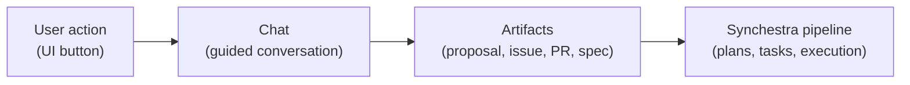
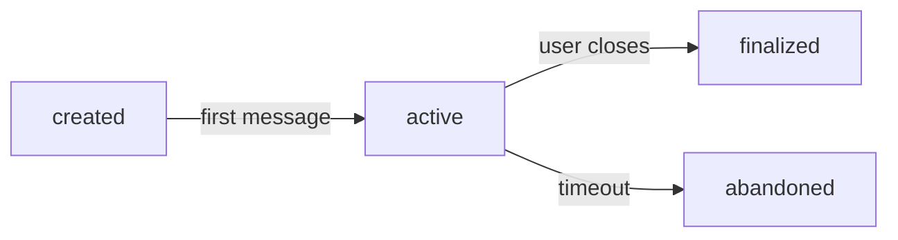

# Feature: Chat

**Status:** Conceptual

## Summary

A chat is a server-managed, goal-oriented conversation between a human user and an AI agent. It is the implementation layer behind user-facing actions such as "Create a Proposal," "Raise an Issue," or "Tweak Document." Users never interact with chats directly — they interact with [workflows](workflow/README.md) that use chats under the hood.

Chats are the mechanism through which Synchestra turns a user's intent into concrete artifacts: proposals, issues, feature specs, code changes, and pull requests. A user anchors a chat to a document (or creates a new one), and the system guides them through a structured conversation that produces reviewable output.

## Contents

| Directory | Description |
|---|---|
| [workflow/](workflow/README.md) | Workflow definitions: declarative recipes that configure what happens when a user initiates an action |

### workflow

Workflows are declarative YAML recipes that bridge user-facing actions to the chat mechanics. Each workflow specifies what context to load, what AI prompt/skill to use, what steps to follow, what artifacts can be produced, and who can use it. Synchestra ships with built-in workflows (Create Proposal, Create Feature, Raise Issue, Tweak Document) and is architecturally designed to support user-defined workflows in the future.

## Problem

Synchestra has a well-defined pipeline for going from specifications to executed tasks: features describe what to build, development plans describe how to build it, and tasks track who is doing what. But entering this pipeline today requires manual authorship — a human writes a proposal, creates a plan, or files an issue outside Synchestra entirely.

This creates three problems:

- **High barrier to contribution.** Contributing to a project requires understanding Synchestra's document conventions, proposal format, and plan structure. A user with a good idea but no familiarity with the system cannot easily participate.
- **Disconnected feedback loops.** Ideas, issues, and change requests originate in external systems (GitHub Issues, Slack, email) and lose context when they are later translated into Synchestra artifacts.
- **Wasted latency.** A simple change that a maintainer could implement in minutes still requires the full ceremony of proposal, plan, task generation, and execution as separate steps.

Chat solves these by providing a guided, conversational interface that meets users where they are and produces Synchestra-native artifacts as output.

## Design Philosophy

Chats are **operational scaffolding, not deliverables.** The value is in the artifacts they produce (proposals, issues, PRs, feature specs), not in the conversation itself. A chat is a means to an end.

Chats are the **primary entry point into the Synchestra pipeline.** Rather than requiring users to learn document conventions and manually author specs, chats guide users through structured conversations that produce well-formed artifacts. The system handles the formatting, cross-referencing, and pipeline integration.



## Behavior

### Anchor

Every chat is anchored to a document, a section of a document, or a not-yet-existing entity. The anchor defines the primary context the AI agent receives.

| Anchor type | Example | Behavior |
|---|---|---|
| Existing document | `spec/features/auth/README.md` | Load and use as context |
| Section of existing document | `spec/features/auth/README.md#permissions` | Load section as primary context |
| Non-existing entity | "New feature" from `/features/` | Chat creates the entity in a new branch, then anchors to it |
| Code file | `src/api/auth.ts` | Load file as context (requires repo reference) |

The anchor is specified in the chat metadata alongside optional repository and branch references:

```yaml
anchor: spec/features/auth/README.md
repo: github.com/myorg/myapp    # optional, defaults to spec repo
branch: feature/add-mfa         # optional, null = default branch
workflow: create-proposal
status: active
user: "@alex"
created: 2026-03-14
updated: 2026-03-14
```

#### Anchor resolution rules

| `repo` | `branch` | Meaning |
|---|---|---|
| omitted | omitted | Spec repo, default branch |
| omitted | set | Spec repo, specific branch (new entity being created) |
| set | omitted | Code repo, default branch (existing file) |
| set | set | Code repo, specific branch (tweak in progress) |

The `repo` field uses the same repository identifiers configured in `synchestra-project.yaml` under code repo URLs.

### Lifecycle



- **Created:** chat directory exists in state repo, metadata is set, no messages yet.
- **Active:** user and AI are exchanging messages. Artifacts may be produced during this phase. User can leave and return at any time.
- **Finalized:** user explicitly closes the chat. Produced artifacts are in their final state. Message history is flushed to git per the project's retention policy.
- **Abandoned:** chat left inactive beyond a configurable timeout. System may auto-finalize or notify user before abandoning.

### Data model (state repo)

```
chats/
  {chat-id}/
    README.md        # metadata: anchor, workflow, status, user, created, updated
    artifacts/       # produced documents (proposals, issues, feature drafts, etc.)
    history.jsonl    # flushed on finalize/checkpoint — raw message log
```

During an active chat, messages are held server-side for real-time interaction. They are flushed to `history.jsonl` on finalization or at periodic checkpoints. This hybrid approach (Approach C from design) provides snappy web UX without commit-per-message overhead while maintaining git-backed permanence.

### Context passing to AI agents

When the server invokes a stateless AI agent for a chat turn, it assembles context from:

1. **Anchored document** — always loaded as primary context
2. **Current artifact state** — if a draft has been started, include its latest version
3. **Conversation window** — first N messages + last M messages + a compacted summary of the middle (sliding window with anchored edges)
4. **Workflow prompt/skill** — the system prompt that guides the agent's behavior for the current step
5. **Project-configured context** — additional documents specified in the workflow's `context.load` field

The exact context assembly strategy is an implementation detail that deserves its own feature specification. The key contract is: the agent receives enough context to continue the conversation coherently without access to the server's full message store.

### Chat retention

What happens to a chat after finalization is configurable per project or per workflow:

| Policy | Behavior |
|---|---|
| `archive` | Chat is marked as finalized and kept in the state repo indefinitely |
| `summarize` | Generate a summary, attach it to the produced artifact, then dispose of the raw conversation |
| `dispose` | Delete the chat directory after artifacts are committed |

```yaml
# synchestra-project.yaml
chat:
  retention: archive    # default retention policy: archive | summarize | dispose
  abandon_timeout: 7d   # time before inactive chats are abandoned
```

Individual workflows can override the project default via their own `retention` field.

### The two paths

Chats support two execution paths depending on the user's role and the change's complexity:

**Standard path (any user):**

```
Chat -> Artifact (proposal, issue, feature spec) -> [Review] -> Dev Plan -> Tasks -> Implementation -> PR
```

The chat produces documents that enter the normal Synchestra pipeline. Other humans or AI agents review, plan, and implement.

**Fast path (maintainers and authorized contributors):**

```
Chat -> Tasks + Implementation + Dev Plan (as report) -> PR
```

The system implements the change during the conversation and produces a development plan as a report of what was done. This path is available only to users with appropriate roles and only when the AI assesses the change as straightforward. The AI may suggest the fast path, or the user may request it.

**Fast-path constraints:**
- Limited to changes affecting a **single code repository.** Multi-repo changes require the standard path with a development plan and task status board to manage coordination.
- All code changes go through a **PR with CI validation**, regardless of path.

## Project Configuration

All chat-level settings in `synchestra-project.yaml`:

```yaml
chat:
  retention: archive          # default retention policy: archive | summarize | dispose
  abandon_timeout: 7d         # time before inactive chats are abandoned
```

Workflow-specific configuration is documented in the [Workflow](workflow/README.md) feature spec.

## Interaction with Other Features

| Feature | Interaction |
|---|---|
| [Feature](../feature/README.md) | Chats anchor to features. "Create Feature" workflow produces new feature specs. |
| [Proposals](../proposals/README.md) | "Create Proposal" workflow produces proposals under `features/{name}/proposals/`. Chats can also anchor to existing proposals. |
| [Development Plan](../development-plan/README.md) | Standard-path chats produce artifacts that later trigger plans. Fast-path chats produce plans as reports. Chats can anchor to existing plans for discussion. |
| [Task Status Board](../task-status-board/README.md) | Fast-path chats create tasks directly. Tasks spawned by chats appear on the board like any other tasks. |
| [Agent Skills](../agent-skills/README.md) | Workflow steps reference skills/prompts. The same skill infrastructure powers both chat-based and task-based agent work. |
| [CLI](../cli/README.md) | `synchestra chat list`, `synchestra chat info {id}` for admin and debugging. Chats are primarily a web UI concept. |
| [API](../api/README.md) | REST endpoints for chat lifecycle: create, send message, get status, finalize. The web UI consumes these. |
| [UI](../ui/README.md) | The web UI renders workflow action buttons on documents and provides the chat interface. Button visibility depends on document type and user role. |
| [Project Definition](../project-definition/README.md) | Chat and workflow configuration lives in `synchestra-project.yaml`. |

## Outstanding Questions

- Should chats support multiple participants (e.g., a user invites a teammate into an active chat), or is it strictly 1:1 between a human and the system?
- How should the context assembly strategy handle very long documents as anchors — should there be a size limit or automatic summarization of the anchor itself?
- Should finalized chats be linkable from the artifacts they produced (e.g., a proposal README links back to "this proposal was developed in chat X")?
- What is the exact `chat-id` format — UUID, timestamp-based, slug-based, or a combination?
