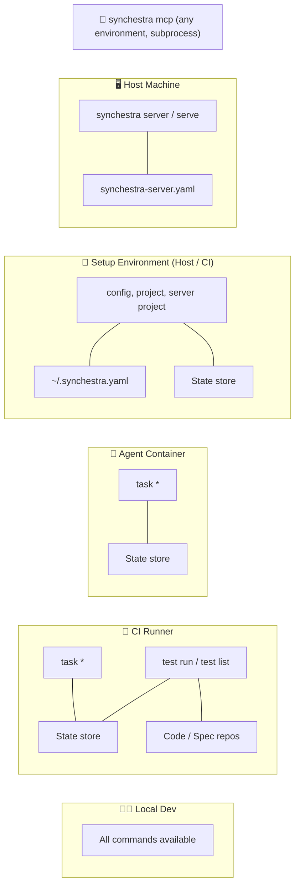

# Command Environments

**Status:** In Progress

## Summary

Every Synchestra CLI command is designed to run in a specific execution environment — or set of environments. This document categorizes all commands by where they run and what system resources they require.

Environment categorization matters because Synchestra coordinates work across heterogeneous environments: a host machine running the daemon, agent containers executing tasks, CI runners validating work, and developer laptops doing all of the above. Knowing which commands belong where prevents misconfiguration, clarifies deployment requirements, and helps agents understand their operational boundaries.

### State store abstraction

Coordination commands (`task *`) interact with project state through the [state store](../state-store/README.md) abstraction — a pluggable interface (`state.Store`) whose default implementation is git-backed (`gitstore`). Alternative backends (SQLite, PostgreSQL, cloud databases) can be used by satisfying the same interface. This document uses **"state store"** when describing what coordination commands require, not "git" — the storage backend is a project-level configuration choice, not an inherent requirement of the commands themselves.

## Environment Model



## Categories

### 1. 🖥️ Infrastructure — Host-only

Commands that manage the Synchestra server process lifecycle. Only meaningful on the machine hosting the daemon. These have no API equivalents — the daemon IS the API server, so managing it over its own HTTP interface would be circular.

| Command | Description | Type | Spec Reference |
|---|---|---|---|
| `synchestra server start` | Start background daemon | mutation | [server/start](server/start/README.md) |
| `synchestra server stop` | Stop daemon by PID | mutation | [server/stop](server/stop/README.md) |
| `synchestra server restart` | Stop then start daemon | mutation | [server/restart](server/restart/README.md) |
| `synchestra server status` | Show daemon status, PID, uptime | read | [server/status](server/status/README.md) |
| `synchestra serve` | Start foreground dev server (HTTP/HTTPS/MCP) | long-running | [serve](serve/README.md) |

**Environment requirements:**
- Host filesystem access (PID files, logs)
- `synchestra-server.yaml` configuration file
- Network ports for HTTP/HTTPS/MCP listeners

**Typical caller:** Human operator, systemd/launchd service manager, deployment script.

### 2. 🔧 Setup & Configuration — Human/Automation, typically Host

One-time or infrequent commands that establish the working environment. Run by humans or setup scripts before agents begin work — not called by agents mid-task.

| Command | Description | Type | Spec Reference |
|---|---|---|---|
| `synchestra config show` | Display effective config with defaults | read | [config/show](config/show/README.md) |
| `synchestra config set` | Set config values in ~/.synchestra.yaml | mutation | [config/set](config/set/README.md) |
| `synchestra config clear` | Clear config value back to default | mutation | [config/clear](config/clear/README.md) |
| `synchestra project new` | Create a new project, clone repos, commit+push | mutation | [project/new](project/new/README.md) |
| `synchestra project info` | Display project configuration | read | [project/info](project/info/README.md) |
| `synchestra project set` | Update project settings | mutation | [project/set](project/set/README.md) |
| `synchestra project code add` | Add a code repo to the project | mutation | [project/code/add](project/code/add/README.md) |
| `synchestra project code remove` | Remove a code repo from the project | mutation | [project/code/remove](project/code/remove/README.md) |
| `synchestra server project add` | Add project to server config | mutation | [server/project/add](server/project/add/README.md) |
| `synchestra server project list` | List projects in server config | read | [server/project/list](server/project/list/README.md) |

**Environment requirements:**
- `~/.synchestra.yaml` for config commands
- Git access to spec/code repositories for project commands (these repos are always git-backed)
- `synchestra-server.yaml` for server project commands

**Typical caller:** Human developer, setup/provisioning script, CI pipeline bootstrap step.

### 3. 🤖 Coordination — Agent environment (container, CI, local)

The core workflow commands for task lifecycle management. These are what agents call most frequently. All state operations go through the [state store](../state-store/README.md) abstraction — mutations are atomic (the backend determines the mechanism: git uses commit-and-push, SQL uses row-level locking), and reads ensure freshness before returning.

| Command | Description | Type | Spec Reference |
|---|---|---|---|
| `synchestra task new` | Create a new task in planning or queued | mutation | [task/new](task/new/README.md) |
| `synchestra task enqueue` | Move task from planning to queued | mutation | [task/enqueue](task/enqueue/README.md) |
| `synchestra task claim` | Claim a queued task (optimistic locking) | mutation | [task/claim](task/claim/README.md) |
| `synchestra task start` | Begin work on claimed task → in_progress | mutation | [task/start](task/start/README.md) |
| `synchestra task status` | Query task status | read | [task/status](task/status/README.md) |
| `synchestra task complete` | Mark task completed | mutation | [task/complete](task/complete/README.md) |
| `synchestra task fail` | Mark task failed with reason | mutation | [task/fail](task/fail/README.md) |
| `synchestra task block` | Mark task blocked with reason | mutation | [task/block](task/block/README.md) |
| `synchestra task unblock` | Resume blocked task → in_progress | mutation | [task/unblock](task/unblock/README.md) |
| `synchestra task release` | Release claimed task back to queued | mutation | [task/release](task/release/README.md) |
| `synchestra task abort` | Request abortion, sets abort_requested flag | mutation | [task/abort](task/abort/README.md) |
| `synchestra task aborted` | Report task has been aborted (terminal) | mutation | [task/aborted](task/aborted/README.md) |
| `synchestra task list` | List tasks with filtering | read | [task/list](task/list/README.md) |
| `synchestra task info` | Show full task details and context | read | [task/info](task/info/README.md) |

**Environment requirements:**
- Access to the project's [state store](../state-store/README.md) (git-backed by default, but backend-agnostic)
- Write access to the state store (for mutations)
- Network access when the state store backend requires it (e.g., git remote, database server)

**Typical caller:** AI agent (via CLI or MCP), human developer, orchestration script.

### 4. 🧪 Execution — Agent environment, needs code/spec access

Commands that operate on project content — running tests, validating specs. Require the spec repo (and potentially code repos) to be checked out locally.

| Command | Description | Type | Spec Reference |
|---|---|---|---|
| `synchestra test run` | Execute test scenarios | read | [test](test/README.md) |
| `synchestra test list` | List test scenarios | read | [test](test/README.md) |

**Environment requirements:**
- Spec repo checked out locally (for scenario definitions)
- Code repos checked out locally (for test execution, when applicable)
- Access to the state store (for result reporting)

**Typical caller:** AI agent, CI pipeline, human developer.

## Cross-cutting: Integration Bridges

### `synchestra mcp`

| Command | Description | Type | Spec Reference |
|---|---|---|---|
| `synchestra mcp` | Start stdio MCP server for AI agent tools | long-running | [mcp](mcp/README.md) |

`mcp` is not bound to a single environment category. It spawns as a subprocess of an AI agent host (Claude Code, Cursor, etc.) and exposes CLI capabilities via the [Model Context Protocol](https://modelcontextprotocol.io/). The MCP server can invoke any Synchestra command the calling environment has access to — which commands are actually available depends on where the subprocess is running.

**Environment requirements:** Whatever the underlying commands require. The MCP process itself only needs stdio.

**Typical caller:** AI agent host process (launched as a subprocess).

## Command Environment Matrix

Quick-reference table of every CLI command.

| Command | Category | Type | Requires |
|---|---|---|---|
| `config show` | 🔧 Setup | read | `~/.synchestra.yaml` |
| `config set` | 🔧 Setup | mutation | `~/.synchestra.yaml` |
| `config clear` | 🔧 Setup | mutation | `~/.synchestra.yaml` |
| `project new` | 🔧 Setup | mutation | git (spec + code repos) |
| `project info` | 🔧 Setup | read | `synchestra-spec-repo.yaml` |
| `project set` | 🔧 Setup | mutation | git (spec repo) |
| `project code add` | 🔧 Setup | mutation | git (spec repo) |
| `project code remove` | 🔧 Setup | mutation | git (spec repo) |
| `task new` | 🤖 Coordination | mutation | state store |
| `task enqueue` | 🤖 Coordination | mutation | state store |
| `task claim` | 🤖 Coordination | mutation | state store |
| `task start` | 🤖 Coordination | mutation | state store |
| `task status` | 🤖 Coordination | read | state store |
| `task complete` | 🤖 Coordination | mutation | state store |
| `task fail` | 🤖 Coordination | mutation | state store |
| `task block` | 🤖 Coordination | mutation | state store |
| `task unblock` | 🤖 Coordination | mutation | state store |
| `task release` | 🤖 Coordination | mutation | state store |
| `task abort` | 🤖 Coordination | mutation | state store |
| `task aborted` | 🤖 Coordination | mutation | state store |
| `task list` | 🤖 Coordination | read | state store |
| `task info` | 🤖 Coordination | read | state store |
| `server start` | 🖥️ Infrastructure | mutation | host filesystem, `synchestra-server.yaml` |
| `server stop` | 🖥️ Infrastructure | mutation | host filesystem (PID) |
| `server restart` | 🖥️ Infrastructure | mutation | host filesystem, `synchestra-server.yaml` |
| `server status` | 🖥️ Infrastructure | read | host filesystem (PID) |
| `server project add` | 🔧 Setup | mutation | `synchestra-server.yaml` |
| `server project list` | 🔧 Setup | read | `synchestra-server.yaml` |
| `serve` | 🖥️ Infrastructure | long-running | host filesystem, `synchestra-server.yaml`, network ports |
| `mcp` | 🔌 Bridge | long-running | stdio, depends on invoked commands |
| `test run` | 🧪 Execution | read | spec repo, code repos |
| `test list` | 🧪 Execution | read | spec repo |

## Annotating Individual Command Specs

Each command's own `README.md` should self-document its environment category. Add a metadata line immediately after the **Status** line:

```markdown
**Status:** Draft
**Environment:** Infrastructure (Host-only)
```

Valid values:

| Value | Meaning |
|---|---|
| `Infrastructure (Host-only)` | 🖥️ Server lifecycle, host machine only |
| `Setup & Configuration` | 🔧 One-time setup, typically host or CI |
| `Coordination (Agent)` | 🤖 Task lifecycle, any environment with state store access |
| `Execution (Agent)` | 🧪 Tests/validation, needs code/spec repos |
| `Integration Bridge` | 🔌 Cross-cutting subprocess |

This annotation makes each spec self-describing — tools and agents can read a command's environment from its own spec without consulting this document.

## Outstanding Questions

- Should the environment annotation proposed above be enforced by a linter or validation step?
- Do any coordination commands need a "degraded mode" when the state store is unreachable (e.g., local-only queueing)?
