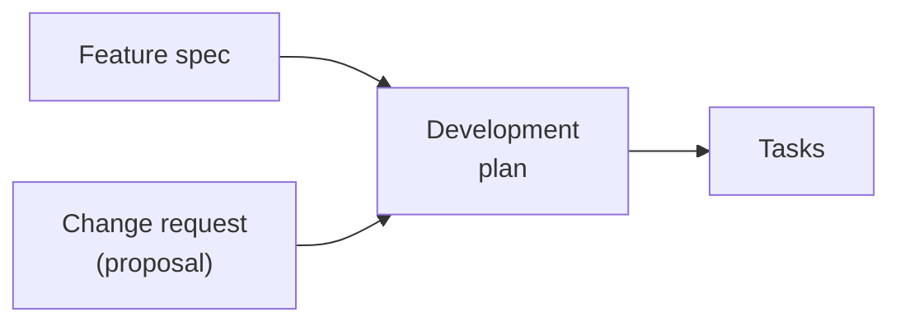
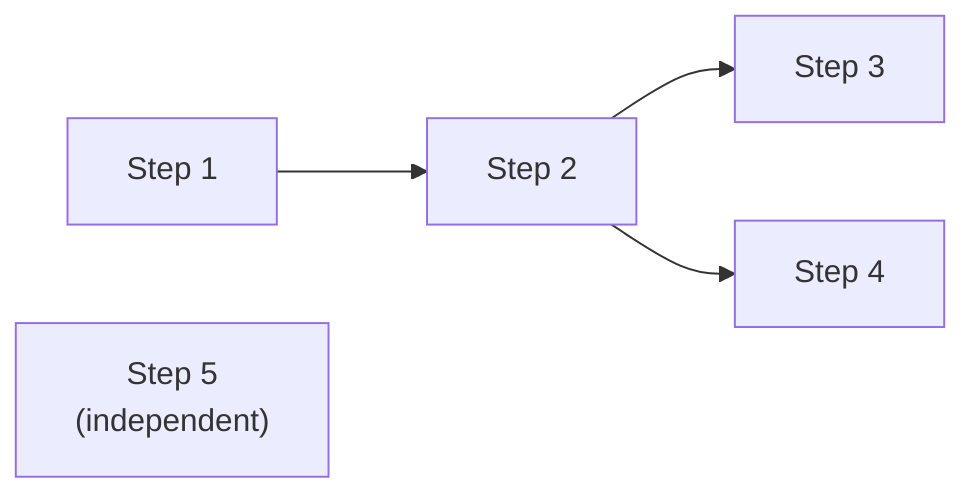
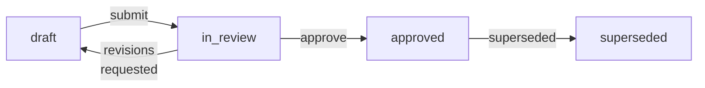
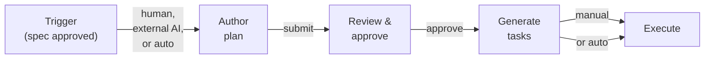
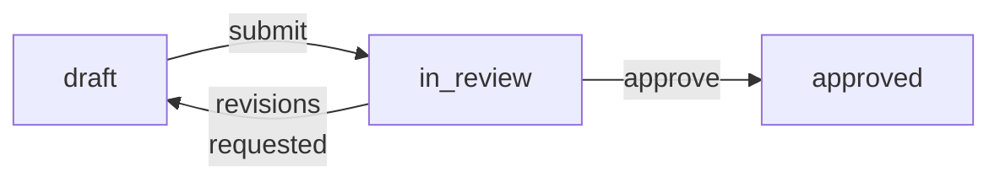
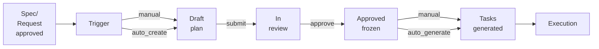
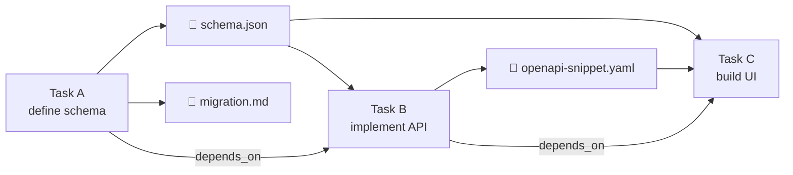

# Feature: Development Plan

**Status:** Conceptual

## Summary

A development plan bridges feature specifications and change requests to executable tasks. It is a short, flat, immutable document that captures the approach and rationale for implementing a piece of work. Once approved, it never changes — tasks evolve freely during execution while the plan remains a fixed reference point for review and retrospective.

## Problem

Synchestra has a well-defined task system: tasks live in the state repo, agents claim and execute them, and the task status board provides real-time visibility. But there is no structured way to go from "we know what to build" to "here are the tasks to execute."

Today that decomposition happens ad hoc — a human or AI agent reads a feature spec, mentally breaks it into steps, and manually creates tasks one by one. This creates three problems:

- **No review gate.** Work begins without explicit approval of the approach. A bad decomposition wastes agent time and compute.
- **No stable reference.** Tasks are designed to be fluid — agents add sub-tasks, humans cancel tasks, parallel work gets restructured. This fluidity is a feature of execution, but it means there is no fixed record of what was originally planned.
- **No retrospective anchor.** Without a snapshot of intent, you cannot compare what was planned against what actually happened. Lessons learned require a before-and-after.

## Design Philosophy

Synchestra separates **intent** from **execution** by design, with distinct artifacts for each stage of the workflow.

| Artifact | Question it answers | Audience | Mutability | Lives in |
|---|---|---|---|---|
| Feature spec | What do we want? | Product, engineering | Versioned | Spec repo |
| Change request | What should change in an existing feature? | Product, engineering | Versioned until approved | Spec repo |
| Development plan | How will we build it? | Reviewers, planners | Immutable once approved | Spec repo |
| Tasks | Who's doing what right now? | Agents, operators | Highly fluid | State repo |

A **feature spec** defines something new. A **change request** (implemented as a [proposal](../proposals/README.md)) mutates something that already exists. Both are *what* artifacts — they describe desired outcomes. The distinction matters because:

- **New features** start from a blank slate. The plan is unconstrained.
- **Change requests** operate on existing behavior. The plan must account for what is already there — migration paths, backward compatibility, affected dependents. The review process is different: reviewers need to understand the delta, not just the destination.

From the planning pipeline's perspective, both converge to the same output — a development plan that produces tasks:

```
Feature spec ──────┐
                   ├──→ Development plan ──→ Tasks
Change request ────┘
```



**Why not use the task tree as the plan?** Tasks are designed to be fluid. Agents add sub-tasks when they discover complexity. Humans cancel tasks when priorities shift. Parallel work gets restructured on the fly. This fluidity is a feature — it is how real development works. But fluidity is the enemy of reviewability. A human reviewer needs a stable, scannable document to approve before work begins. And after work completes, you need a fixed reference point to compare against.

**No duplicated status tracking.** The plan does not track completion — tasks do. Synchestra derives a progress view by mapping plan steps to their linked tasks and looking up live status. One source of truth, two views: the flat plan view for humans, the deep task tree for agents.

## Behavior

### Plan location

All plans live under `spec/plans/` in the spec repository:

```text
spec/plans/
  README.md              ← index of all plans
  {plan-slug}/
    README.md            ← the plan document
```

`{plan-slug}` is a URL/path-safe identifier (e.g., `add-batch-mode`, `user-auth`).

Plans always list their affected features. There is no distinction between single-feature and multi-feature plans — every plan uniformly declares the features it touches.

### Plan document structure

```markdown
# Plan: Add batch mode to CLI

**Status:** approved
**Features:**
  - [cli](../../features/cli/README.md)
**Source type:** feature
**Source:** [CLI feature spec](../../features/cli/)
**Author:** @alex
**Approver:** @jordan
**Created:** 2026-03-14
**Approved:** 2026-03-15

## Context

Why this plan exists. Links to the feature spec or the approved change
request (proposal) that triggered it. 2-5 sentences establishing the
problem and the high-level approach chosen.

## Acceptance criteria

- All new CLI flags appear in `synchestra --help` output
- End-to-end test: batch file with 100 items completes in under 10s
- No breaking changes to existing single-item flow

## Steps

### 1. Define batch input schema

Establish the YAML/JSON schema for batch input files. This determines
the contract for all downstream steps.

**Depends on:** (none)
**Produces:**
  - `batch-input-schema.json` — JSON Schema definition
**Task mapping:** `add-batch-mode/define-schema`

**Acceptance criteria:**
- Schema validates all example inputs from the feature spec
- Schema rejects malformed inputs with actionable error messages

### 2. Implement batch parser

Parse and validate batch input files against the schema.

**Depends on:** Step 1
**Produces:**
  - Batch parser module
**Task mapping:** `add-batch-mode/implement-parser`

**Acceptance criteria:**
- Validates input against schema from Step 1; rejects invalid files
  with per-field error messages
- Handles files up to 50MB without exceeding 256MB memory

#### 2.1. Add streaming support

For large batch files, parse line-by-line rather than loading into
memory.

**Task mapping:** `add-batch-mode/implement-parser/streaming`

**Acceptance criteria:**
- Files over 10MB are streamed; memory stays under 256MB regardless of
  file size

### 3. Update CLI entry point

Add `--batch <file>` flag and wire it to the parser.

**Depends on:** Step 2
**Task mapping:** `add-batch-mode/update-cli`

**Acceptance criteria:**
- `synchestra --help` shows `--batch` flag with description
- `--batch` and positional arguments are mutually exclusive with a
  clear error message

## Dependency graph

Step 1 ──→ Step 2 ──→ Step 3

## Risks and open decisions

- Batch files over 10MB may need streaming — Step 2.1 addresses this
  but we may discover additional memory constraints.
- Error reporting granularity: per-item or fail-fast? Defaulting to
  per-item with `--fail-fast` flag.

## Outstanding Questions

None at this time.
```

### Header fields

| Field | Required | Description |
|---|---|---|
| **Status** | Yes | Current plan status (see [Plan statuses](#plan-statuses)) |
| **Features** | Yes | List of affected features, each linking to its feature spec README |
| **Source type** | Yes | `feature` or `change-request` |
| **Source** | Yes | Link to the originating feature spec or approved proposal |
| **Author** | Yes | Who wrote the plan |
| **Approver** | On approval | Who approved the plan |
| **Created** | Yes | Date the plan was created |
| **Approved** | On approval | Date the plan was approved |

When a plan is triggered by a change request (proposal), the **Source** field links directly to the proposal. The proposal in turn gets a forward reference to the plan:

```markdown
# Proposal: Deprecate v1 endpoints

| Field  | Value                                             |
|--------|---------------------------------------------------|
| Status | `approved`                                        |
| Plan   | [migrate-to-v2](../../../plans/migrate-to-v2/)      |
```

### Acceptance criteria

Acceptance criteria can be specified in two ways:

**Inline (simple).** Include them directly in the plan as bullet points. Suitable for straightforward criteria that fit in a line or two.

**Subdirectory (complex).** For criteria that require scripts, multiple test cases, or extensive documentation, create `spec/plans/{plan-slug}/acs/{ac-slug}/` directories:

```
spec/plans/user-auth/
  README.md
  acs/
    end-to-end-test/
      README.md          # Describes the test
      script.sh          # Test implementation
      fixtures/
        ...
    security-audit/
      README.md
      checklist.md
```

This allows criteria to be as simple or as complex as needed without cluttering the plan document.

### Nesting limit

Plans support a maximum of **two levels** of nesting: steps (level 1) and sub-steps (level 2, e.g., "2.1"). Anything deeper is execution detail that belongs in task decomposition, not the plan.

This constraint is intentional — it keeps plans scannable. A reviewer should be able to read the full plan in under two minutes.

### Steps without dependencies are parallel-eligible

Steps that do not declare a `Depends on` field may execute in parallel. The dependency graph determines the critical path. This mirrors how task dependencies work in the [task status board](../task-status-board/README.md).

For complex plans, an optional **Dependency graph** section visualizes the parallelism:

```markdown
## Dependency graph

Step 1 ──→ Step 2 ──→ Step 3
              │
              └──→ Step 4

Step 5 (independent)
```



This section is optional — useful for complex plans, noise for simple sequential ones.

### Acceptance criteria

Acceptance criteria appear at two levels:

- **Plan-level** (the `## Acceptance criteria` section): cross-cutting criteria that span multiple steps. These inform integration and end-to-end tests.
- **Step-level** (within each step): criteria specific to that step's deliverable. These inform unit and component tests.

Both levels are copied into the generated task descriptions, giving agents and test authors clear targets.

### Plan statuses

| Status | Description |
|---|---|
| `draft` | Plan is being written, not ready for review |
| `in_review` | Submitted for human review |
| `approved` | Reviewed and approved — tasks can be generated |
| `superseded` | Replaced by a newer plan (includes link to successor) |

Plans do not have `completed` or `failed` statuses — those are task concerns. A plan is either the current approved approach (`approved`) or it has been replaced (`superseded`).

### Status transitions

```text
draft ──→ in_review ──→ approved
              │
              └──→ draft  (revisions requested)

approved ──→ superseded
```



### Immutability after approval

Once a plan reaches `approved`, its content is frozen. The plan document is not write-protected at the filesystem level — the freeze is a convention enforced by the CLI and optionally validated by [micro-tasks](../micro-tasks/README.md).

If the approach needs to change after approval, create a new plan that supersedes the current one rather than editing the approved plan. The superseded plan remains as a historical record.

```yaml
# synchestra-project.yaml
planning:
  enforce_freeze: warn  # warn | reject | off (default: warn)
```

### Plans index

`spec/plans/README.md` lists all plans:

```markdown
# Plans

| Plan                           | Status     | Progress   | Features        | Author | Approved   |
|--------------------------------|------------|------------|-----------------|--------|------------|
| [user-auth](user-auth/)        | approved   | 2/4 steps  | api, ui/web-app | @alex  | 2026-03-15 |
| [add-batch-mode](add-batch-mode/) | in_review  | —          | cli             | @alex  | —          |
| [refactor-output](refactor-output/) | superseded | —          | cli             | @alex  | —          |

## Recently Closed

| Plan                     | Status     | Completed  |
|--------------------------|------------|------------|
| [old-auth](old-auth/)    | superseded | 2026-03-10 |

## Outstanding Questions

None at this time.
```

The **Progress** column shows derived status (see [Derived status view](#derived-status-view)) for approved plans that have generated tasks. Plans in `draft` or `in_review` show `—`.

The **Recently Closed** section shows completed, failed, or superseded plans from the last N (configurable per project, default: 5) plans.

### Feature README back-reference

Each affected feature's README includes a **Plans** section linking to plans that touch it:

```markdown
## Plans

| Plan                          | Status    | Author | Approved   |
|-------------------------------|-----------|--------|------------|
| [user-auth](../../plans/user-auth/) | approved  | @alex  | 2026-03-15 |
| [add-batch-mode](../../plans/add-batch-mode/) | in_review | @alex  | —          |
```

## Workflow

The pipeline has five stages. Each can be performed by a human, an external AI agent, or Synchestra itself.

```
┌────────┐     ┌─────────┐     ┌──────────┐     ┌────────────┐     ┌───────────┐
│ Trigger│────→│ Author  │────→│  Review  │────→│  Generate  │────→│  Execute  │
│        │     │  plan   │     │ & approve│     │   tasks    │     │           │
└────────┘     └─────────┘     └──────────┘     └────────────┘     └───────────┘
```



### Stage 1: Trigger

Something initiates the need for a plan:

| Trigger | Source |
|---|---|
| New feature spec approved | `spec/features/{feature}/README.md` |
| Change request (proposal) approved | `spec/features/{feature}/proposals/{proposal}/` |
| Manual request | Human decides work is needed |

**Auto-planning setting:** If `planning.auto_create` is enabled in project configuration, Synchestra automatically creates a `draft` plan when a feature spec or proposal reaches `approved` status. If disabled (the default), a human or external tool initiates plan creation explicitly.

```yaml
# synchestra-project.yaml
planning:
  auto_create: false          # create draft plan on spec/proposal approval
  auto_generate_tasks: false  # generate tasks on plan approval
```

Both settings default to `false`. Synchestra is opinionated but not presumptuous — users opt in to automation as trust builds.

### Stage 2: Author the plan

The plan author (human or AI agent) writes the plan document following the structure defined above.

**When authored by a human:** Write the markdown directly. The CLI scaffolds the directory and template:

```
synchestra plan create --feature cli --slug add-batch-mode --title "Add batch mode to CLI" --author @alex
synchestra plan create --feature api --feature ui/web-app --slug user-auth --title "User authentication" --author @alex
```

This creates the plan directory and template README, adds the plan to the `spec/plans/README.md` index, and adds back-references to each listed feature's README.

**When authored by an AI agent:** The agent receives the feature spec or approved proposal as input context, along with relevant codebase context, and produces the plan document. The agent should have access to:

- The feature spec or approved proposal
- Existing codebase structure (for change requests)
- Other active plans (to avoid conflicts)
- Project conventions

### Stage 3: Review and approve

```text
draft ──→ in_review ──→ approved
              │
              └──→ draft  (revisions requested)
```



CLI support:

```
synchestra plan submit --plan add-batch-mode
synchestra plan approve --plan add-batch-mode --approver @jordan
```

`plan approve` sets the status to `approved`, records the approver and approval date, and freezes the plan content.

### Stage 4: Generate tasks

Once approved, the plan's steps become tasks in the state repo.

**Generation rules:**

- Each plan step (level 1) becomes a root task under `tasks/{plan-slug}/`
- Each plan sub-step (level 2) becomes a sub-task under `tasks/{plan-slug}/{step-slug}/`
- `Depends on` in the plan maps to `depends_on` in the task board
- `Acceptance criteria` from the plan step is copied into the task description
- Each task's README references back to its plan and plan step

**Task README back-reference:**

```markdown
# Task: Define auth data model

**Plan:** [user-auth](link-to-spec-repo/spec/plans/user-auth/)
**Plan step:** 1 — Define auth data model (API)
```

**What gets queued immediately:** Tasks whose `depends_on` are all satisfied get status `queued`. Tasks with unmet dependencies remain in `planning` until their dependencies complete.

**Auto-generation setting:** If `planning.auto_generate_tasks` is enabled, Synchestra generates tasks automatically when a plan is approved. If disabled (the default), the user explicitly runs:

```
synchestra plan generate-tasks --plan user-auth
```

This is a separate step from approval because a reviewer might approve the approach but want to control *when* tasks enter the queue.

### Stage 5: Execute

This is the existing Synchestra flow — no changes needed:

1. Tasks with status `queued` and fulfilled dependencies are claimable
2. Agents claim tasks via [`synchestra task claim`](../cli/task/claim/README.md)
3. Work happens on branches, status transitions track progress
4. Tasks complete, unblocking downstream tasks

**The plan's role during execution:** None, actively. The plan is a frozen reference. Agents read it for context (via `task info` which includes the plan step reference), but they do not update it. If execution reveals that the plan was wrong — a step needs splitting, a new parallel track is needed — that is fine. Tasks mutate freely. The plan stays as-is, documenting the original intent.

### The full lifecycle

```
Feature spec / Change request
         │
         │ approved
         ▼
    ┌────────┐  auto_create    ┌─────────┐
    │ Trigger│ ──────────────→ │  Draft  │
    │        │  (or manual)    │  plan   │
    └────────┘                 └────┬────┘
                                    │ submit
                                    ▼
                               ┌──────────┐
                               │In review │
                               └────┬─────┘
                                    │ approve (+ freeze)
                                    ▼
                               ┌──────────┐  auto_generate    ┌───────────┐
                               │ Approved │ ────────────────→ │  Tasks    │
                               │ (frozen) │  (or manual)      │ generated │
                               └──────────┘                   └─────┬─────┘
                                                                    │
                                                       queued tasks claimable
                                                                    ▼
                                                              ┌───────────┐
                                                              │ Execution │
                                                              └───────────┘
```



## Plan-to-Task Linkage

### The link: plan step reference

Each task generated from a plan carries a reference to its plan and step number in its README. Each plan step carries a **Task mapping** field that points to the task path in the state repo. These references are written once during task generation and never updated.

### What happens when tasks mutate

Tasks evolve during execution. The linkage rules:

| Scenario | What happens to the link |
|---|---|
| Task is split into sub-tasks | Original task keeps its plan step reference. Sub-tasks inherit it — they are part of the same plan step. |
| New task added (not in plan) | No plan step reference. It is execution-level work the plan did not anticipate. |
| Task cancelled | Task moves to `aborted`. Plan step shows as aborted in derived view. |
| Task restructured (moved in tree) | Plan step reference stays — it is by plan slug + step number, not by task path. |

### Derived status view

`synchestra plan status --plan user-auth` reads the plan, finds all tasks with matching plan step references, and renders a combined view:

```
Plan: User authentication (end-to-end)
Status: approved | 2 of 4 steps complete

  Step 1: Define auth data model (API)          ✅ complete (4m32s)
    └─ task: user-auth/define-data-model

  Step 2: Implement auth endpoints (API)        🔵 in_progress
    └─ task: user-auth/implement-endpoints
       ├─ user-auth/implement-endpoints/signup     ✅ complete
       ├─ user-auth/implement-endpoints/login      🔵 in_progress
       └─ user-auth/implement-endpoints/logout     ⏳ queued

  Step 3: Build login/signup UI (Web)            ⏳ queued
    └─ task: user-auth/build-auth-ui

  Step 4: Add auth guard middleware (API)        ⏳ queued
    └─ task: user-auth/auth-guard

  Unplanned tasks:                               1 task
    └─ user-auth/add-rate-limiting               🔵 in_progress
```

**Step-level status is derived** from the mapped task's status. If a task has sub-tasks, the step status reflects the aggregate: all complete means complete, any in_progress means in_progress, and so on.

**Unplanned tasks** are tasks under the plan's task tree that do not have a plan step reference. They appear separately — this is valuable signal for retrospectives.

**The plan document itself is never modified.** This view is computed on the fly.

### API support

The same derived view is available through the REST API:

```
GET /api/v1/plan/status?plan=user-auth
```

Returns structured JSON with plan steps, mapped tasks, statuses, and unplanned tasks. The web app and TUI render this view on their respective surfaces.

## Task Artifacts

### What is an artifact?

An artifact is a named output that a task produces and commits to the state repo. It is not code (code lives in code repos on branches). It is the metadata, decisions, schemas, and intermediate results that downstream tasks need to do their work.

Examples:

| Artifact | Produced by | Consumed by |
|---|---|---|
| JSON Schema definition | "Define data model" task | "Implement endpoints" task, "Build UI" task |
| API contract (OpenAPI snippet) | "Design API" task | "Implement client" task, "Write integration tests" task |
| Migration plan | "Analyze existing data" task | "Write migration script" task |
| Architecture decision record | "Evaluate auth approach" task | All downstream tasks |
| Test fixtures / seed data | "Generate test data" task | Any task running tests |

### Where artifacts live

Inside the task directory in the state repo:

```
tasks/user-auth/
  README.md
  implement-endpoints/
    README.md
    artifacts/
      openapi-snippet.yaml
      auth-flow-diagram.md
```

The `artifacts/` directory is a convention. Simple tasks may have zero artifacts. Complex tasks may have several. Artifacts are committed to git — they are versioned, auditable, and accessible to any agent that can read the state repo.

### Declaring artifacts in the plan

Plan steps declare expected artifacts using the `Produces` field:

```markdown
### 1. Define auth data model (API)

**Produces:**
  - `data-model-schema.json` — JSON Schema for user and session entities
  - `migration-plan.md` — sequence of DB migrations with rollback steps
```

This serves two purposes:

- **For reviewers:** makes the plan's data flow visible at a glance.
- **For task generation:** produced artifacts become part of the task's acceptance criteria — the task is not complete until these artifacts exist.

### Consuming artifacts

When a task depends on another task, it has access to that task's artifacts. This is made explicit in the task README:

```markdown
# Task: Implement auth endpoints

**Plan:** user-auth
**Plan step:** 2
**Depends on:** define-data-model
**Inputs:**
  - `define-data-model/artifacts/data-model-schema.json`
  - `define-data-model/artifacts/migration-plan.md`
```

The **Inputs** field tells the agent exactly what to read before starting work. An agent running `synchestra task info --task user-auth/implement-endpoints` gets these paths as part of the task context.

### Artifact validation

A completing task that declared artifacts in the plan can be validated:

```yaml
# synchestra-project.yaml
planning:
  validate_artifacts: warn  # warn | reject | off (default: warn)
```

When enabled, `synchestra task complete` checks that all `Produces` artifacts from the corresponding plan step exist in the task's `artifacts/` directory. This is a lightweight contract — it checks existence, not content quality. Content quality is the acceptance criteria's job.

### How artifacts flow through the dependency graph

```
Task A                    Task B                    Task C
(define schema)           (implement API)           (build UI)
     │                         │                         │
     ├─ produces:              ├─ inputs:                ├─ inputs:
     │  schema.json            │  A/artifacts/schema     │  A/artifacts/schema
     │  migration.md           │                         │  B/artifacts/openapi
     │                         ├─ produces:              │
     └─────────────────────→   │  openapi-snippet.yaml   └─────────────────────→
           depends_on          └──────────────────────→        depends_on
                                      depends_on
```



Artifacts make the data flow between tasks explicit and traceable. Instead of an agent needing to figure out "what did the previous task produce that I need?" — it is declared in the task description. This is especially important for AI agents, which benefit enormously from explicit context rather than implicit assumptions.

### Artifacts vs. code

| | Code (code repo) | Artifacts (state repo) |
|---|---|---|
| What | Source code, configs, tests | Schemas, decisions, intermediate results |
| Where | `synchestra/{task-slug}` branch | `tasks/{task}/artifacts/` |
| When merged | PR after task completion | Committed during task execution |
| Who consumes | Build system, runtime | Downstream tasks, agents, reviewers |

An artifact may describe code (e.g., an OpenAPI snippet that the next task will implement), but it is not the code itself.

## Retrospective

Once all tasks linked to a plan reach terminal states, Synchestra can generate a deviation report:

```
synchestra plan report --plan user-auth
```

This compares:

- **Planned steps** vs. **actual tasks** — were steps added, removed, or split?
- **Planned dependencies** vs. **actual execution order**
- **Planned acceptance criteria** vs. **task outcomes**
- **Time estimates** (if provided) vs. **actual durations**

The report is a learning artifact. It can be stored alongside the plan:

```
spec/plans/{plan-slug}/
  README.md             ← the plan
  reports/
    README.md           ← deviation report
```

## Project Configuration

All planning settings in `synchestra-project.yaml`:

```yaml
planning:
  auto_create: false          # create draft plan on spec/proposal approval (default: false)
  auto_generate_tasks: false  # generate tasks on plan approval (default: false)
  enforce_freeze: warn        # protect approved plans from edits: warn | reject | off (default: warn)
  validate_artifacts: warn    # check declared artifacts exist on task complete: warn | reject | off (default: warn)
```

## Interaction with Other Features

| Feature | Interaction |
|---|---|
| [Proposals](../proposals/README.md) | A proposal (change request) is a trigger for plan creation. Approved proposals link forward to their plan; plans link back to their source proposal. |
| [Task Status Board](../task-status-board/README.md) | Tasks generated from a plan appear on the board like any other task. The plan adds a back-reference in each task README but does not change board behavior. |
| [Claim-and-Push](../claim-and-push/README.md) | No change. Generated tasks are claimed via the existing protocol. |
| [Micro-Tasks](../micro-tasks/README.md) | A post-commit micro-task can enforce plan immutability (`enforce_freeze`). A pre-completion micro-task can validate artifact existence (`validate_artifacts`). |
| [CLI](../cli/README.md) | New `synchestra plan` command group: `create`, `submit`, `approve`, `generate-tasks`, `status`, `report`. |
| [API](../api/README.md) | New `/api/v1/plan/` endpoints mirroring the CLI commands 1:1. |
| [Outstanding Questions](../outstanding-questions/README.md) | Plan steps may surface outstanding questions. These follow the existing question lifecycle. |
| [Model Selection](../model-selection/README.md) | Plan authoring by AI agent uses model selection to choose the appropriate model for the planning task. |

## Outstanding Questions

- Should `synchestra plan create` accept a `--source-proposal` flag that auto-links the proposal bidirectionally, or should the author add the source link manually?
- Should the deviation report (`plan report`) be generated automatically when all tasks complete, or only on demand?
- How should plan steps reference specific sections of a feature spec when the plan implements only part of a feature?
- What is the exact format for the plan step reference in task READMEs — should it be structured metadata (YAML frontmatter) or a markdown convention (as shown in examples)?
