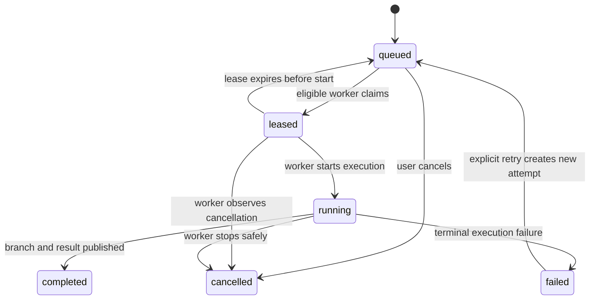

# Feature: Remote Task Dispatch

**Status:** Approved
**Source Ideas:** [Remote Dispatch](https://github.com/synchestra-io/synchestra-marketing/blob/main/ideas/remote-dispatch.md)

## Summary

Remote Task Dispatch accepts an ad-hoc repository prompt or a SpecScore Plan/Task target, records it as durable scheduled work, leases it to an eligible registered worker, and returns a reviewable Git branch plus execution evidence. The initial proof uses the existing personal VM and Claude Code, while the contract supports multiple workers, agents, model profiles, and future runtimes.

## Contents

| Directory | Description |
|---|---|
| [scheduler](scheduler/README.md) | Durable jobs, attempts, worker matching, leases, retries, and cancellation |
| [worker](worker/README.md) | Outbound lease pickup, repository worktrees, agent execution, and result publication |

### Scheduler

The scheduler is the Hub-side operational control plane. It persists dispatch requests independently of sessions, transactionally assigns eligible work, and recovers abandoned leases.

### Worker

The worker role is implemented by the existing `synchestra-host`. It claims work outbound, prepares an isolated Git worktree, launches the resolved agent, and reports logs and a branch result.

## Problem

Synchestra can represent queued tasks and can start remote sessions, but no durable workflow connects those systems. A user cannot currently submit:

```text
/dispatch @sonnet Update dal-go deps to latest
```

and have a registered VM pick it up, execute it unattended, push a branch, and report a terminal result. Manually SSHing to a VM loses scheduling, auditability, retries, cancellation, model routing, and multi-worker support.

## Behavior

### Dispatch sources

A dispatch accepts one of two source forms:

- **Ad-hoc:** repository identity, immutable base revision, prompt, and optional project context resolved from the caller's working directory.
- **SpecScore target:** repository identity plus a Plan or Task reference and an immutable target snapshot.

An ad-hoc dispatch MUST NOT require the system to create a Synchestra Task. A target-bound dispatch records the task/plan reference but keeps its operational attempts separate from task state.

### Dispatch lifecycle



A dispatch owns immutable intent and aggregate status. Each claim or retry creates an attempt with its own lease owner, timestamps, resolved execution configuration, session ID, logs, and result.

### Execution profiles

The stable user-level profiles are:

| Profile | Purpose |
|---|---|
| `fast` | Mechanical, low-risk work optimized for latency and cost |
| `balanced` | Normal implementation work; default |
| `large` | Cross-cutting, ambiguous, or high-risk work |

Provider-specific selectors MAY be accepted as convenience aliases. For the initial Claude adapter, `@haiku`, `@sonnet`, and `@opus` request the corresponding provider model and normally map to fast, balanced, and large. The scheduler persists both requested and resolved configuration; concrete model mappings are versioned configuration, not hard-coded product semantics.

Routing precedence is explicit selector, target metadata, project rules, then balanced default. An unavailable exact selector is rejected unless an explicit fallback policy is configured. The scheduler MUST NOT silently upgrade to a more expensive model.

### Delivery result

The MVP delivery policy is branch-only:

1. Resolve the repository and immutable base revision.
2. Create an isolated worktree and `synchestra/<dispatch-id>` branch.
3. Run the selected agent non-interactively.
4. Run repository-appropriate validation chosen by the agent from project instructions.
5. Commit and push the resulting branch.
6. Report terminal status, summary, validation evidence, branch, commit, session, and logs.

The worker MUST NOT merge, deploy, or mutate the caller's working tree.

### User surfaces

- The deterministic CLI owns create, status, logs, retry, and cancel operations.
- `ai-plugin-synchestra` provides the human-visible `/dispatch` command and translates conversational input to the CLI contract.
- Hub UI is optional for the proof; it may later render the same dispatch records.
- SpecStudio may later delegate approved Plan tasks to Synchestra but remains an optional integration.

## Security and Safety

- Workers use existing host registration and rotating access tokens.
- Worker connectivity is outbound; no public inbound VM endpoint is required.
- Git and model credentials are scoped to the execution and MUST NOT be written to task artifacts or logs.
- Logs redact configured secrets.
- A cancellation or lease loss stops publication; a worker MUST NOT report success after losing ownership.
- The personal proof may reuse the VM user's existing credentials. Broader use requires short-lived Git credentials.

## Acceptance Criteria

### AC: ad-hoc-dispatch-accepted

**Given** a caller is inside a Git repository registered or resolvable by Synchestra
**When** the caller dispatches a raw prompt with a valid agent/model selector
**Then** Synchestra creates a durable queued dispatch without requiring a pre-existing Task and returns its ID immediately.

### AC: specscore-target-dispatch-accepted

**Given** an approved SpecScore Plan or queued Task
**When** the caller dispatches that target
**Then** the dispatch records an immutable target reference and source revision while operational attempts remain separate from task state.

### AC: eligible-worker-leases-once

**Given** multiple registered workers concurrently request eligible work
**When** one queued dispatch matches them
**Then** exactly one worker receives the active lease and every other claimant observes that the dispatch is unavailable.

### AC: profile-resolution-audited

**Given** a dispatch requests `@sonnet`, `fast`, `balanced`, or `large`
**When** an eligible worker is selected
**Then** the attempt records requested selector, resolved profile, agent, concrete model, effort, mapping version, and routing reason.

### AC: worker-publishes-branch-result

**Given** a worker completes the requested change and validation
**When** it finalizes the attempt
**Then** it pushes a dedicated branch and records the commit, branch, summary, validation evidence, session, and logs before the dispatch becomes completed.

### AC: caller-worktree-untouched

**Given** a dispatch originates from a developer's non-clean or active local checkout
**When** the remote worker executes it
**Then** no file, branch, index entry, or uncommitted change in the caller's checkout is modified.

### AC: lease-expiry-recovers-work

**Given** a worker holds a lease and stops heartbeating before execution becomes terminal
**When** the lease expires
**Then** the attempt is marked abandoned and the dispatch becomes eligible for retry according to policy without two active owners.

### AC: cancellation-stops-publication

**Given** a queued, leased, or running dispatch
**When** the caller cancels it
**Then** no new agent work is started and any running worker stops safely without publishing a success result.

### AC: vm-proof-completes

**Given** the registered personal VM is online with Docker, Git credentials, and Claude Code
**When** `/dispatch @sonnet Update dal-go deps to latest` is submitted from the appropriate repository context
**Then** that VM claims the dispatch and the user receives either a pushed review branch with validation evidence or a durable failed result with actionable logs.

### AC: specstudio-remains-optional

**Given** SpecStudio is not installed
**When** a user invokes Synchestra dispatch directly
**Then** all dispatch, observation, cancellation, and result behavior remains available.

## Dependencies

- [runner](../runner/README.md) — registered compute and capabilities
- [host-auth](../host-auth/README.md) — worker identity and rotating tokens
- [cli/runner/dispatch](../cli/runner/dispatch/README.md) — deterministic CLI surface
- [agent-skills/dispatch](../agent-skills/dispatch/README.md) — conversational command surface
- [model-selection](../model-selection/README.md) — provider-neutral profile routing
- [state-store](../state-store/README.md) — optional Task linkage and lifecycle state
- [channels](../channels/README.md) — reusable session/log transport

## Not Doing

- Automatic merge, deployment, or production mutation.
- Paid/shared runner marketplace or billing.
- Learned/LLM-based routing before real dispatch history exists.
- Multi-agent fan-out inside one dispatch; the implementation Plan may use parallel development agents, but the product proof runs one agent per attempt.
- Cloud Run, AWS, Azure, or Kubernetes workers before the VM protocol is proven.
- A mandatory SpecStudio dependency.

## Outstanding Questions

1. Should retry be a mutation of one dispatch or a new child dispatch? The MVP uses a new attempt under the same dispatch.
2. How long should completed dispatch logs be retained after the personal proof?

---
*This document follows the https://specscore.md/feature-specification*
