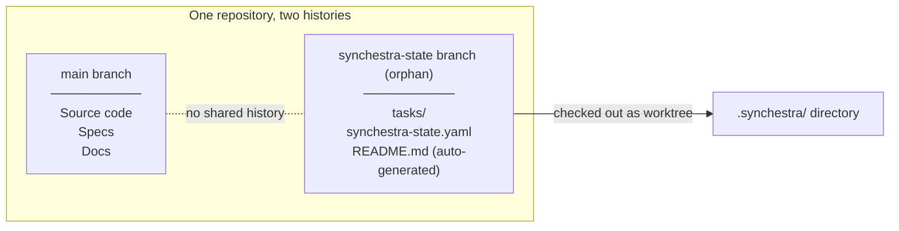
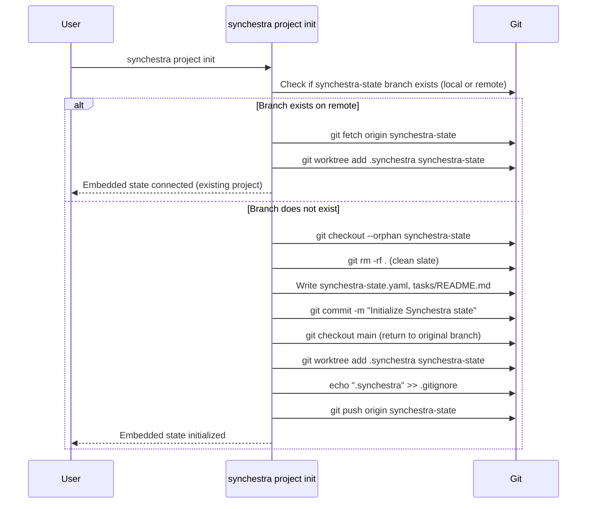
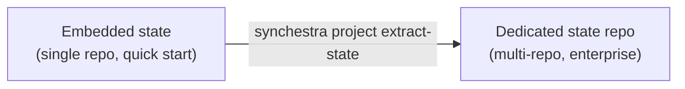

# Feature: Embedded State

**Status:** Conceptual

## Summary

Embedded state allows Synchestra to manage coordination state inside an existing repository using a git worktree on an orphan branch — no separate state repo required. This provides a zero-friction onboarding path: any git repository can add Synchestra task management with a single `synchestra project init` command.

## Problem

Synchestra's default architecture requires a dedicated state repository. This is the right choice for teams with multiple repos, strict permissions, and high-frequency agent coordination. But it creates friction for:

1. **First-time users** — "I just want to try task management in my repo" requires creating a new repo, configuring YAML, and linking everything together.
2. **Single-repo projects** — Many projects live in one repo. A separate state repo doubles the repo count for no clear benefit.
3. **Plugin ecosystems** — Tools like [superpowers](https://github.com/obra/superpowers) that want to integrate Synchestra state need the simplest possible setup — ideally invisible to users who don't opt in.

## Design

### Mechanism: Orphan Branch + Git Worktree

Embedded state uses a standard git feature — [worktrees](https://git-scm.com/docs/git-worktree) — to maintain a separate branch history within the same repository.



**How it works:**

1. `synchestra project init` creates an orphan branch (`synchestra-state`) with no shared history with `main`
2. The orphan branch is checked out as a git worktree into `.synchestra/` at the project root
3. `.synchestra` is added to `.gitignore` (the worktree directory is local; the branch is shared via the remote)
4. All Synchestra state operations (`task claim`, `task complete`, etc.) operate on the worktree — commits land on `synchestra-state`, never on `main`
5. `git push origin synchestra-state` syncs state to the remote — same optimistic locking protocol as the dedicated state repo

**The result:**
- `git log main` shows only code/spec commits — no coordination noise
- `git log synchestra-state` shows only task state — full audit trail
- Same remote, same permissions model, same clone
- Other developers/agents run `synchestra project init` (idempotent) to set up their local worktree

### Setup Flow



### Configuration

Embedded state uses a simplified config file on the orphan branch:

```yaml
# .synchestra/synchestra-state.yaml
title: My Project
mode: embedded                    # signals this is embedded, not a dedicated state repo
source_branch: main               # the primary branch of the host repo
sync:
  pull: on_commit
  push: on_commit
```

The host repo gets a minimal marker at its root:

```yaml
# synchestra.yaml (in repo root, on main branch)
state: embedded                   # tells CLI to look for .synchestra/ worktree
state_branch: synchestra-state    # the orphan branch name
```

### Config-less Mode

Config-less mode allows Synchestra task commands to work without any configuration file (`synchestra-spec-repo.yaml` or `synchestra-state-repo.yaml`) on the main branch. This is the zero-friction path for "Option A" onboarding — the user runs `synchestra project init` and immediately starts using task commands.

**How it works:**

1. `resolve.StateRepoPath()` walks up the directory tree looking for config files (existing behavior)
2. If no config file is found, it falls back to finding the git repo root
3. If `.synchestra/` exists at the repo root, it is returned as the state store path
4. If `.synchestra/` does not exist, a `NotFound` error suggests running `synchestra project init`

**Defaults in config-less mode:**

| Setting | Default value |
|---|---|
| State branch | `synchestra-state` |
| Worktree path | `.synchestra/` |
| Spec root | `spec/` |
| Docs root | `docs/` |

**When config-less mode is used:**

- After `synchestra project init` (which creates the orphan branch and worktree)
- When onboarding selects "Option A: single repo, default settings"
- The `synchestra-spec-repo.yaml` file is still created by `project init` for explicit configuration, but task commands no longer require it to exist

**Upgrading from config-less to configured:**

Running `synchestra project init` always writes `synchestra-spec-repo.yaml` with `state_repo: worktree://synchestra-state`. If a user later needs custom configuration (multi-repo, dedicated state repo), they can edit or replace this file. The config-less fallback only activates when no config file exists at all.

### State Store Backend

The existing `gitstore` backend works with minimal changes. The key difference is the git directory path:

| Mode | State git dir | Push target |
|---|---|---|
| **Dedicated repo** | `{state-repo}/.git` | `origin/main` of the state repo |
| **Embedded** | `{project-repo}/.git/worktrees/synchestra-state` | `origin/synchestra-state` of the host repo |

The `gitstore` constructor accepts either path. All operations (commit, push, pull, conflict resolution) work identically — git worktrees are full-fidelity git checkouts.

### Idempotency

`synchestra project init` is safe to run multiple times:

| State | Behaviour |
|---|---|
| No branch, no worktree | Full initialization |
| Branch exists on remote, no local worktree | Fetch + create worktree |
| Branch exists locally, no worktree | Create worktree |
| Worktree already exists | No-op, success |
| Worktree exists but is stale (pruned) | Re-create worktree |

### Multi-Agent Coordination

Embedded state supports the same multi-agent claiming protocol as dedicated repos:

1. Agent pulls `synchestra-state` branch via worktree
2. Updates task board row (status -> in_progress, agent field)
3. Commits to `synchestra-state` branch
4. Pushes `origin synchestra-state`
5. If push conflict: pull, check if claimed task's row conflicted, retry or move on

The orphan branch means agents pushing state never conflict with developers pushing code on `main`.

## Relationship to Dedicated State Repos

Embedded state is not a replacement — it's an on-ramp.



Projects that outgrow embedded state can extract it to a dedicated repo. The `synchestra project extract-state` command (future) would:

1. Create a new state repo from the orphan branch history
2. Update config files to point to the new repo
3. Remove the orphan branch from the host repo

The reverse is not supported — collapsing a dedicated state repo into embedded mode would lose the separation benefits.

## Comparison

| Aspect | Dedicated State Repo | Embedded State |
|---|---|---|
| Setup | Create repo, configure YAML, link repos | `synchestra project init` |
| Repos | 2+ (state is separate) | 1 (state on orphan branch) |
| History isolation | Complete (separate .git) | Complete (orphan branch, no shared commits) |
| Push conflicts | State pushes never conflict with code | Same — different branches |
| Permissions | State repo can have different ACLs | Same repo permissions for code and state |
| Multi-repo projects | Native (one state repo, many code repos) | Not supported (use dedicated mode) |
| Migration path | N/A | Extract to dedicated repo |

## Dependencies

- [state-store](../state-store/README.md) — `gitstore` backend needs to accept worktree paths
- [cli](../cli/README.md) — New `synchestra project init` command
- [task-status-board](../task-status-board/README.md) — Works unchanged (operates on files in the state directory)

## Outstanding Questions

- Should the orphan branch name be configurable, or always `synchestra-state`? Configurability adds complexity; a fixed name is simpler and discoverable.
- Should `synchestra project init` also scaffold an initial `spec/features/` structure on the main branch, or only set up state? Scaffolding is an onboarding concern and may belong in a separate command.
- How should CI/CD pipelines interact with the orphan branch? Should we provide a GitHub Actions workflow template that runs on `synchestra-state` pushes?
- Should `synchestra project init` require a remote, or support purely local (offline) usage? Local-only mode would skip the push step and set sync policy to `manual`.
