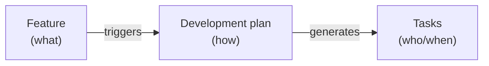
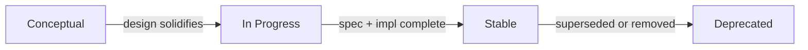
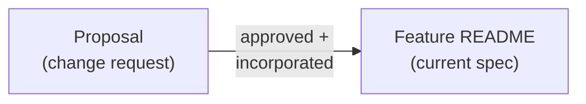
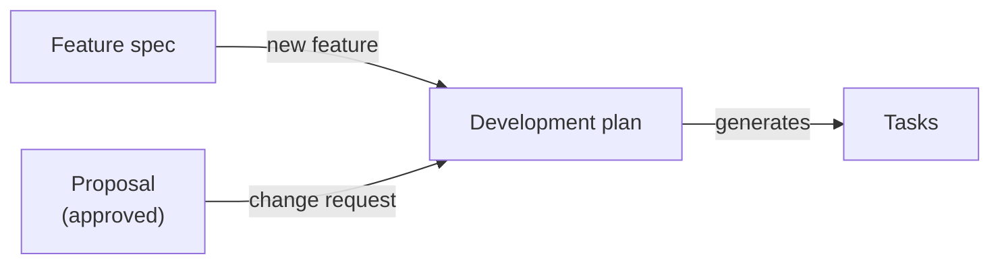

# Feature: Feature

**Status:** Conceptual

## Summary

A feature is the atomic unit of product specification in Synchestra. It describes a capability the product should have — what it does, why it matters, and how it behaves. Features live in the spec repository under `spec/features/` as directories with a mandatory `README.md`. They can nest (sub-features), accept change requests via [proposals](../proposals/README.md), trigger [development plans](../development-plan/README.md), and ultimately produce [tasks](../task-status-board/README.md) that agents execute.

This specification defines the structure, metadata, lifecycle, and conventions that every feature must follow.

## Problem

Synchestra already has features — they are the directories under `spec/features/`. But the conventions governing them are implicit: scattered across `CLAUDE.md`, the root `README.md`, and learned by example from existing features. There is no single document that answers:

- What must a feature directory contain?
- What metadata does a feature carry?
- What is a feature's lifecycle?
- How do features relate to plans, proposals, and tasks?

Without a formal definition, new features are created inconsistently, AI agents cannot reliably navigate the feature tree, and validation tools have nothing to validate against.

## Design Philosophy

Features are the **"what"** layer of Synchestra. They describe desired product behavior — not how to build it (that is the [development plan](../development-plan/README.md)'s job) and not who is building it right now (that is [tasks](../task-status-board/README.md)' job). See [Spec-to-Execution Pipeline](../../architecture/spec-to-execution.md) for how these three layers connect across repository boundaries.



Features are **living documents**. Unlike development plans, which are frozen once approved, a feature spec evolves as proposals are accepted and incorporated. The feature README always reflects the current desired behavior of the product — not a historical snapshot.

## Behavior

### Feature location

Features live under `spec/features/` in the spec repository:

```
spec/features/
  README.md                     ← feature index
  {feature-slug}/
    README.md                   ← feature specification
    _acs/                       ← acceptance criteria (optional)
      {ac-slug}.md
    _tests/                     ← feature-scoped test scenarios (optional)
      {scenario-slug}.md
      flows/
    proposals/                  ← change requests (optional)
      README.md
      {proposal-slug}/
        README.md
    {sub-feature-slug}/         ← sub-feature (optional)
      README.md
```

`{feature-slug}` is a URL/path-safe identifier using lowercase letters, numbers, and hyphens (e.g., `claim-and-push`, `model-selection`, `ui`).

### Reserved `_` prefix convention

Directories prefixed with `_` are reserved for Synchestra tooling and are **not** sub-features. They are excluded from the feature index and Contents table.

| Directory | Purpose | Introduced by |
|---|---|---|
| `_acs/` | Acceptance criteria | [Acceptance Criteria](../acceptance-criteria/README.md) |
| `_args/` | CLI argument documentation | [CLI](../cli/README.md) |
| `_tests/` | Feature-scoped test scenarios | [Testing Framework](../testing-framework/README.md) |

### Feature README structure

Every feature README follows this structure:

```markdown
# Feature: {Title}

**Status:** {status}

## Summary

One to three sentences describing the feature's purpose.

## Contents

(Only if the feature has sub-features or child directories)

| Directory   | Description                     |
|-------------|---------------------------------|
| [child/](child/README.md) | Brief description of the child |

### child

1-7 sentence summary of each child directory.

## Problem

Why this feature exists. What gap or pain point it addresses.

## Behavior

How the feature works. The bulk of the spec — structure, rules,
examples, edge cases.

## Interaction with Other Features

(Optional) How this feature relates to other features.

## Dependencies

- feature-slug-1
- feature-slug-2

(Or omit the section entirely if the feature is independent.)

## Acceptance Criteria

Not defined yet.

(Or: a table of ACs when defined. See [Acceptance Criteria](../acceptance-criteria/README.md).)

## Outstanding Questions

- Question 1
- Question 2

(Or: "None at this time." — the section is never omitted.)
```

### Required sections

| Section                 | Required | Notes                                                             |
|-------------------------|----------|-------------------------------------------------------------------|
| Title (`# Feature: X`) | Yes      | Always prefixed with `Feature:`                                   |
| Status                  | Yes      | Immediately after the title                                       |
| Summary                 | Yes      | 1-3 sentences                                                     |
| Contents                | Conditional | Required when the feature has child directories                |
| Problem                 | Yes      | Why the feature exists                                            |
| Behavior                | Yes      | How the feature works                                             |
| Proposals               | Conditional | Present when the feature has a `proposals/` directory. See [Proposals](../proposals/README.md#feature-readme-proposals-section). |
| Plans                   | Conditional | Present when a [development plan](../development-plan/README.md) touches this feature. |
| Acceptance Criteria     | Yes      | Always present. States "Not defined yet." if empty; must also raise an Outstanding Question. See [Acceptance Criteria](../acceptance-criteria/README.md). |
| Outstanding Questions   | Yes      | Always present. Explicitly states "None at this time." if empty.  |

### Optional sections

Features may include additional sections as needed. Common patterns seen across existing features:

| Section                       | When to use                                              |
|-------------------------------|----------------------------------------------------------|
| Dependencies                  | When the feature depends on other features. A bullet list of feature IDs. Consumed by `synchestra feature deps`. Omit if the feature is independent. |
| Design Principles             | When the feature has guiding architectural constraints    |
| Interaction with Other Features | When the feature has notable dependencies or touchpoints |
| Configuration                 | When the feature introduces project settings             |

### Feature statuses

| Status        | Description                                                                  |
|---------------|------------------------------------------------------------------------------|
| `Conceptual`  | Feature is described at a high level; design decisions remain open            |
| `In Progress` | Feature is actively being specified and/or implemented                        |
| `Stable`      | Feature is fully specified and implemented; changes go through proposals      |
| `Deprecated`  | Feature is being phased out; a successor or removal plan exists               |



These statuses describe the feature's **specification maturity**, not its implementation progress. A feature can be `Stable` in spec while its implementation is still in development — the spec is the source of truth for desired behavior.

### Feature nesting (sub-features)

Features can contain sub-features as child directories. Each sub-feature is a full feature with its own `README.md`, status, and lifecycle.

```
spec/features/ui/
  README.md                  ← parent feature
  web-app/
    README.md                ← sub-feature
  tui/
    README.md                ← sub-feature
```

When a feature has children, its README must include a **Contents** section with:
1. An index table listing each child directory with a description
2. A brief summary (1-7 sentences) for each child, giving readers high-level context without requiring them to open each child

This is enforced by the project conventions in `CLAUDE.md`.

### Feature identification

Features are identified by their path relative to `spec/features/`:

| Feature path        | Identifier          |
|---------------------|---------------------|
| `spec/features/cli/` | `cli`               |
| `spec/features/ui/web-app/` | `ui/web-app` |
| `spec/features/task-status-board/` | `task-status-board` |

This path-based identification is used in development plans (the `Features` header field), CLI commands, and cross-references between specs.

### Feature index

`spec/features/README.md` is the index of all features. It contains:

1. An **Index** table with columns: Feature, Status, Description
2. A **Feature Summaries** section with a paragraph per feature
3. A **Feature dependency graph** showing relationships
4. An **Outstanding Questions** section
5. A list of features with outstanding questions and their counts

The index is the entry point for understanding the product's planned capabilities.

## Relationship to Other Artifacts

### Features and proposals

[Proposals](../proposals/README.md) are change requests attached to a feature. They live under `{feature}/proposals/` and follow the proposal lifecycle (`draft → submitted → approved → implemented`). A proposal is non-normative until its content is incorporated into the feature's main README.



### Features and development plans

[Development plans](../development-plan/README.md) bridge features to tasks. A plan is triggered by either a new feature spec or an approved proposal (change request). Plans live separately in `spec/plans/` but reference the features they affect.

Every plan lists its affected features in its header. Each affected feature's README includes a **Plans** section back-referencing active plans.



### Features and tasks

Features do not directly reference tasks — the development plan is the bridge. However, task context (via `synchestra task info`) can include the originating feature spec for agent awareness.

The chain is always: **Feature (or proposal) → Plan → Tasks**. This separation ensures that the spec repo stays focused on *what* while the state store handles *who and when*.

### Features and outstanding questions

Every feature maintains an [Outstanding Questions](../outstanding-questions/README.md) section. Questions can be linked to tasks; when the linked task completes, a sub-agent evaluates whether the output answers the question and resolves it automatically.

## Structural Rules

These rules are enforced by schema validation and pre-commit hooks:

1. **Every feature directory must contain a `README.md`.**
2. **Every feature README must have an Outstanding Questions section.** If there are none, it explicitly states "None at this time."
3. **Every feature README with child directories must have a Contents section** with an index table and brief summaries.
4. **Feature slugs must be lowercase, hyphen-separated, and URL-safe.** No underscores, spaces, or special characters.
5. **The feature index (`spec/features/README.md`) must list every top-level feature.** Unlisted features are a validation error.

## CLI Support

Features are a spec-repo concern. The CLI provides read operations for agent consumption:

```
synchestra feature info <feature_id> [--project <project_id>]
synchestra feature list [--project <project_id>] [--fields <fields>]
synchestra feature tree [<feature_id>] [--direction up|down] [--project <project_id>] [--fields <fields>]
synchestra feature deps <feature_id> [--project <project_id>] [--fields <fields>] [--transitive]
synchestra feature refs <feature_id> [--project <project_id>] [--fields <fields>] [--transitive]
```

- **`feature info`** — structured metadata (status, parent, children, deps/refs counts) plus a section table-of-contents with line ranges. Enables surgical reading of specific sections instead of loading the full README. Default output: YAML (~500 tokens vs ~3,000 for the full README).
- **`feature list`** — flat alphabetical listing of all feature IDs, one per line. Grep/pipe-friendly.
- **`feature tree`** — hierarchical view with tab indentation. Can focus on a specific feature showing ancestors, subtree, or both via `--direction`.
- **`feature deps`** — shows features that the given feature depends on, read from its `## Dependencies` section.
- **`feature refs`** — shows features that reference (depend on) the given feature. Computed dynamically by scanning all features' `## Dependencies` sections — no static `Referrers` section is needed.

**Shared flags:**
- **`--fields`** — inline metadata (e.g., `status,oq`) next to each feature in the output. Auto-switches to YAML.
- **`--transitive`** — follow full dependency/reference chains in one call instead of recursive reads. Available on `deps` and `refs`.

See the [feature command group spec](../cli/feature/README.md) for full details and [skills](../../../ai-plugin/skills/README.md) for agent-ready skill wrappers.

## Configuration

Features themselves have no project-level configuration. Related settings are managed by their associated features:

| Setting                         | Feature                                      | Default |
|---------------------------------|----------------------------------------------|---------|
| `proposals.feature_page.limit`  | [Proposals](../proposals/README.md)          | `3`     |
| `project_dirs.specifications`   | [Project Definition](../project-definition/README.md) | `spec`  |

## Interaction with Other Features

| Feature                                           | Interaction                                                                                         |
|---------------------------------------------------|-----------------------------------------------------------------------------------------------------|
| [Proposals](../proposals/README.md)               | Proposals attach change requests to features. Features display recent proposals in their README.     |
| [Development Plan](../development-plan/README.md) | Plans reference features they affect. Features back-reference active plans.                          |
| [Task Status Board](../task-status-board/README.md) | Tasks are generated from plans, not directly from features. The plan is the bridge.                |
| [Outstanding Questions](../outstanding-questions/README.md) | Every feature maintains an Outstanding Questions section with the standard question lifecycle. |
| [UI](../ui/README.md)                             | The Features screen renders the feature index and individual feature specs.                          |
| [CLI](../cli/README.md)                           | `synchestra feature list` and `synchestra feature info` provide programmatic access.                |
| [LSP](../lsp/README.md)                            | LSP server reuses the same Go packages as the CLI to provide live IDE integration for spec editing. |
| [API](../api/README.md)                           | Feature endpoints mirror CLI commands 1:1.                                                          |

## Outstanding Questions

- Should features have a machine-readable metadata format (YAML frontmatter) in addition to the markdown convention (`**Status:** X`), or is the markdown convention sufficient for both humans and parsers?
- Should sub-feature status roll up to the parent? (e.g., if all sub-features are `Stable`, is the parent automatically `Stable`?)
- Should there be a `synchestra feature create` CLI command that scaffolds the directory, README template, and updates the feature index, similar to `synchestra plan create`?
- How should features handle versioning? When a feature undergoes a major redesign, should the old spec be archived or superseded in place?
