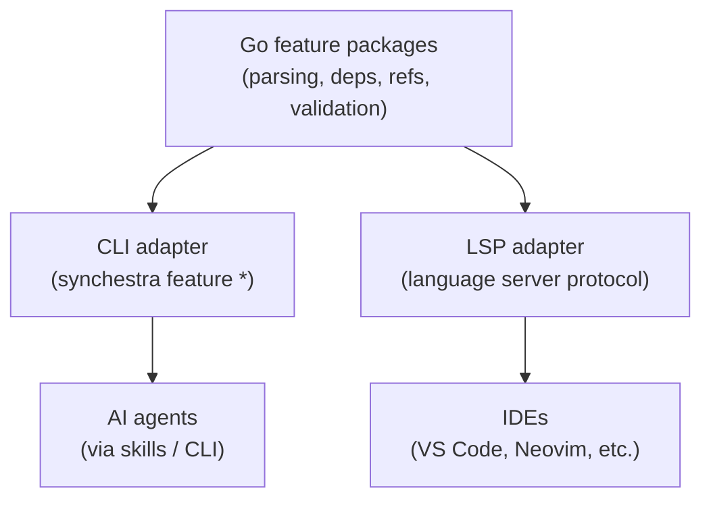

# Feature: LSP for Specifications

**Status:** Conceptual

## Summary

A [Language Server Protocol](https://microsoft.github.io/language-server-protocol/) (LSP) server that exposes Synchestra's specification navigation capabilities to IDEs and editors. The `synchestra feature` CLI commands already form an LSP-like semantic layer — this feature would wrap them in the standard LSP protocol, giving humans live IDE integration for specification files.

## Problem

AI agents consume specifications through the CLI and skills. Humans edit specifications in IDEs — but they get no structured help. There is no autocomplete for feature IDs, no hover info for feature metadata, no red squiggles for broken cross-references, and no rename refactoring across specs. The same semantic understanding that powers the CLI could power an IDE experience, but today it doesn't.

The `feature` command group already implements the core operations:

| LSP concept | Synchestra CLI equivalent |
|---|---|
| `textDocument/documentSymbol` | `feature info` (section TOC with line ranges) |
| `textDocument/definition` | `feature deps` (go to dependency) |
| `textDocument/references` | `feature refs` (find all referrers) |
| `workspace/symbol` | `feature list` / `feature tree` |
| `textDocument/hover` | `feature info` metadata (status, oq, children) |
| `callHierarchy/incomingCalls` | `feature refs --transitive` |
| `callHierarchy/outgoingCalls` | `feature deps --transitive` |
| `textDocument/diagnostic` | `spec validate` (not yet implemented) |
| `textDocument/completion` | Autocomplete feature IDs in `## Dependencies` sections |
| `textDocument/rename` | Rename a feature ID across all specs |
| `textDocument/codeAction` | Quick-fix broken references, scaffold missing sections |

The gap is not semantic understanding — it's the delivery protocol.

## Behavior

### Architecture

The LSP server reuses the same Go packages that implement the CLI commands. The CLI is a batch interface (stateless, one-shot). The LSP server is a persistent interface (long-running, incremental). Both share the feature-parsing, dependency-resolution, and validation logic.

### Capabilities (planned)

#### Tier 1 — Navigation

- **Document symbols** (`textDocument/documentSymbol`): Section headings as symbols with line ranges. Enables outline view and breadcrumb navigation in the IDE.
- **Go to definition** (`textDocument/definition`): From a feature ID in a `## Dependencies` bullet to the feature's README.
- **Find references** (`textDocument/references`): From a feature README, find all specs that depend on it.
- **Workspace symbols** (`workspace/symbol`): Search features by name across the entire spec tree.
- **Hover** (`textDocument/hover`): Hover over a feature ID to see status, summary, outstanding question count, dependency/reference counts.

#### Tier 2 — Diagnostics

- **Broken references** (`textDocument/diagnostic`): Feature IDs in `## Dependencies` that don't resolve to an existing feature directory.
- **Missing required sections**: Feature READMEs missing `## Outstanding Questions`, `## Summary`, etc.
- **Index consistency**: Features on disk but not listed in `spec/features/README.md` index.
- **Orphaned features**: Features listed in the index but missing on disk.

#### Tier 3 — Editing assistance

- **Autocomplete** (`textDocument/completion`): When typing a feature ID inside a `## Dependencies` section, suggest existing feature IDs.
- **Rename** (`textDocument/rename`): Rename a feature directory and update all references across the entire spec tree.
- **Code actions** (`textDocument/codeAction`): Quick-fix for broken references (suggest closest match), scaffold missing required sections.

### Protocol details

- Transport: stdio (standard for LSP servers launched by editors).
- Initialization: The server reads the `synchestra-spec-repo.yaml` to discover the spec root and project layout.
- File watching: The server watches `spec/features/` for changes and incrementally updates its index. No need to re-parse everything on each keystroke.
- Multi-root support: If the IDE has multiple workspace folders, each with a `synchestra-spec-repo.yaml`, the server handles them independently.

### Relationship to the CLI

The LSP server does **not** replace the CLI. They serve different audiences through the same semantic layer:

| | CLI | LSP |
|---|---|---|
| **Audience** | AI agents, scripts, humans in terminal | Humans in IDEs |
| **Lifecycle** | Stateless, one-shot | Persistent, incremental |
| **Output** | Text / YAML / JSON | LSP JSON-RPC |
| **Latency** | Acceptable (git pull + parse) | Must be fast (cached, incremental) |
| **Mutations** | Atomic commit-and-push | Edit-in-place (IDE manages saves) |

The CLI pulls fresh state from git on every invocation. The LSP server maintains an in-memory index and updates incrementally — it must be fast enough for keystroke-level interactions.

### Editor support

The LSP server would work with any editor that supports LSP:

- **VS Code**: Extension wrapping the LSP server. Could be bundled with a Synchestra extension that also provides command palette integration for CLI commands.
- **Neovim**: Native LSP client configuration.
- **JetBrains IDEs**: Via LSP plugin.
- **Emacs**: Via `lsp-mode` or `eglot`.

### When to build this

This is a **later-phase** feature. The priority sequence:

1. **CLI `feature` commands** — already specified, not yet implemented. These are the foundation.
2. **`spec validate`** — spec validation independent of LSP (CLI-first).
3. **LSP server** — once the Go packages are proven through CLI usage, wrap them in LSP.

The incremental cost of adding LSP on top of working CLI packages is moderate — it's primarily a protocol adapter and an incremental indexing layer.

## Dependencies

- cli/feature
- feature

## Interaction with Other Features

| Feature | Interaction |
|---|---|
| [CLI / Feature](../cli/feature/README.md) | Reuses the same Go packages. The CLI is the batch interface; LSP is the persistent interface. |
| [Feature](https://github.com/synchestra-io/specscore/blob/main/spec/features/feature/README.md) | Operates on feature specs. Parses feature READMEs, resolves feature IDs, validates structure. |
| [Agent Skills](../agent-skills/README.md) | Complementary approach. Skills serve agents via CLI; LSP serves humans via IDE. Same semantic layer, different delivery. |
| [Outstanding Questions](../outstanding-questions/README.md) | LSP could surface OQ counts in hover info and highlight unresolved questions. |

## Acceptance Criteria

Not defined yet.

## Outstanding Questions

- Should the LSP server support specification files beyond feature READMEs (e.g., development plans, proposal documents, acceptance criteria)?
- Should the LSP server integrate with git to show feature status changes (e.g., "this feature was modified in the current branch but not yet pushed")?
- Is there value in a "spec preview" capability — rendering how a feature's metadata and relationships will look after the current edits are saved?
- Should the LSP server expose custom commands (e.g., `synchestra.featureCreate`) that IDEs can bind to keyboard shortcuts or command palette entries?
- How should the server handle spec repositories that don't yet have the CLI's feature-parsing packages implemented? Graceful degradation with partial capabilities, or refuse to start?
