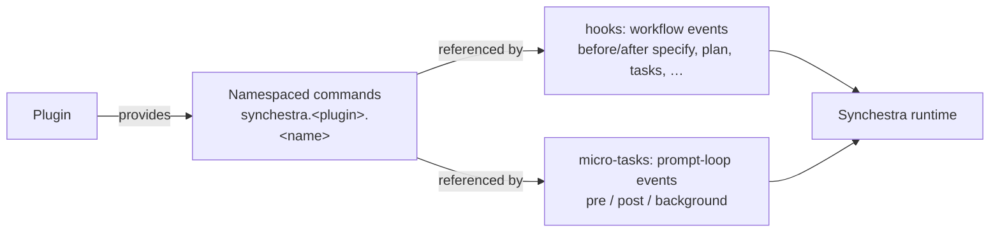

# Feature: Plugins

**Status:** Deferred

> A Synchestra-native plugin SPI is **intentionally not on the roadmap** for 2026. Until plugin authors are knocking, Synchestra and SpecScore extensibility ships *into* GitHub Spec Kit's existing extension system rather than a parallel one. This document records the intended shape (V7) for when the question returns. See [`synchestra-marketing/decisions/2026-05-01-plugin-system-strategy.md`](https://github.com/synchestra-io/synchestra-marketing/blob/main/decisions/2026-05-01-plugin-system-strategy.md) for the full rationale, trigger conditions, and assumptions.

## Summary

The eventual Synchestra plugin SPI is expected to follow a single, simple shape: **plugins contribute namespaced commands.** The project's configuration then composes those commands into either workflow-event hooks (Spec Kit-style: *after the spec is written, run X*) or [micro-task](../micro-tasks/README.md) chain steps (Synchestra-style: *before every prompt, run X*). One plugin shape serves both surfaces.

This is **V7 — a unified hook surface with extended events**, refined.

## Why deferred

- No third-party plugin authors are asking for a Synchestra-native SPI today. Designing for an audience that does not exist is the most reliable way to mismatch their eventual requirements.
- The internal abstraction the SPI must accommodate ([micro-tasks](../micro-tasks/README.md)) is itself at *Conceptual* status. Locking a manifest schema against a moving target is the worst time to commit.
- Synchestra and SpecScore can ride Spec Kit's existing extension system today (~92k stars, mature plugin SPI, 100+ community extensions) via three first-party extensions: `speckit-specscore`, `speckit-synchestra`, `speckit-rehearse`. This captures the ecosystem leverage without forking the standard.

## Proposed Behavior (V7, deferred)

The mechanism collapses to one primitive — **a plugin contributes commands** — composed by the project at two surfaces:

Key properties:

- **Plugins do not subscribe to events.** They contribute a command surface. Composition is the project's responsibility, not the plugin's.
- **Hooks and micro-task chains are not separate concepts** — they are two event surfaces (workflow stages vs. the prompt loop) that consume the same command primitive.
- **Manifest is a strict superset of Spec Kit's `extension.yml`.** The Spec Kit-shaped portion (extension metadata, namespaced commands, before/after workflow hooks) makes a Synchestra plugin a valid Spec Kit extension automatically for the overlap surface. Synchestra-only fields (e.g., `mode: blocking | background`, explicit `order` for chain composition) are silently ignored by Spec Kit.
- **Distribution is Go-native.** Loader is part of the `synchestra` CLI; no Python/`uv` runtime dependency.

## Trigger conditions for revisit

The deferral holds until one of the following fires (mirrored from the strategy decision):

1. ≥3 third-party authors request a Synchestra-native SPI distinct from Spec Kit's, within any rolling 90-day window.
2. The [micro-tasks](../micro-tasks/README.md) feature ships to GA — at which point V7's "chains-are-hooks" assumption needs sanity-checking against the as-built semantics.
3. Spec Kit's ecosystem becomes hostile (curation gates, breaking schema redesigns without migration paths, vendor-lock requirements).
4. A competing SDD-adjacent tool ships a plugin SPI Synchestra is forced to interoperate with.

Until then, prefer adding to [agent-skills](../agent-skills/README.md) for Synchestra-only extensibility, and to the three Spec Kit extensions for cross-runtime plugin authorship.

## Open Design Decisions

- Whether the manifest field for chain composition lives at plugin level (the plugin *suggests* a chain placement) or project level only (the project *decides* placement). Current intent: project-only — keeps composition control with the user.
- Whether plugins can contribute *new event surfaces* beyond `before_*`/`after_*` workflow events and `pre`/`post`/`background` chain phases, or whether the event vocabulary is fixed.
- Manifest format: extend Spec Kit's `extension.yml` (one file, two readers) or ship a separate `synchestra-plugin.yaml` with a converter. Current intent: extend.

## Outstanding Questions

- What concrete signal should trip trigger condition #1 — a GitHub label that auto-counts, a survey, an explicit RFC-request issue template? Without an instrumented tripwire, "≥3 authors asking" silently becomes "we never noticed."
- If [micro-tasks](../micro-tasks/README.md) ships with semantics V7 cannot express (chain-level shared state, transactional rollback across steps, DAG-not-linear ordering), does this feature graduate from *Deferred* to *Conceptual* with a redesign, or is the deferral extended further?
- How are Spec Kit breaking changes (manifest 1.0 → 2.0) absorbed without breaking the three first-party extensions before this feature graduates? Pin-and-patch is workable short-term; a longer-term answer is owed before plugin count grows.
