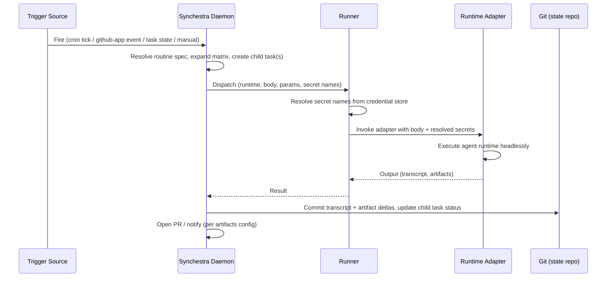
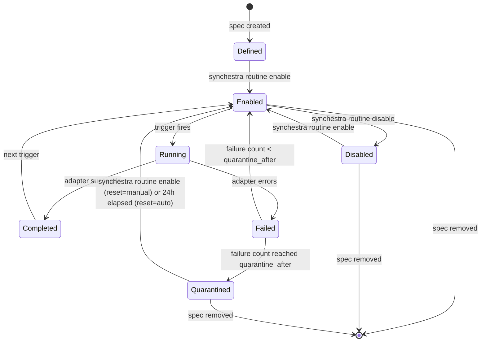

# Feature: Routines

**Status:** draft

## Summary

Cross-platform scheduled and triggered agent workflows. A routine is a spec-native, runtime-portable unit of recurring or event-driven work that runs on a chosen runner and produces reviewable git artifacts.

## Problem

AI agent runtimes are converging on a "recurring task" primitive — Claude Code has [Routines](https://code.claude.com/docs/en/routines), GitHub Copilot has background agents, Cursor has background tasks. Each is scoped to a single runtime and a single execution environment. Teams that coordinate work across multiple runtimes and multiple compute targets hit three walls:

1. **Runtime lock-in.** A routine authored for Claude Code cannot be executed by Copilot CLI without rewriting the configuration, secrets, and output contract.
2. **Compute lock-in.** Vendor-hosted routines run on the vendor's infrastructure. Teams with compliance, data-residency, or cost constraints need the same routine to run on a personal laptop, an in-house VM, or a self-hosted cloud environment (Azure, GCP, AWS) interchangeably.
3. **Coordination blindness.** Routines scheduled in external tools do not share state with the project's work graph. They produce side effects (commits, issues, messages) without appearing as first-class nodes in the task tree — making it impossible to see, from one place, what is running, what ran, and why.

Synchestra already models compute endpoints ([runner](../runner/README.md)), pre/post workflow chains ([micro-tasks](../micro-tasks/README.md)), and reusable agent invocations ([agent-skills](../agent-skills/README.md)). What is missing is the envelope that binds them: a trigger, a runtime choice, and a runner target, captured as a versioned spec.

## Behavior

### Repository Location

The routines **feature specification** lives at `spec/features/routines/` (this file). Individual **routine instances** live at `spec/routines/<slug>/README.md`, mirroring how tasks and plans are organized. Routines are instances of work, not features — they do not nest under `spec/features/`.

### Routine Definition

A routine is a spec directory at `spec/routines/<slug>/` with a `README.md` describing intent and YAML frontmatter describing execution. A routine has four declarative components:

- **Trigger** — when the routine should fire.
- **Runtime** — which agent runtime executes the body.
- **Runner** — which registered [runner](../runner/README.md) the runtime runs on.
- **Body** — the prompt, skill reference, or task reference to execute, optionally wrapped in a [micro-tasks](../micro-tasks/README.md) chain.

```yaml
---
trigger:
  - cron: "0 2 * * *"          # nightly at 02:00 local to runner
  - manual: true               # also invocable on demand via CLI/API
runtime: claude-code-headless  # or: copilot-cli, anthropic-api, openai-api, ...
runner: local                  # any registered runner name
secrets:
  - ANTHROPIC_API_KEY          # resolved from runner's credential store by name
body:
  skill: triage-stale-prs      # ref an agent-skill, a task, or inline prompt
  params:
    max_age_days: 14
matrix:
  repo: [org/a, org/b, org/c]  # fan out — one run per value per trigger fire
on_conflict: skip              # skip | queue | fail (default: skip)
on_failure:
  quarantine_after: 3          # consecutive failures before auto-disable
  reset: manual                # manual | auto (default: manual)
artifacts:
  commit_to: branch:routines/triage-stale-prs
  open_pr: true                # HITL by default — result is reviewable
---
```

### Trigger Types

Four trigger types are supported at v1. Multiple triggers may be combined; any one firing invokes the routine.

| Trigger | Fires When | Notes |
|---|---|---|
| `cron` | A cron expression matches the runner's clock | Standard 5-field cron. Timezone defaults to the runner's timezone; overridable per trigger. |
| `git-event` | A repository event occurs (push, PR opened, issue labeled, file changed) | Events are sourced exclusively through the Synchestra [github-app](../github-app/README.md). Projects without the app installed cannot use `git-event` triggers. |
| `task-state` | A [task](../cli/task/README.md) transitions to a named status | Example: `task-state: { status: queued, label: routine-dispatch }`. Lets routines react to the work graph. |
| `manual` | Invoked via `synchestra routine run <name>` or API | Makes the routine a reusable callable unit independent of schedule. |

### Runtime Adapters

A routine's `runtime` field names an adapter that knows how to invoke a specific agent runtime in headless mode, pass parameters, and capture output. Each adapter is a thin wrapper around an external tool or API.

v1 adapters:
- `claude-code-headless` — Claude Code in non-interactive mode.
- One additional adapter (`copilot-cli` or a raw `anthropic-api`/`openai-api` adapter) — chosen during implementation to prove runtime portability.

Future adapters (out of scope for v1): `cursor-background`, `aider`, `opencode`, custom shell scripts.

### Runner Targeting

A routine targets a registered [runner](../runner/README.md) by name. At v1, only `runner: local` is required — the local daemon acts as the runner. As the runner feature matures to support remote VMs and cloud targets (Azure/GCP/AWS/Synchestra Cloud), the same routine spec targets any of them by changing one field. No routine rewrite is needed to move compute.

### Secrets

Routines reference secrets by name only — never by value. Secret values live in the runner's credential store:

- **Local runner** — OS keychain, environment, or a local secret file the daemon reads.
- **Remote runner (in-house VM)** — runner-owned secret file, env, or sidecar secret agent.
- **Cloud runner** — native KMS (Azure Key Vault, GCP Secret Manager, AWS Secrets Manager).
- **Synchestra Cloud runner** — the hosted runner's managed secret store.

Synchestra never stores, transmits, or sees secret values. The routine's `secrets:` list is a capability declaration; the runner's credential store resolves names to values at dispatch time. Moving a routine between runners may require provisioning the same secret name on the target runner — a deliberate tradeoff that preserves compute portability without centralizing trust.

### Conflict and Failure Policy

- **`on_conflict`** controls what happens when a routine body references a task that is already in-flight (claimed by another agent). Values: `skip` (no-op the run, default), `queue` (defer until the task is free), `fail` (surface as a run failure).
- **`on_failure`** controls failure quarantine. After `quarantine_after` consecutive failures the routine auto-disables. `reset: manual` (default) requires `synchestra routine enable <name>` to resume; `reset: auto` resumes after 24 hours.

### Run Model

Routine runs reuse the [task](../cli/task/README.md) primitive — they are not a separate status or storage model. Each defined routine has a synthetic parent task (created on first enable); each run is a child task under that parent. This means:

- Runs appear on the task status board alongside regular work.
- `synchestra task` commands (status, info, abort, logs) work on runs with no new CLI surface.
- The task state machine (`queued → claimed → in_progress → completed|failed|aborted`) governs runs.
- The `task-state` trigger type composes naturally — a routine can fire on another routine's run completion.

### Matrix Fan-Out

A routine may declare a `matrix:` map of named axes. Each trigger fire expands into the Cartesian product of matrix values, producing one run per combination. This unlocks fleet use cases — run the same routine per repo, per region, per tenant — without authoring N routines. Matrix values are bound as body `params` and are available in `artifacts.commit_to` templates.

### Human-in-the-Loop by Default

Every routine run produces a reviewable git artifact — a branch, a PR, or a task update. Routines never silently mutate main branches or external state. A routine that intends to auto-merge must declare `artifacts.auto_merge: true` explicitly; the default is a human review gate.

### Spec-Native Coordination

Because routines live in the spec tree and commit through Synchestra's state repository, each run is:
- Attributable (signed/co-authored commits via [host-auth](../host-auth/README.md)).
- Queryable (runs appear on the task status board).
- Composable (a routine body may reference a [task](../cli/task/README.md), an [agent-skill](../agent-skills/README.md), or a [micro-tasks](../micro-tasks/README.md) chain).

### Execution Flow



### Routine Lifecycle



## Dependencies

- [runner](../runner/README.md) — Routines target registered runners for execution; the runner owns the credential store that resolves secret names.
- [micro-tasks](../micro-tasks/README.md) — A routine body may be wrapped in a pre/post/background micro-task chain.
- [agent-skills](../agent-skills/README.md) — A routine body may reference a skill as its unit of work.
- [cli](../cli/README.md) — `synchestra routine new|run|list|enable|disable|logs` commands surface routine operations.
- [github-app](../github-app/README.md) — Sole source of `git-event` triggers.
- [task-status-board](../task-status-board/README.md) — Routine runs are tasks; they appear on the board.

## Acceptance Criteria

1. A user can scaffold a routine with `synchestra routine new --title <name>` producing a valid spec directory under `spec/routines/<slug>/`.
2. The Synchestra daemon fires routines with `cron` and `manual` triggers on the local runner.
3. At least two runtime adapters are implemented and routable by the `runtime` field.
4. A routine run commits its transcript and any artifact deltas to the state repository (or a designated branch in the code repo), never to `main` by default.
5. `synchestra routine list` shows defined routines, their triggers, last run status, and next scheduled fire.
6. Switching a routine's `runner` field from `local` to any other registered runner requires no other spec changes (secret names must be provisioned on the target runner).
7. Changing a routine's `runtime` field between supported adapters requires no other spec changes (beyond adapter-specific `params`).
8. Secret values never appear in the routine spec, the state repository, Synchestra logs, or Hub storage — only secret names.
9. Routine runs appear as tasks on the [task-status-board](../task-status-board/README.md) under a synthetic per-routine parent task.
10. A routine with `matrix:` expands into N child task runs per trigger fire, one per matrix combination.
11. `on_conflict: skip|queue|fail` and `on_failure: { quarantine_after, reset }` behave per spec under test.
12. A routine spec validates via `synchestra spec lint`.

## Outstanding Questions

None at this time.
