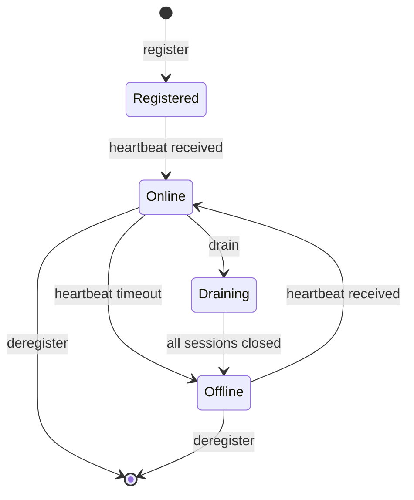

# Feature: Runner

**Status:** Conceptual

## Summary

Remote hosts, VMs, and cloud environments where AI agents execute sessions and claim tasks. A runner is a registered compute endpoint that Synchestra connects to for remote agent interaction. Users interact with agents on runners through sessions — ephemeral, chat-like conversations surfaced in the web UI.

## Problem

Synchestra agents today run locally or inside sandbox containers on the same host. For production workloads, teams need:

1. **Remote execution** — Run agents on dedicated VMs, cloud instances, or GPU-equipped machines closer to the resources they need.
2. **Persistent availability** — Agents that stay online and claim tasks continuously, not just during a developer's terminal session.
3. **Multi-environment support** — Different runners for different purposes: a beefy GPU runner for ML tasks, a lightweight runner for spec updates, a staging runner for integration testing.
4. **Centralized visibility** — See all registered runners, their health, active sessions, and claimed tasks from a single UI.

## Behavior

### Runner Registration

A runner is a named compute endpoint registered with a Synchestra project. Registration captures:

- **Name** — Human-readable identifier (e.g., `prod-east`, `gpu-worker-1`)
- **Host** — Connection details (address, protocol, authentication)
- **Labels** — Key-value pairs for routing and filtering (e.g., `gpu=true`, `env=staging`)
- **Status** — Online, offline, draining

### Sessions

A session is an ephemeral interaction between a user and an agent running on a runner. Sessions:

- Are created on demand (user opens a chat) or by the system (agent claims a task)
- Have a chat-like interface in the web UI, similar to ChatGPT
- Track which tasks the agent has claimed and their progress
- Can be reviewed after completion (conversation history, task outcomes)

### Runner Lifecycle

## Dependencies

- [sandbox](../sandbox/README.md) — Runners may host sandbox containers; shared execution model
- [state-store](../state-store/README.md) — Runner and session state persistence
- [api](../api/README.md) — Runner management and session endpoints
- [ui](../ui/README.md) — Runner dashboard and session chat interface

## Acceptance Criteria

<!-- To be defined -->

## Outstanding Questions

1. Should runners be project-scoped or organization-scoped? An org-scoped runner could serve multiple projects.
2. What authentication model for runner-to-server communication — API keys, mTLS, or short-lived tokens?
3. How do sessions relate to sandbox containers — is each session a new container, or can sessions share a persistent container on a runner?
4. Should task routing rules (e.g., "GPU tasks go to gpu-runner") live in the runner config, project config, or task metadata?
5. What is the recovery model when a runner goes offline mid-session — auto-reassign tasks, hold for reconnection, or fail?
