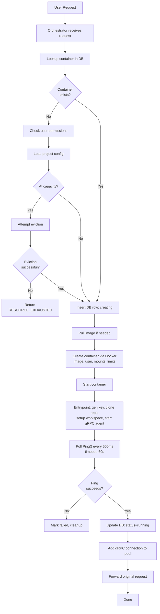
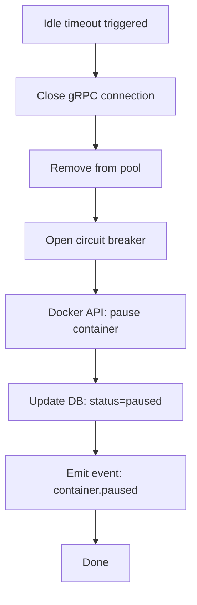
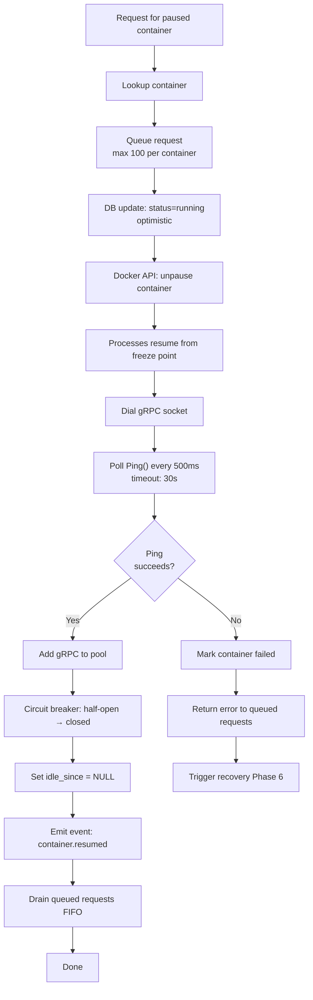
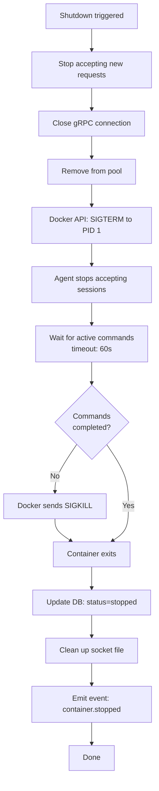

# Container Lifecycle Management

## Overview

> **Related documents:** [orchestrator.md](orchestrator.md) (state machine, transitions), [monitoring.md](monitoring.md) (lifecycle events and metrics), [credentials.md](credentials.md) (credential persistence across restarts), [outstanding-questions.md](outstanding-questions.md) (open design questions).

This specification details the hybrid lifecycle model for sandbox containers. Containers are **persistent** (always exist in some state) but **resource-efficient** (auto-pause when idle, auto-resume on demand). The orchestrator manages all transitions; containers themselves are passive.

The lifecycle model is "hybrid" because it combines:
- **Persistent storage** — workspace volumes survive all container states
- **Ephemeral compute** — CPU/memory released when containers pause or stop
- **On-demand activation** — containers resume transparently when needed

**Design principles:**
- The **host is stateless** — all runtime state lives in containers and the database
- The **container is autonomous** — once started, it manages its own workspace, agent, and sessions
- The **orchestrator is the sole authority** on state transitions — no container self-reports its state

**Relationship to other specs:**
- [`orchestrator.md`](orchestrator.md) defines the state machine (10 states, 17 transitions), gRPC connection pool, and routing logic
- [`database-schema.md`](database-schema.md) defines the `sandbox_container_metadata` table that persists container status
- [`protocol.md`](protocol.md) defines the `Ping()` RPC used for health checks and readiness
- This document **consolidates and details** the lifecycle behaviors, adding operational guidance

---

## Container States

### Stable States (persisted in DB)

| State | Description | Resources Used |
|-------|-------------|----------------|
| `creating` | Image being pulled, container being created via Docker API | Disk (image layers) |
| `running` | Container active, agent ready, accepting commands | CPU, memory, disk |
| `paused` | Docker-paused; all processes frozen in memory | Memory, disk |
| `stopped` | Container exists but is not running | Disk only |
| `failed` | Container crashed or health checks failed repeatedly | Disk only |
| `terminated` | Container and resources explicitly destroyed | Workspace cache only |

### Transitional States (tracked by orchestrator in-memory only)

| State | Description | Typical Duration |
|-------|-------------|-----------------|
| `unprovisioned` | No container exists for this project | N/A |
| `starting` | Container started, agent initializing (git clone, key gen) | 5–120s |
| `resuming` | Container being unpaused, agent reconnecting | 1–3s |
| `stopping` | Container shutting down gracefully (draining sessions) | Up to 60s |

Transitional states are **not written to the database**. If the host crashes during a transition, recovery logic infers the actual Docker state on restart and reconciles.

---

## Lifecycle Phases

### Phase 1: Provisioning (First Request)

Triggered when the first user request arrives for a project with no existing container.

**Complete flow:**



**Expected latency:**
- Image pre-pulled, warm workspace cache: **5–10s**
- Image pre-pulled, cold start (no cache): **10–15s**
- Image needs pull: **30–120s** (depends on image size and registry)

**Failure modes:**
- Image pull fails → status = `failed`, return error to user
- Container creation fails (resource conflict) → retry once, then `failed`
- Entrypoint fails (bad state repo URL, permission error) → container exits, status = `failed`
- Ping() timeout → container stopped and removed, status = `failed`

### Phase 2: Active Operation

Container is `running`, accepting commands via gRPC over Unix socket.

**Behavior:**
- Multiple users can execute commands concurrently
- Each command runs in an isolated session directory: `/workspace/{project_id}/sessions/{session_id}/`
- Session activity (command start/end) resets the idle timer
- The agent manages session isolation; the orchestrator only forwards requests

**Health monitoring (continuous):**
- Orchestrator sends `Ping()` every 30s to each running container
- Ping timeout: 5s per check
- On success: consecutive failure counter reset to 0
- On failure: increment failure counter
- 3 consecutive failures → transition to `failed` (see Phase 6)

**Idle tracking:**
- `idle_since` timestamp set when last active session completes
- `idle_since` cleared (set to `NULL`) when any new session starts
- Tracked in DB: `sandbox_container_metadata.idle_since`

### Phase 3: Idle Detection & Auto-Pause

When a container has no active sessions for `IDLE_TIMEOUT` (default 10 minutes), the orchestrator automatically pauses it.

**Detection mechanism:**
- Background goroutine checks every 60s (`IDLE_CHECK_INTERVAL`)
- For each running container: if `active_sessions == 0` and `now() - idle_since >= IDLE_TIMEOUT` → trigger pause

**Pause sequence:**


**What happens during pause:**
- Docker `pause` sends `SIGSTOP` to all processes in the container's cgroup
- All processes frozen — memory state preserved exactly as-is
- No CPU consumed
- Memory remains allocated (frozen pages)
- Disk unchanged
- Unix socket file remains on host filesystem
- No gRPC connection (closed by orchestrator)

**Why pause instead of stop:**
- Resume is **much faster** (1–3s vs. 10–15s for stop/start)
- Memory state preserved (no re-initialization needed)
- Agent doesn't need to re-clone repos or regenerate state

### Phase 4: Auto-Resume (On Demand)

When a new request arrives for a paused container, the orchestrator transparently resumes it.

**Resume sequence:**


**Expected resume latency:** 1–3s (processes resume instantly; gRPC reconnect is the bottleneck)

**Request queuing during resume:**
- Up to 100 requests buffered while container resumes
- Requests beyond limit: return `SERVICE_UNAVAILABLE` with `Retry-After` header
- All queued requests drained once container reaches `running`
- Queue timeout: 30s (same as resume timeout)

### Phase 5: Graceful Shutdown

Triggered by: admin request, host shutdown signal, or resource pressure eviction.

**Shutdown sequence:**


> **Note:** The admin force-stop endpoint in [orchestrator.md](orchestrator.md) uses a shorter 10-second timeout before SIGKILL, compared to the 60-second graceful shutdown timeout above. The 10s timeout applies only to the admin force-stop API; the 60s timeout applies to all other stop triggers (idle timeout, system shutdown, user-initiated stop).

**What's preserved after stop:**
- Workspace volume on host (repos, cache, credentials, encryption key)
- DB metadata (config, history, restart counts)

**What's lost:**
- In-memory state (decrypted credentials, agent runtime state)
- Active sessions (forcefully terminated if SIGKILL)
- gRPC connection state

### Phase 6: Failure & Recovery

Container enters `failed` when health checks detect unresponsiveness or when the container process exits unexpectedly.

**Failure detection triggers:**
- 3 consecutive `Ping()` failures (health check loop)
- Container process exits with non-zero code (Docker event)
- Container OOM-killed (Docker event)

**Automatic recovery sequence:**
```
1. Container marked 'failed' in DB
2. Emit event: container.failed (includes exit code, OOM flag)
3. Check restart budget: restart_count < MAX_RESTARTS_PER_HOUR (3)
   - If budget exhausted → stay in 'failed', alert admin, stop
4. Wait backoff period: 5s, 15s, 45s (exponential, 3× multiplier)
5. Stop container (if still running)
6. Remove container (Docker rm)
7. Create new container with same config
8. Start container → entrypoint runs
9. Poll Ping() (startup timeout: 60s)
10. On success:
    a. DB: status = 'running', restart_count++, last_restart_at = now()
    b. gRPC connection re-established
    c. Emit event: container.restarted
11. On failure:
    a. DB: status = 'failed', restart_count++
    b. Go to step 3 (next attempt with longer backoff)
```

**What survives restart:**
- Workspace volume (repos, dependency caches, encryption key, credentials)
- DB metadata (project config, session history)
- Restart count persists across host restarts (stored in DB)

**What doesn't survive:**
- Active sessions (all terminated)
- Decrypted in-memory credentials (re-decrypted on next access using persisted encryption key)
- Agent runtime state (rebuilt on startup)

**Restart budget reset:**
- `restart_count` is per rolling hour window
- Checked as: restarts in last 60 minutes < `MAX_RESTARTS_PER_HOUR`
- Allows recovery from transient bursts without permanent lockout

### Phase 7: Termination & Cleanup

Explicit destruction of a container and its resources.

**Triggers:**
- Admin request: `DELETE /api/v1/admin/sandbox/{project_id}`
- User request (with appropriate project access)
- Capacity eviction (Phase 8)

**Termination sequence:**
```
1. If container is running or paused:
   a. Graceful shutdown (Phase 5)
2. Docker API: remove container
3. Socket file removed: /var/run/synchestra-{project_id}.sock
4. Workspace cache decision:
   a. Default: cache preserved at {WORKSPACE_ROOT}/{project_id}/
   b. If clear_cache=true: cache directory deleted immediately
5. DB update: status = 'terminated', terminated_at = now()
6. gRPC connection removed from pool (if present)
7. Emit event: container.terminated
```

**Post-termination behavior:**
- If `clear_cache=false` (default): workspace cache remains, subject to TTL cleanup
- If a new request arrives later: full re-provision from Phase 1
  - With cache: **warm start** — repos pre-cloned, dependencies cached → ~5s
  - Without cache: **cold start** — everything from scratch → 10–120s

### Phase 8: Eviction (Capacity Management)

When container count reaches `MAX_CONTAINERS` (default 50) and a new container is needed.

**Eviction algorithm:**
```
1. New container requested but count >= MAX_CONTAINERS
2. Identify eviction candidates:
   - Status: 'paused' or 'stopped'
   - No active sessions
   - Never evict 'running' containers with active sessions
3. Sort candidates by idle_since ASC (oldest idle first = LRU)
4. Select first candidate
5. Evict: stop container → preserve workspace cache → remove container
6. Free slot now available for new container
7. Emit event: container.evicted (includes evicted project_id, idle duration)
```

**If no evictable candidates:**
- All containers are actively running with sessions
- Return `RESOURCE_EXHAUSTED` to the requesting user
- Request is **not** queued (fail fast)
- Include `Retry-After` header with suggested delay

**Eviction is transparent to the evicted project:**
- Workspace cache preserved on host
- Next request for the evicted project triggers Phase 1 (re-provision)
- Warm start from cache minimizes re-provision time

---

## Workspace Cache

### What's Cached

| Path | Contents | Survives |
|------|----------|----------|
| `/workspace/{project_id}/repos/` | Cloned repositories | All lifecycle phases |
| `/workspace/{project_id}/.synchestra/` | State repository | All lifecycle phases |
| `/workspace/{project_id}/.secure/encryption.key` | Encryption key for credentials | All lifecycle phases |
| `/workspace/{project_id}/.secure/credentials.enc` | Encrypted credentials | All lifecycle phases |
| `/workspace/{project_id}/.cache/` | Build artifacts, dependency caches (npm, pip, maven) | All lifecycle phases |

### What's NOT Cached

| Item | Reason |
|------|--------|
| `/workspace/{project_id}/sessions/` | Ephemeral; cleaned up after `SESSION_RETENTION_HOURS` |
| Decrypted credentials in memory | Gone on container stop/pause; re-decrypted on demand |
| gRPC agent state | Rebuilt on every container start |
| Container filesystem changes (outside /workspace) | Read-only rootfs; tmpfs cleared on stop |

### Cache Location

- **Host filesystem:** `{WORKSPACE_ROOT}/{project_id}/`
  - Default `WORKSPACE_ROOT`: `/var/lib/synchestra/workspaces`
- **Mounted to container:** bind mount at `/workspace/{project_id}/`
- **Permissions:** owned by UID 1000:1000 (`synchestra` user)
- **Filesystem:** inherits host filesystem (typically ext4/xfs)

### Cache Lifecycle

```
Phase 1 (Provision)     → Cache created (or reused if exists)
Phase 2 (Active)        → Cache grows (repos cloned, deps installed)
Phase 3 (Paused)        → Cache unchanged (frozen with container)
Phase 4 (Resumed)       → Cache continues growing
Phase 5 (Stopped)       → Cache persists on host
Phase 6 (Failed/Restart)→ Cache persists, reused by new container
Phase 7 (Terminated)    → Cache preserved (default) or cleared
                           If preserved: TTL countdown begins
Phase 8 (Evicted)       → Cache always preserved
```

**TTL-based cleanup:**
- After termination, cache is retained for `CACHE_TTL` (default 7 days)
- Background job runs hourly, removes caches past TTL
- Clock starts at `terminated_at` timestamp
- Any new provisioning request resets the TTL (cache reused)

**Cache size:**
- Counts toward project's disk quota
- Monitored every 5 minutes by disk quota checker
- Warning at 90% quota, block new commands at 100%

### Benefits

- **Warm start:** Re-provisioned containers skip full clone → `git pull` instead of `git clone` (seconds vs. minutes for large repos)
- **Dependency cache:** `node_modules/`, `.cache/pip/`, `.m2/repository/` survive all lifecycle phases
- **Credential continuity:** Encryption key persists on volume; encrypted credentials remain readable across container restarts without user re-entry

---

## Resource Management During Lifecycle

### Memory

| Container State | Memory Usage | Notes |
|----------------|-------------|-------|
| Running (active) | Up to `memory_limit_mb` (default 512MB) | Actively executing commands |
| Running (idle) | ~50MB base overhead | Agent waiting for requests |
| Paused | Same as when paused | Frozen pages; no new allocations |
| Stopped | 0 | Container not running |
| Terminated | 0 | Container removed |

### CPU

| Container State | CPU Usage | Notes |
|----------------|----------|-------|
| Running (active) | Up to `cpu_limit` (default 2.0 cores) | Executing user commands |
| Running (idle) | ~0% | Agent blocked on socket read |
| Paused | 0% | All processes suspended by cgroup freezer |
| Stopped | 0% | Container not running |

### Disk

- Workspace volume persists regardless of container state
- Disk usage monitored every 5 minutes (async, non-blocking)
- **90% quota:** log warning, emit `disk.warning` metric
- **100% quota:** block new commands with `RESOURCE_EXHAUSTED`, notify admin
- Old sessions cleaned up automatically after `SESSION_RETENTION_HOURS` (default 24h)
- Cache TTL cleanup removes workspace directories 7 days after termination

### Network

- Containers have **no network access** (`--network=none`)
- All communication via Unix socket on host
- State repo access happens during entrypoint only (before network isolation, via host-side clone passed through volume)

---

## Timing Parameters

| Parameter | Default | Env Variable | Description |
|-----------|---------|-------------|-------------|
| Provision timeout | 120s | `SYNCHESTRA_SANDBOX_PROVISION_TIMEOUT` | Max time for full provisioning (image pull + start + init) |
| Startup timeout | 60s | `SYNCHESTRA_SANDBOX_STARTUP_TIMEOUT` | Max time for container to reach `running` after start |
| Resume timeout | 30s | `SYNCHESTRA_SANDBOX_RESUME_TIMEOUT` | Max time for paused container to respond to Ping() |
| Idle timeout | 10m | `SYNCHESTRA_SANDBOX_IDLE_TIMEOUT` | Time with no active sessions before auto-pause |
| Idle check interval | 60s | `SYNCHESTRA_SANDBOX_IDLE_CHECK_INTERVAL` | How often idle containers are checked |
| Health check interval | 30s | `SYNCHESTRA_SANDBOX_HEALTH_INTERVAL` | Time between Ping() checks for running containers |
| Health check timeout | 5s | `SYNCHESTRA_SANDBOX_HEALTH_TIMEOUT` | Max time to wait for single Ping() response |
| Max health failures | 3 | `SYNCHESTRA_SANDBOX_MAX_HEALTH_FAILURES` | Consecutive failures before marking `failed` |
| Restart backoff | 5s, 15s, 45s | — | Exponential backoff (3× multiplier) between restart attempts |
| Max restarts/hour | 3 | `SYNCHESTRA_SANDBOX_MAX_RESTARTS` | Restart attempts per rolling hour before giving up |
| Graceful shutdown timeout | 60s | `SYNCHESTRA_SANDBOX_SHUTDOWN_TIMEOUT` | Time to drain sessions on stop before SIGKILL |
| Session retention | 24h | `SYNCHESTRA_SANDBOX_SESSION_RETENTION_HOURS` | How long session directories and logs are kept |
| Cache TTL | 7d | `SYNCHESTRA_SANDBOX_CACHE_TTL` | How long workspace cache is kept after termination |
| Disk check interval | 5m | `SYNCHESTRA_SANDBOX_DISK_CHECK_INTERVAL` | How often disk usage is measured |
| Max containers | 50 | `SYNCHESTRA_SANDBOX_MAX_CONTAINERS` | Global container limit before eviction |
| Max queued requests | 100 | `SYNCHESTRA_SANDBOX_MAX_QUEUED_REQUESTS` | Requests buffered during resume, per container |

---

## Lifecycle Events

State transitions emit structured events for monitoring, alerting, and audit logging.

| Event | Trigger | Payload |
|-------|---------|---------|
| `container.creating` | Provisioning started | `project_id`, `image`, `requested_by` |
| `container.running` | Container ready | `project_id`, `startup_duration_ms` |
| `container.paused` | Auto-pause triggered | `project_id`, `idle_duration_s` |
| `container.resumed` | Auto-resume completed | `project_id`, `resume_duration_ms` |
| `container.stopped` | Graceful shutdown completed | `project_id`, `reason` |
| `container.failed` | Health check or crash | `project_id`, `exit_code`, `oom_killed`, `failure_count` |
| `container.restarted` | Automatic recovery succeeded | `project_id`, `restart_count`, `downtime_ms` |
| `container.terminated` | Explicit destroy | `project_id`, `cache_cleared`, `terminated_by` |
| `container.evicted` | LRU eviction | `project_id`, `idle_duration_s`, `evicted_for` |
| `container.provision_failed` | Provisioning failed | `project_id`, `error`, `stage` |

---

## Operational Runbook

### Container won't start

**Symptoms:** Request returns error, container status stuck at `creating` or `failed`.

**Diagnosis:**
1. Check container logs: `docker logs synchestra-sandbox-{project_id}`
2. Check DB status: query `sandbox_container_metadata` for `project_id`
3. Verify state repo URL is accessible from the host
4. Check disk space on host: `df -h {WORKSPACE_ROOT}`
5. Verify image exists: `docker images synchestra/sandbox-agent`
6. Check resource availability: `docker stats --no-stream`
7. Review orchestrator logs for provisioning errors

**Common causes:**
- State repo URL invalid or requires auth not configured
- Host disk full (can't pull image or create workspace)
- Image tag doesn't exist in registry
- Resource limits too low (container OOM-killed during startup)
- Port/socket conflict with existing container

**Resolution:** Fix root cause, then retry request (orchestrator will re-provision).

### Container keeps crashing (restart loop)

**Symptoms:** Container repeatedly enters `failed`, `restart_count` incrementing.

**Diagnosis:**
1. Check `restart_count` and `last_restart_at` in DB
2. If at max restarts (3/hour): won't auto-restart until budget resets
3. Check container logs for last 3 runs: `docker logs --tail 100 synchestra-sandbox-{project_id}`
4. Check if OOM-killed: `docker inspect synchestra-sandbox-{project_id} | grep OOMKilled`

**Common causes:**
- State repo clone failure (auth, network, repo deleted)
- Permission issues on workspace volume
- OOM during startup (memory limit too low for entrypoint operations)
- Corrupted workspace cache (bad encryption key, broken git repo)

**Resolution:**
1. Fix root cause (repo URL, permissions, memory limit)
2. If cache corrupted: terminate with `clear_cache=true`, then re-provision
3. Manually restart via admin endpoint: `POST /api/v1/admin/sandbox/{project_id}/restart`

### High memory usage

**Symptoms:** Container approaching memory limit, OOM risk.

**Diagnosis:**
1. Check container memory: `docker stats synchestra-sandbox-{project_id}`
2. Check active sessions: query DB for active session count
3. Many concurrent commands consume cumulative memory
4. Long-running commands may accumulate memory

**Resolution:**
1. Reduce concurrent commands if possible
2. Increase memory limit: `PATCH /api/v1/admin/sandbox/{project_id}/config` with higher `memory_limit_mb`
3. Pause and resume to reset memory state (all processes restart fresh)
4. Kill specific long-running commands via session management

### Disk quota exceeded

**Symptoms:** New commands return `RESOURCE_EXHAUSTED`, disk warning alerts.

**Diagnosis:**
1. Check workspace size: `du -sh {WORKSPACE_ROOT}/{project_id}/`
2. Break down by subdirectory: `du -sh {WORKSPACE_ROOT}/{project_id}/*/`
3. Check session retention: old sessions may not have been cleaned
4. Check dependency cache size (node_modules, .m2, .cache)

**Resolution:**
1. Clean old sessions: they're retained for 24h by default; reduce `SESSION_RETENTION_HOURS`
2. Remove unused repos from workspace
3. Clear dependency caches if bloated
4. Increase quota: `PATCH /api/v1/admin/sandbox/{project_id}/config` with higher disk limit

### Container stuck in transitional state

**Symptoms:** Container shows `creating`, `starting`, `resuming`, or `stopping` for longer than expected.

**Diagnosis:**
1. Transitional states are in-memory only — DB may show stale stable state
2. Check if orchestrator process is still running
3. Check Docker container actual state: `docker inspect synchestra-sandbox-{project_id} --format '{{.State.Status}}'`

**Resolution:**
1. If orchestrator crashed during transition: restart orchestrator; reconciliation logic will detect Docker state and update DB
2. If container stuck in Docker: `docker stop synchestra-sandbox-{project_id}` followed by cleanup
3. If container was removed but DB not updated: orchestrator reconciliation will mark as `terminated`

### Host restart recovery

**Symptoms:** Host rebooted, containers need recovery.

**Recovery behavior (automatic):**
1. Orchestrator starts and reads all container records from DB
2. For each non-terminated container, checks Docker state:
   - Container exists and running → reconnect gRPC, mark `running`
   - Container exists but stopped → mark `stopped`
   - Container exists but paused → mark `paused`
   - Container doesn't exist → mark `terminated` (if previously `stopped`/`failed`) or re-provision (if was `running`)
3. Workspace caches on host filesystem survive reboot
4. Socket files may need cleanup (stale files from pre-reboot containers)

---

## Outstanding Questions

1. Should there be a "maintenance" state where the container is running but not accepting new commands (for updates/migrations)?
2. Should auto-pause be disabled for specific high-priority projects?
3. Should the workspace cache TTL be per-project configurable, or global only?
4. Should lifecycle hooks support custom scripts (e.g., pre-start, post-stop) for project-specific initialization?
5. Should eviction emit a user-facing notification to the project owner, or only internal events?
6. What is the behavior when a container is paused and the host runs low on memory — should paused containers be candidates for OOM, or should they be stopped proactively?
