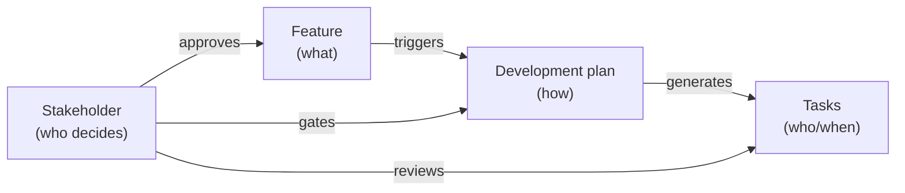

# Feature: Stakeholder

**Status:** Conceptual

## Summary

A stakeholder is any entity — human or AI agent — that participates in workflow decisions within a Synchestra project. Stakeholders review specifications, approve plans, review code, and provide input when agents need guidance. They are the "who decides" layer that connects Synchestra's workflow artifacts (features, plans, tasks) to the people and agents responsible for governing them.

The stakeholder feature formalizes three things that are currently implicit:

1. **Identity** — who can participate in decisions (humans, AI agents)
2. **Routing** — who gets assigned to which decisions, based on roles and feature scope
3. **Interaction** — how decisions are requested, structured, responded to, and recorded

## Problem

Synchestra has well-defined decision points — development plans go through `in_review → approved`, proposals have review status, code gets reviewed before merge. But three questions are unanswered:

- **Who** reviews or approves? Today this is implicit — whoever happens to be around.
- **How** are decisions requested? Agents that hit blockers have no structured way to ask for input. They call `task block` and hope someone notices.
- **Where** are decisions recorded? Approval decisions vanish into git commit messages or chat history with no queryable audit trail.

Without stakeholders, Synchestra can coordinate *work* but cannot coordinate *decisions*.

## Design Philosophy

Stakeholders sit between the "what" layer (features, proposals) and the "who/when" layer (tasks, execution). They answer: **who has authority over this decision, and how do they exercise it?**

**Decisions are tasks.** A decision request creates a task of `type: decision` with structured metadata in frontmatter and human-readable context in the markdown body. This reuses the existing task infrastructure — claiming, status tracking, board visibility — without inventing a parallel system.

**Roles, not individuals.** Assignments go through roles (`code-reviewer`, `spec-approver`), not directly to people. This indirection means changing who reviews CLI code is a single config edit, not a search-and-replace across the project.

**Hierarchical resolution.** Roles are defined at the project level and overridden per-feature using `add`/`remove` operations that cascade through the feature tree. A sub-feature inherits its parent's role assignments unless it explicitly modifies them.

**Agent IDs are resolvable.** When an AI agent stakeholder ID matches an available agent in the current runtime environment (Claude Code, Copilot, etc.), Synchestra dispatches the decision task directly to that agent. When no match is found, the task is created and queued for manual pickup.

## Identity Model

Stakeholders are identified by inline string references:

**Format:** `{id}[@{platform}][:{key}={value},...]`

| Component | Meaning | Example |
|---|---|---|
| `id` | Canonical identifier within the project | `alex`, `agent-x` |
| `@platform` | Human on a platform (absence implies AI agent) | `alex@github` |
| `:{key}={value}` | Inline configuration parameters | `agent-x:model=opus` |

**Examples:**

- `alex@github` — human, GitHub user
- `bob@gitlab` — human, GitLab user
- `agent-x:model=opus` — AI agent with model configuration
- `lint-bot` — AI agent with default configuration

**Uniqueness:** The `id` portion (before `@` or `:`) is the canonical identifier. `alex@github:timezone=UTC` and `alex@github` refer to the same stakeholder. `alex@github` and `alex@gitlab` are different stakeholders.

**No registry for now.** Stakeholders exist only as references in role assignments. The format is designed so a `stakeholders.yaml` registry can be introduced later — at that point inline strings resolve against the registry, and unregistered strings are either errors or auto-registered depending on project configuration.

## Contents

| Directory | Description |
|---|---|
| [role/](role/README.md) | Role definitions and hierarchical add/remove resolution |
| [decision/](decision/README.md) | Decision lifecycle — request, response, blocking, and unblocking |
| [gate/](gate/README.md) | Built-in and future custom workflow gates |
| [notification/](notification/README.md) | Signal vs payload delivery and agent resumption |

### role

Roles are named responsibilities (`code-reviewer`, `spec-approver`) that map to stakeholders. Defined at the project level, overridden per-feature with `add`/`remove` operations that cascade through the feature hierarchy. The resolved set of stakeholders for a role at any feature is computed by walking the tree from root to target.

### decision

The core interaction unit. A decision is a structured request for stakeholder input, created either by a workflow gate or by an agent that needs guidance. Decisions are tasks with `type: decision`, structured options in frontmatter, and human-readable context in the markdown body. Contains sub-features for [options format](decision/options/README.md) and [audit logging](decision/audit/README.md).

### gate

Named decision points in workflows where stakeholders must weigh in before the process continues. Ships with built-in gates for spec review, code review, and plan approval. Gates configure which roles are required and what policy governs resolution (all, any, min, majority). Designed to support custom user-defined gates in the future.

### notification

How stakeholders learn about decisions and how responses flow back to requesting agents. Separates signal (always pushed) from payload (inlined if small, referenced if large). Covers delivery channels (bot, GitHub, webhook, email, CLI polling) and agent resumption strategies for both long-running and ephemeral agents.

## Integration Points

| Feature | Relationship |
|---|---|
| [task-status-board](../task-status-board/README.md) | Decisions are tasks with `type: decision` — appear on the board. Introduces the `type` field to the task model (planned addition to task-status-board spec). |
| [cli](../cli/README.md) | New `synchestra decision` and `synchestra stakeholder` command groups (planned addition to CLI spec) |
| [agent-skills](../agent-skills/README.md) | `synchestra-decision-request` skill for agent-initiated decisions |
| [state-store](../state-store/README.md) | `DecisionStore` sub-interface joins existing store hierarchy (planned addition to state-store spec) |
| [development-plan](../development-plan/README.md) | Gates trigger on plan status transitions |
| [feature](../feature/README.md) | `_config.yaml` for feature-scoped role overrides (planned addition to feature spec's reserved `_` prefix table) |
| [github-app](../github-app/README.md) | GitHub review requests and PR comments as a notification delivery channel |
| [chat](../chat/README.md) | Workflows can create decisions as part of guided conversations (planned addition to chat spec) |
| [ui](../ui/README.md) | Renders decision tasks with structured options (buttons, selects) |
| [bots](../bots/README.md) | Delivers decision notifications and accepts responses |

## Acceptance Criteria

Not defined yet.

## Outstanding Questions

- Acceptance criteria are not yet defined for this feature.

- Should the `stakeholders.yaml` registry be specified now as a future sub-feature, or deferred entirely until real usage patterns emerge?
- How should role resolution interact with cross-repo-sync — if a decision spans multiple repositories, are stakeholders resolved per-repo or at the coordination level?
- Should there be a default timeout for decisions, and what happens when a decision expires — auto-reject, escalate, or leave blocked?
- When an agent ID is resolvable and dispatched directly, should there be a fallback timeout after which the task is re-queued for manual pickup (in case the agent fails silently)?
