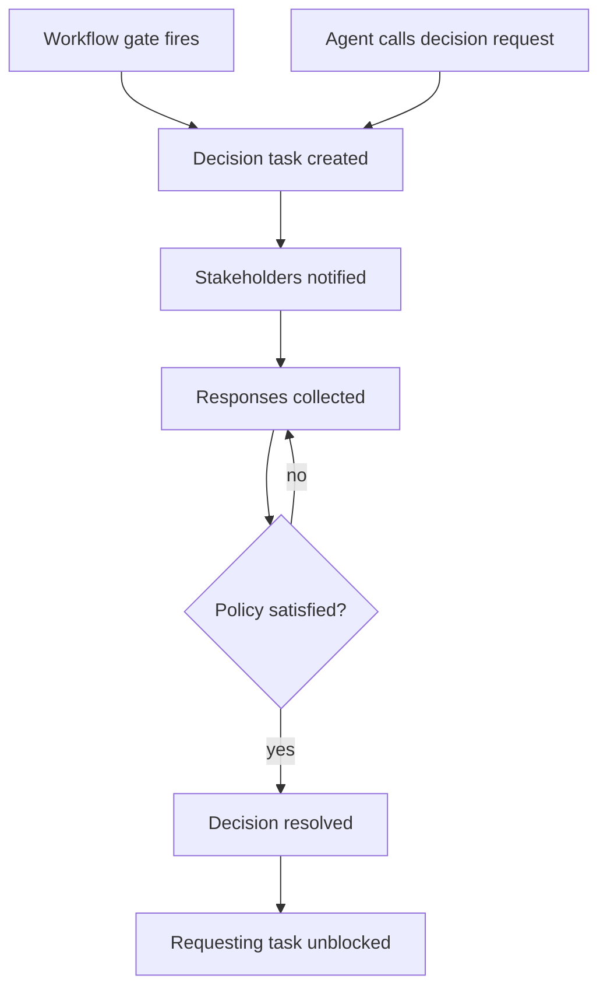
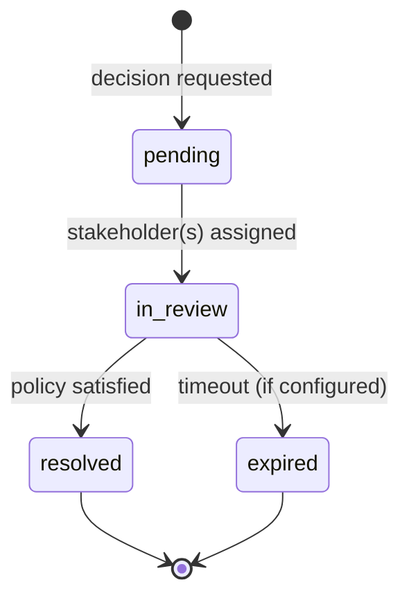

# Feature: Stakeholder / Decision

**Status:** Conceptual

## Summary

A decision is a structured request for [stakeholder](../README.md) input. It is the core interaction unit of the stakeholder feature — the mechanism through which agents and workflows ask humans or other agents to make choices, approve work, or provide guidance.

Decisions are implemented as tasks with `type: decision`. This reuses the existing task infrastructure (claiming, status tracking, board visibility) while adding structured metadata for options, stakeholder assignment, and response policy.

## Contents

| Directory | Description |
|---|---|
| [options/](options/README.md) | Structured options format — types, keys, labels, and `allow_custom` |
| [audit/](audit/README.md) | Per-task decision log recording responses and outcomes |

### options

Defines the structured format for presenting choices to stakeholders. Covers interaction types (`pick-one`, `pick-many`, `approve-reject`, `free-text`), the `key` + optional `label` model, and `allow_custom` for free-text escape hatches. Designed to give UIs enough information to render appropriate controls (buttons, selects, radio groups) without prescribing specific UI implementations.

### audit

Every decision accumulates a record of stakeholder responses in a `decisions.md` file within the task directory. The audit log captures who responded, what they chose, when, and the final outcome once the resolution policy is satisfied. Custom/free-text responses are recorded inline. The log is a human-readable markdown file, not machine configuration.

## Problem

Synchestra agents encounter two situations that require external input:

1. **Workflow gates** — a development plan needs review, code needs approval, a spec needs sign-off. These are predictable decision points defined by the project's workflow.
2. **Agent blockers** — an agent is implementing a task and encounters an ambiguity, a trade-off, or a choice it cannot make autonomously. Today it calls `task block` and waits, but there is no structured way to describe what it needs or from whom.

Both cases require the same mechanism: create a structured request, assign it to the right stakeholders, collect responses, and feed the outcome back into the workflow.

## Behavior

### Two Triggers

**Gate-triggered decisions** are created automatically when a workflow reaches a configured [gate](../gate/README.md). The gate definition specifies which [roles](../role/README.md) are required and what policy governs resolution.

**Agent-initiated decisions** are created by an agent that needs input. The agent calls `synchestra decision request` (via skill or CLI), providing the question, options, and optionally which role should answer. The agent's current task is automatically blocked pending the decision.



### Decision Lifecycle



### Decision Task Format

A decision is a task with `type: decision`. Structured metadata lives in YAML frontmatter; human-readable context lives in the markdown body.

```markdown
---
type: decision
requester: agent-x
source_task: implement-api
gate: code-review
stakeholders:
  - alex@github
  - carol@github
policy: min
min: 2
options:
  type: pick-one
  items:
    - key: jwt
      label: "JWT bearer tokens"
    - key: api-key
      label: "Static API keys"
    - key: oauth
      label: "OAuth 2.0 with PKCE"
  allow_custom: true
---

# Decision: API Authentication Method

The API needs an authentication method. JWT is stateless and scalable
but requires token refresh logic. API keys are simpler but less secure
for user-facing endpoints. OAuth adds third-party support but is complex
to implement.

## Context

- Related spec: [API feature](spec/features/api/README.md)
- Current task: [implement-api](../implement-api/)
- See also: [security guidelines](docs/security.md)
```

### Frontmatter Fields

| Field | Required | Description |
|---|---|---|
| `type` | Yes | Always `decision` |
| `requester` | Yes | Stakeholder ID of who requested the decision |
| `source_task` | If agent-initiated | Task ID that spawned this decision |
| `gate` | If gate-triggered | Gate name that triggered this decision |
| `stakeholders` | Yes | Resolved list of stakeholders assigned to this decision |
| `policy` | Yes | Resolution policy: `all`, `any`, `min`, `majority` |
| `min` | If policy is `min` | Minimum number of responses required |
| `options` | Yes | Structured options (see [options/](options/README.md)) |

### Blocking and Unblocking

When an agent-initiated decision is created:

1. The agent's current task transitions to `blocked` with a reference to the decision task
2. The decision task is created and assigned to the resolved stakeholders
3. Stakeholders are [notified](../notification/README.md) through configured channels

When a decision resolves:

1. The outcome is written to the decision task's [audit log](audit/README.md)
2. The decision task's markdown body is updated with the resolved outcome
3. The requesting task transitions from `blocked` back to `queued` (or `in_progress` if the agent is still live)
4. The resuming agent reads the decision from the task context

### Custom Responses and Follow-up

When a stakeholder provides a custom response (via `allow_custom`), the decision may not resolve cleanly into a single option key. In this case:

- The custom response is recorded in the audit log
- The requesting agent receives the free-text response and must interpret it
- The agent may create a follow-up decision to clarify, forming an async conversation loop

This is by design — not every decision fits neatly into predefined options, and the ability to steer with free-text is what enables truly async, persistent conversations between stakeholders and agents.

## Outstanding Questions

- Should decisions support attachments (files, images, links) in addition to text context?
- What is the maximum nesting depth for follow-up decisions before the system should escalate to a human?
- Should there be a way to delegate a decision — a stakeholder receives it but reassigns to someone else?
