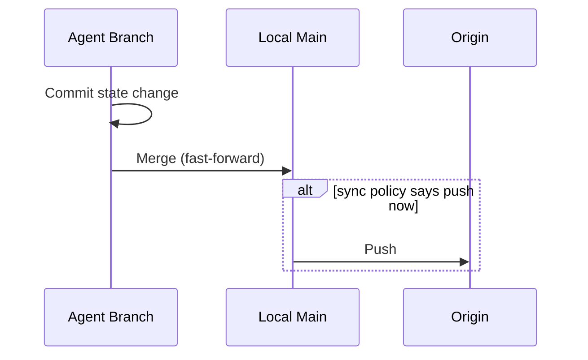
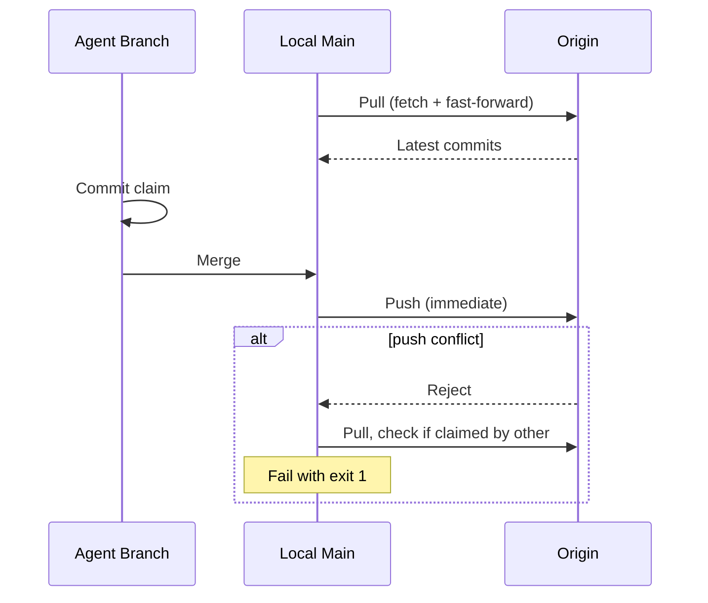

# Backend: Git State Store

**Parent:** [Backends](../)

**Status:** Conceptual

## Summary

The git backend (`gitstore`) is the default `state.Store` implementation. It maps every interface method to file operations, markdown table rendering, and atomic commit-and-push in the [state repository](../../../../architecture/repository-types.md#state-repository).

This backend requires no external infrastructure — only a git remote. It is the reference implementation against which all other backends are validated.

## Implementation Location

`pkg/state/gitstore/`

## Method Mapping

### TaskStore

| Interface Method | Git Operation |
|---|---|
| `Task().Create()` | Create `tasks/{slug}/README.md` with metadata, update board table, commit |
| `Task().Get()` | Parse `tasks/{slug}/README.md` |
| `Task().List()` | Scan `tasks/` directories, parse each README, apply filter |
| `Task().Enqueue()` | Update status field in `tasks/{slug}/README.md`, commit, push |
| `Task().Claim()` | Update status → claimed + claim metadata, commit, push (fail on conflict = another agent won) |
| `Task().Start()` | Update status → in_progress, commit, push |
| `Task().Complete()` | Update status → completed + summary, move board row to recently-finished, commit, push |
| `Task().Fail()` | Update status → failed + reason, move board row to recently-finished, commit, push |
| `Task().Block()` | Update status → blocked + reason, commit, push |
| `Task().Unblock()` | Update status → in_progress, commit, push |
| `Task().Release()` | Update status → queued, clear claim metadata, commit, push |
| `Task().RequestAbort()` | Set `abort_requested: true` in task README, commit, push |
| `Task().ConfirmAbort()` | Update status → aborted, move board row to recently-finished, commit, push |

### Board

| Interface Method | Git Operation |
|---|---|
| `Task().Board().Rebuild()` | Regenerate `tasks/README.md` markdown table from all task READMEs |
| `Task().Board().Get()` | Parse `tasks/README.md` markdown table into `BoardView` |

### ArtifactStore (Task-Scoped)

| Interface Method | Git Operation |
|---|---|
| `Task().Artifact(ctx, slug).Put()` | Write file to `tasks/{slug}/artifacts/{name}`, commit |
| `Task().Artifact(ctx, slug).Get()` | Read file from `tasks/{slug}/artifacts/{name}` |
| `Task().Artifact(ctx, slug).List()` | List files in `tasks/{slug}/artifacts/` |

### ChatStore

| Interface Method | Git Operation |
|---|---|
| `Chat().Create()` | Create `chats/{id}/README.md` with metadata, commit |
| `Chat().Get()` | Parse `chats/{id}/README.md` |
| `Chat().List()` | Scan `chats/` directories, parse each README, apply filter |
| `Chat().Finalize()` | Update status → finalized, flush messages to `history.jsonl`, commit, push |
| `Chat().Abandon()` | Update status → abandoned, flush messages, commit, push |
| `Chat().AppendMessages()` | Append to server-side buffer (flushed to git on finalize/checkpoint) |
| `Chat().Messages()` | Read from `chats/{id}/history.jsonl` |

### ArtifactStore (Chat-Scoped)

| Interface Method | Git Operation |
|---|---|
| `Chat().Artifact(ctx, id).Put()` | Write file to `chats/{id}/artifacts/{name}`, commit |
| `Chat().Artifact(ctx, id).Get()` | Read file from `chats/{id}/artifacts/{name}` |
| `Chat().Artifact(ctx, id).List()` | List files in `chats/{id}/artifacts/` |

### ProjectStore

| Interface Method | Git Operation |
|---|---|
| `Project().Config()` | Read and parse `synchestra-state-repo.yaml` |
| `Project().UpdateConfig()` | Write `synchestra-state-repo.yaml`, commit |
| `Project().RebuildREADME()` | Regenerate root `README.md` from project state |

### StateSync

| Interface Method | Git Operation |
|---|---|
| `State().Pull()` | Fetch from origin, fast-forward local main, rebase active agent branches |
| `State().Push()` | Merge pending agent branch commits to local main, push main to origin |
| `State().Sync()` | Pull then push, with conflict retry |

## Sync Policy

The git backend respects the `SyncConfig` from `StoreOptions` to determine when automatic pull/push happens. See [State Store: SyncConfig](../../README.md#construction) for the policy values and configuration.

| Policy | Pull before read | Push after write | Use case |
|---|---|---|---|
| `on_commit` | Yes | Yes | Multi-host: multiple agents on different machines. Every operation hits the remote to ensure consistency. This is the default. |
| `on_interval=<dur>` | On timer | On timer | Balanced: reduces network I/O while maintaining periodic freshness. |
| `on_session_end` | No | On session close | Single-host primary: local agents work freely, push when done. |
| `manual` | No | No | Full manual control: sync only via explicit `synchestra state pull/push/sync` commands. |

**Contended operations note:** `task claim` follows the project's sync policy like any other mutation command. Under the default `on_commit` policy, this means an immediate pull+push round-trip, which preserves optimistic locking via git's push-or-fail semantics. Under policies that defer push (e.g., `manual`, `on_session_end`), claim atomicity is scoped to the local host — the caller or orchestrator is responsible for ensuring remote visibility when needed (e.g., via `synchestra state push` or the `--sync` flag).

## Agent Branching Model

Each agent operates on a dedicated branch in the state repository:

```
agent/<run-id>
```

Where `<run-id>` is the same identifier passed to `task claim --run`. This gives each agent session its own branch, traceable back to the task run.

```go
// GitStoreOptions holds git-backend-specific configuration.
type GitStoreOptions struct {
    state.StoreOptions          // embeds shared options including SyncConfig
    RunID              string   // agent branch: agent/<run-id>
}
```

### Operation flow

For a typical mutating operation (e.g., `task complete`):



1. Commit on `agent/<run-id>`
2. Checkout main
3. Merge `agent/<run-id>` (fast-forward if possible)
4. If sync policy says push now → push main to origin
5. Checkout `agent/<run-id>`

### Conflict during merge to local main

Another local agent may have merged to main concurrently. Resolution:
- Pull main (local)
- Rebase `agent/<run-id>` onto main
- Retry merge
- State repo changes are small and scoped to different files (different task directories), so conflicts should be rare

### Conflict during push to origin

Another environment pushed to origin. Resolution:
- Pull origin → local main
- Rebase and retry push
- If the conflict affects the same task (e.g., two environments both completing the same task), fail with exit `1`

### Branch cleanup

Agent branches are deleted after the agent session ends, after final merge to main.

### Contended operations (`task claim`)

Follows the sync policy like other mutations. Under `on_commit` (default), this is a full round-trip:



Under policies that defer push (`manual`, `on_session_end`, `on_interval`), the push step is skipped and claim atomicity is scoped to the local host. Use `--sync remote` or `synchestra state push` to force immediate remote visibility when needed.

## Atomicity

The git backend relies on the agent branching model for local atomicity and git's push-or-fail semantics for remote atomicity.

**Local atomicity:** Each agent writes to its own branch (`agent/<run-id>`), so concurrent local agents never conflict at the commit level. Contention is resolved during the merge-to-main step, where only one agent can merge at a time.

**Remote atomicity (when sync policy triggers a push):** The push-or-fail protocol ensures exactly one environment succeeds. On conflict: pull, re-verify preconditions, retry or fail.

See [Task Status Board: Claiming a Task](../../../task-status-board/README.md#claiming-a-task-optimistic-locking) for the detailed claiming protocol and conflict resolution.

## Performance Characteristics

| Operation | Cost (`on_commit`) | Cost (`manual` / `on_interval`) | Notes |
|---|---|---|---|
| Read (Get, List) | Pull + file I/O | File I/O only | Deferred sync avoids network round-trip |
| Write (Create, status transitions) | File I/O + commit + merge + push | File I/O + commit + merge | Deferred sync defers push |
| Claim (contended) | File I/O + commit + merge + push + retry | File I/O + commit + merge (local only) | Same as other mutations; use `--sync remote` for immediate remote contention |
| Board Rebuild | Scan all task directories | Same | O(n) in number of tasks regardless of policy |

For single-host setups, `manual` or `on_interval` sync policies eliminate network overhead from the hot path — mutations become local file + commit + merge operations. Periodic or manual push keeps the remote in sync for visibility (dashboards, other tools) without blocking agent work.

For projects with hundreds of concurrent agents or thousands of tasks, database backends may offer better performance. See the [backend matrix](../) for alternatives.

## Outstanding Questions

- Should the git backend batch multiple mutations into a single commit when they occur within a short window (e.g., creating a task and immediately enqueuing it)?
- How should the git backend handle partial failures (e.g., commit succeeds but push fails due to network error)?
- Should `AppendMessages` write to a local buffer file or hold messages in memory until finalize?
