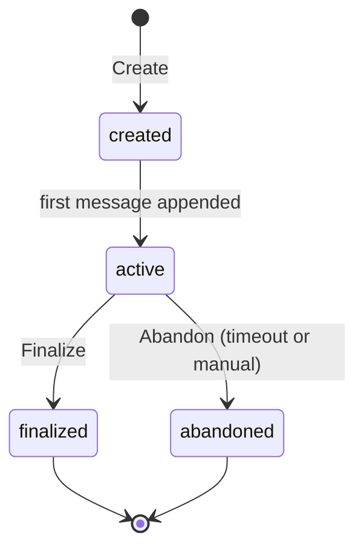

# Sub-Feature: Chat Store

**Parent:** [State Store](../)

**Status:** Conceptual

## Summary

The `ChatStore` interface defines operations for chat lifecycle management, append-only message history, and chat-scoped artifacts.

## Interface

```go
package state

type ChatStore interface {
    Create(ctx context.Context, params ChatCreateParams) (Chat, error)
    Get(ctx context.Context, chatID string) (Chat, error)
    List(ctx context.Context, filter ChatFilter) ([]Chat, error)
    Finalize(ctx context.Context, chatID string) error
    Abandon(ctx context.Context, chatID string) error

    // Message history — append-only
    AppendMessages(ctx context.Context, chatID string, messages []ChatMessage) error
    Messages(ctx context.Context, chatID string) ([]ChatMessage, error)

    // Nested accessor — reuses ArtifactStore interface
    Artifact(ctx context.Context, chatID string) ArtifactStore
}
```

## Chat Lifecycle



- **`created`** — directory exists, metadata set, no messages yet
- **`active`** — messages are being exchanged, artifacts may be produced
- **`finalized`** — user closed the chat, artifacts in final state, message history flushed
- **`abandoned`** — inactive beyond configured timeout, auto-finalized

See [Chat](../../chat/) for the full chat feature specification including workflows, hybrid storage, and retention policies.

## Message History

Messages are append-only. `AppendMessages` adds messages to the chat; `Messages` returns the full history. There is no editing or deleting of individual messages.

In the git backend, messages are held server-side during active chat and flushed to `history.jsonl` on finalize or checkpoint. See [Chat Workflow](../../chat/workflow/) for the hybrid storage model.

## Artifacts

Chat artifacts use the same `ArtifactStore` interface as task artifacts. They represent documents produced during the chat — proposals, feature specs, issues, PRs.

Access: `store.Chat().Artifact(ctx, chatID).Get(ctx, name)`

## Types

```go
type Chat struct {
    ID        string
    Anchor    string     // what the chat is about
    Workflow  string     // workflow name
    Status    ChatStatus
    User      string
    CreatedAt time.Time
    UpdatedAt time.Time
}

type ChatCreateParams struct {
    Anchor   string
    Workflow string
    User     string
}

type ChatFilter struct {
    Status *ChatStatus
}

type ChatStatus string

const (
    ChatStatusCreated   ChatStatus = "created"
    ChatStatusActive    ChatStatus = "active"
    ChatStatusFinalized ChatStatus = "finalized"
    ChatStatusAbandoned ChatStatus = "abandoned"
)

type ChatMessage struct {
    Role      string
    Content   string
    Timestamp time.Time
}
```

## Outstanding Questions

- Should `Messages` support pagination or cursor-based access for long chat histories?
- Should there be a `Checkpoint` method that flushes messages to durable storage without finalizing the chat?
- How should the `created → active` transition be triggered — implicitly on first `AppendMessages`, or explicitly?
