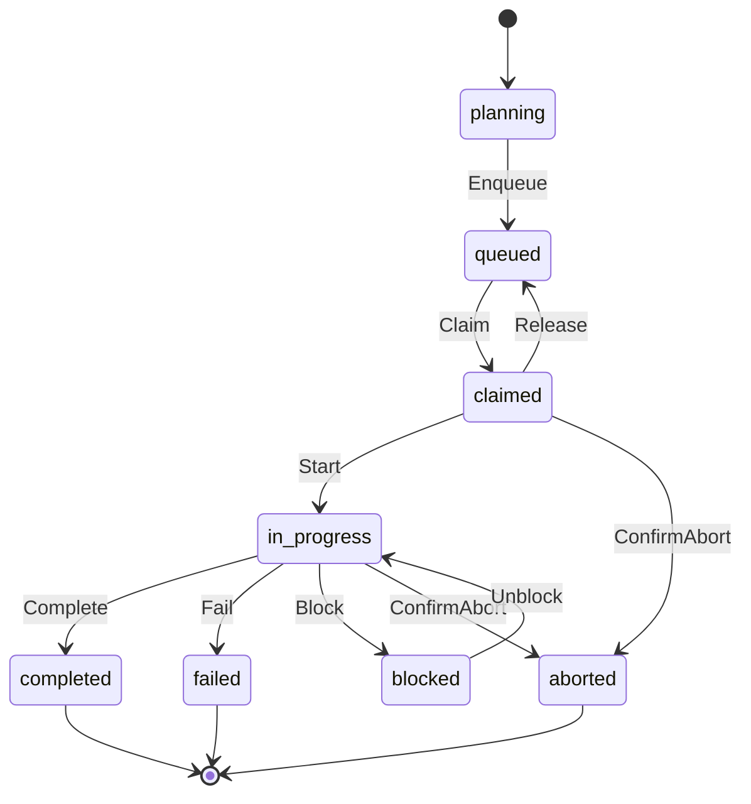

# Sub-Feature: Task Store

**Parent:** [State Store](../)

**Status:** Conceptual

## Summary

The `TaskStore` interface defines all operations on tasks — creation, querying, status transitions, and access to nested board and artifact sub-interfaces.

## Interface

```go
package state

type TaskStore interface {
    Create(ctx context.Context, params TaskCreateParams) (Task, error)
    Get(ctx context.Context, slug string) (Task, error)
    List(ctx context.Context, filter TaskFilter) ([]Task, error)

    // Status transitions — each method enforces valid preconditions
    Enqueue(ctx context.Context, slug string) error                        // planning → queued
    Claim(ctx context.Context, slug string, claim ClaimParams) error       // queued → claimed (atomic)
    Start(ctx context.Context, slug string) error                          // claimed → in_progress
    Complete(ctx context.Context, slug string, summary string) error       // in_progress → completed
    Fail(ctx context.Context, slug string, reason string) error            // in_progress → failed
    Block(ctx context.Context, slug string, reason string) error           // in_progress → blocked
    Unblock(ctx context.Context, slug string) error                        // blocked → in_progress
    Release(ctx context.Context, slug string) error                        // claimed → queued
    RequestAbort(ctx context.Context, slug string) error                   // sets abort_requested flag
    ConfirmAbort(ctx context.Context, slug string) error                   // claimed/in_progress → aborted

    // Nested accessors
    Board() Board
    Artifact(ctx context.Context, taskSlug string) ArtifactStore
}
```

## Status Lifecycle



Each transition method enforces that the task is in the correct source status. Calling `Complete` on a task that is not `in_progress` returns an error.

## Claim Atomicity

`Claim` must guarantee that exactly one caller succeeds when multiple agents attempt to claim the same task concurrently. The interface does not prescribe how — each backend uses its native mechanism:

- **Git:** Atomic commit-and-push; push failure indicates another agent claimed first
- **SQL:** `UPDATE tasks SET status = 'claimed' WHERE slug = ? AND status = 'queued'`; affected rows = 0 means lost race

See [Claim and Push](../../claim-and-push/) for the full git-based protocol.

## Board

```go
type Board interface {
    Rebuild(ctx context.Context) error
    Get(ctx context.Context) (BoardView, error)
}
```

The board is a rendered view of task state. `Rebuild` regenerates it from all task records. `Get` returns the current board as structured data.

See [Task Status Board](../../task-status-board/) for the board format, columns, and rendering rules.

## Artifact Store

```go
type ArtifactStore interface {
    Put(ctx context.Context, name string, data []byte) error
    Get(ctx context.Context, name string) ([]byte, error)
    List(ctx context.Context) ([]ArtifactRef, error)
}
```

Artifacts are named outputs produced by tasks — schemas, API contracts, migration plans, etc. They are scoped to a task (accessed via `store.Task().Artifact(ctx, taskSlug)`) or to a chat (via `store.Chat().Artifact(ctx, chatID)`). The same `ArtifactStore` interface is reused in both contexts.

See [Development Plan](../../development-plan/) for how artifacts are declared in plans and consumed by downstream tasks.

## Types

```go
type Task struct {
    Slug      string
    Title     string
    Status    TaskStatus
    Parent    string       // parent task slug, empty for root
    DependsOn []string
    Run       string       // agent run ID (if claimed/in_progress)
    Model     string       // agent model ID (if claimed/in_progress)
    Requester string
    Reason    string       // block/fail/abort reason
    Summary   string       // completion summary
    CreatedAt time.Time
    ClaimedAt *time.Time
    UpdatedAt time.Time
}

type TaskCreateParams struct {
    Slug      string
    Title     string
    Parent    string
    DependsOn []string
    Requester string
}

type ClaimParams struct {
    Run   string
    Model string
}

type TaskFilter struct {
    Status *TaskStatus
    Parent *string  // nil = all tasks
}

type TaskStatus string

const (
    TaskStatusPlanning   TaskStatus = "planning"
    TaskStatusQueued     TaskStatus = "queued"
    TaskStatusClaimed    TaskStatus = "claimed"
    TaskStatusInProgress TaskStatus = "in_progress"
    TaskStatusCompleted  TaskStatus = "completed"
    TaskStatusFailed     TaskStatus = "failed"
    TaskStatusBlocked    TaskStatus = "blocked"
    TaskStatusAborted    TaskStatus = "aborted"
)

type BoardView struct {
    Rows []BoardRow
}

type BoardRow struct {
    Task      string
    Status    TaskStatus
    DependsOn []string
    Branch    string
    Agent     string
    Requester string
    StartedAt *time.Time
    Duration  *time.Duration
}

type ArtifactRef struct {
    Name string
    Size int64
}
```

## Outstanding Questions

- Should `TaskFilter` support filtering by requester, model, or time range?
- Should `List` support pagination for projects with very large task trees?
- Should there be a `Watch` method for streaming task status changes (useful for dashboards and CI integrations)?
- Should there be `Delete` or `Archive` methods on `TaskStore`, or is accumulation by design (with the recently-finished section handling visibility)?
- Should `Artifact()` accessor drop `context.Context` for consistency with `Board()` (both are namespace accessors, not leaf I/O), deferring context to the leaf methods like `Get` and `Put`?
- Should `ArtifactStore.Put` accept `io.Reader` instead of `[]byte` for large artifacts?
