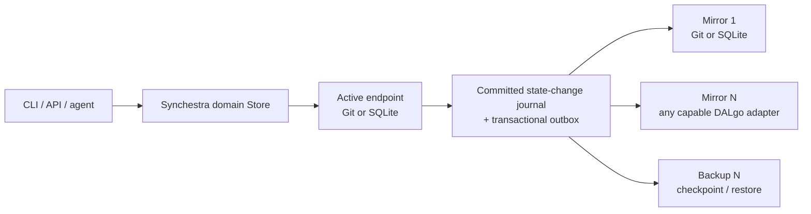

# Feature: Authoritative Store and Replicas

**Status:** Approved
**Source Ideas:** —
**Parent:** [State Store](../)

## Summary

Synchestra state is deployed as a topology with exactly one authoritative
**active** store and one or more **replicas**. The active store is the only
store that accepts domain writes. Replicas consume an ordered state-change
journal and serve either as continuously updated mirrors or restore-oriented
backups. Storage technology and topology role are independent: Git, SQLite,
and future DALgo adapters can participate in either role when they implement
the required capabilities.

Every Synchestra project has at least one Git state repository. Git may be the
active store or a replica. The first two validated topologies use the same two
storage technologies in opposite roles:

1. Git active, SQLite mirror.
2. SQLite active, Git mirror.

This validates the abstraction in both directions and gives comparable
performance, replication-lag, and recovery measurements.

## Contents

| Child | Description |
|---|---|
| [offline-fallback](offline-fallback/README.md) | Keeps agent messaging and recoverable coordination available through the required Git state repository when the Synchestra server is unavailable. |

## Problem

Git provides reviewable history, portability, and recovery without a service,
but high-churn coordination state creates repeated pull/commit/push latency,
merge contention, and repository growth. SQLite provides fast transactions and
indexed queries on one server, but a database file alone is a poor collaboration
and disaster-recovery boundary.

Treating one backend as a permanent source of truth would couple task claiming,
agent presence, messages, and activity views to that backend. Synchronously
writing two independent stores would preserve Git latency and make partial
failure ambiguous. Synchestra therefore needs an explicit authority and
replication protocol rather than ad hoc dual writes.

## Vocabulary

| Term | Meaning |
|---|---|
| **Active store** | The single authoritative endpoint that validates and commits writes for one project. |
| **Replica** | A non-authoritative endpoint that applies changes emitted by the active store and never accepts independent domain writes. |
| **Mirror** | A continuously replicated, queryable replica that may be promoted after it is caught up and verified. |
| **Backup** | A replica optimized for immutable checkpoints and restore; it need not support normal queries or promotion without restore. |
| **State change** | An immutable, idempotent journal entry describing one committed domain transition. |
| **Authority epoch** | A monotonically increasing generation that fences writes from a former active store after promotion. |
| **Replica cursor** | The last contiguous `(authority_epoch, sequence)` durably applied by a replica. |
| **Mirror barrier** | A request to wait until selected replicas acknowledge a specified state change. |

## Topology Invariants

### REQ: exactly-one-active

A project MUST have exactly one configured active store. All normal reads and
all domain writes go to that store unless a read explicitly requests a named
replica and accepts its reported staleness. Synchestra MUST NOT implement
multi-master writes.

### REQ: one-or-more-replicas

A project MUST configure one or more replicas, each with a stable ID and a
purpose of `mirror` or `backup`. A newly initialized topology that has no
replica is invalid. A legacy Git-only project MAY be opened for migration, but
must be reported as `degraded: replica_missing` and MUST NOT be presented as a
healthy production topology.

### REQ: git-required

At least one endpoint in every topology MUST use the Git backend. When Git is
not active, at least one required replica MUST use Git. A Git state repository
is private by default because Synchestra state may contain prompts, messages,
and operational metadata.

### REQ: role-independent-backends

Backend type MUST NOT imply authority. A backend advertises capabilities for
the roles it can perform. The initial Git and SQLite implementations MUST both
support `active` and `mirror`. A backup-only adapter MAY omit query and active
write capabilities.

## Architecture



Synchestra retains two abstraction layers:

1. `state.Store` is the domain contract. It exposes task, session, claim,
   worktree, message, activity, and project operations with Synchestra
   transition rules.
2. DALgo is the persistence contract beneath each endpoint. The SQLite endpoint
   uses `dalgo2sqlite`; the Git endpoint uses inGitDB through its DALgo adapter.

Domain code MUST NOT import SQLite, inGitDB, GitHub, or filesystem APIs.
Replication MUST NOT depend on a backend's private representation.

## State-Change Journal

### REQ: commit-with-journal

An active write MUST commit the domain records, one immutable state-change
entry, and one outbox delivery record per configured replica as one atomic
transaction. A successful domain response without the corresponding journal
and outbox records is invalid.

Every state change contains at least:

```json
{
  "schema": "https://synchestra.io/schemas/state-change/v1",
  "project_id": "github.com/acme/service",
  "event_id": "01J...",
  "authority_epoch": 7,
  "sequence": 1842,
  "occurred_at": "2026-08-10T10:15:30Z",
  "actor_id": "agent:run_01J...",
  "command_id": "01J...",
  "idempotency_key": "task:claim:...",
  "operations": [],
  "previous_checksum": "sha256:...",
  "checksum": "sha256:..."
}
```

`sequence` is contiguous within an authority epoch. `event_id` and
`idempotency_key` provide deduplication; the checksum chain detects omission,
reordering, or mutation. Payload schemas are versioned and deterministic.

### REQ: no-synchronous-dual-write

Domain handlers MUST NOT call two independent stores and report success only
after both return. The active transaction commits once. Replica workers deliver
from the transactional outbox after that commit. This keeps the hot path
bounded and makes every partial failure recoverable from durable state.

### REQ: idempotent-ordered-apply

A replica applies changes in contiguous sequence order. Reapplying an existing
`event_id` is a no-op after checksum verification. A gap, mismatched checksum,
or stale authority epoch stops that replica and surfaces a hard health error;
the worker MUST NOT skip the invalid entry.

## Write Acknowledgement and Durability

Normal commands acknowledge after the active transaction is durable. Callers
that need external durability may request a mirror barrier for one named
replica, all required mirrors, or a specific cursor. Mirror failure is never
silently reported as full durability.

Terminal lifecycle operations that allow local recovery data to be deleted
MUST expose the committed cursor. Workbench may retain its Work Log until the
required Git mirror has crossed that cursor even though the Synchestra command
itself already succeeded.

If a required replica exceeds its configured maximum lag or loses checksum
continuity, topology health becomes degraded. Operators may configure a
fail-closed lag threshold for new writes; the default remains fail-open with a
visible alert so a Git outage does not halt active agents.

## Read Routing and Staleness

Normal CLI/API reads use the active store. A named mirror may serve dashboards,
analytics, verification, or offline inspection only when the response includes:

- replica ID and purpose;
- applied authority epoch and sequence;
- active head epoch and sequence when reachable;
- event and wall-clock lag;
- whether the requested consistency bound was satisfied.

An unlabelled stale response is invalid. Task claims, lease renewals, message
acknowledgements, and all state transitions MUST use the active store.

## Health, Reconciliation, and Measurement

`synchestra state status --format json` exposes active identity and authority
epoch plus every replica's purpose, cursor, lag, last success, last error, and
verification state. `synchestra state verify` compares deterministic collection
checksums at a selected cursor. `synchestra state replicate` drains pending
outbox entries, and `synchestra state wait` implements a mirror barrier.

The server records backend-neutral measurements for the same workload:

- operation count, error count, conflict count, and retry count;
- p50/p95/p99 read and write latency;
- sustained operations per second;
- active journal depth and per-replica event/time lag;
- Git commits, bytes, and repository growth;
- recovery point and recovery time during restore/promotion tests.

Metrics MUST identify endpoint role and backend type without including prompts,
messages, repository credentials, or other state payloads.

## Promotion and Recovery

Promotion is an explicit administrative workflow:

1. acquire the project authority lease and stop or fence active writes;
2. drain and verify the candidate mirror at the active cursor;
3. record a signed promotion checkpoint in all reachable required replicas;
4. increment the authority epoch;
5. atomically publish the new active endpoint and epoch;
6. enable writes on the new active;
7. reconfigure the old active as a replica or mark it retired.

Every mutation carries the authority epoch. An endpoint MUST reject a write for
an epoch older than its latest observed promotion checkpoint. Promotion is not
automatic merely because the active endpoint is unreachable: an operator or an
explicitly configured failover policy must accept the risk that the old active
could return.

A backup restore creates a candidate endpoint, replays through its last
verified cursor, verifies checksums, and then follows the same promotion flow.

## Initial Supported Topologies

### Git active, SQLite mirror

The CLI/server applies domain operations through the inGitDB DALgo adapter and
commits/pushes the Git active repository. A Synchestra server consumes the Git
journal into SQLite for indexed activity views and comparative measurements.
Writes remain limited by Git; SQLite reads are explicitly replica reads.

### SQLite active, Git mirror

Agents use the Synchestra server. The server applies each domain transition and
its replica outbox in one DALgo/SQLite transaction, then asynchronously mirrors
ordered changes through inGitDB into the required Git repository. This is the
default low-latency topology for the founder MVP.

Additional mirrors may be added without changing the active write path.

## Required Upstream Capabilities

The Git endpoint MUST use inGitDB through DALgo rather than a Synchestra-owned
file database. Before inGitDB is used as an active endpoint, its local and
remote DALgo adapters must provide:

- rollback-safe buffering for a multi-record transaction;
- one deterministic Git commit for a successful transaction and no changed
  files/commit when the transaction fails;
- precondition or compare-and-set support suitable for authority epoch,
  sequence, task claim, and lease fencing;
- expected-base protection so a rejected push is a conflict, not an overwrite;
- deterministic record serialization and query ordering;
- explicit fetch/push results and commit SHA evidence.

The current local inGitDB adapter documents single-writer operation but does
not yet guarantee rollback-safe multi-file transactions or DALgo preconditions.
Those capabilities are upstream prerequisites, not behavior Synchestra may
reimplement around the adapter.

## Acceptance Criteria

### AC: topology-rejects-zero-or-multiple-active

**Given** topology configurations with zero, one, and two active endpoints
**When** Synchestra validates them
**Then** only the topology with exactly one active and at least one replica is
accepted, and at least one endpoint must be Git-backed.

### AC: sqlite-active-commits-outbox-atomically

**Given** SQLite as active with required Git and SQLite mirrors
**When** a task claim commits and the process crashes at every injectable point
**Then** either neither domain state nor journal/outbox is visible, or all are
visible with one sequence; restart delivers the change exactly once to both
replicas.

### AC: git-active-replicates-to-sqlite

**Given** Git as active and SQLite as a mirror
**When** the same task lifecycle and agent-activity workload is executed
**Then** SQLite reaches the same cursor and deterministic collection checksums,
and every SQLite response identifies itself as a replica read with lag.

### AC: replica-outage-does-not-create-dual-write

**Given** an unavailable Git mirror
**When** SQLite active commits several transitions
**Then** each command has one unambiguous active result, the outbox retains all
undelivered sequences, health reports exact lag, and recovery drains them in
order without duplicate effects.

### AC: promotion-fences-former-active

**Given** a caught-up mirror and an old active that can later reconnect
**When** the mirror is promoted
**Then** the authority epoch increments, new writes succeed only on the new
active, and the former active rejects stale-epoch writes after reconnecting.

### AC: mirror-barrier-proves-git-durability

**Given** SQLite active and a required Git mirror
**When** a caller waits for the cursor returned by a terminal operation
**Then** success is returned only after Git has durably recorded that cursor and
commit SHA; timeout returns the active success plus an explicit unsatisfied
barrier, never a false rollback.

### AC: backend-comparison-is-equivalent

**Given** the conformance workload run once with Git active and once with
SQLite active
**When** final state is compared
**Then** domain records and journal checksums are equivalent, and the benchmark
reports latency, throughput, conflicts, Git growth, mirror lag, and recovery
time for both runs.

## Dependencies

- [State Store](../) — domain operations and backend-neutral construction.
- [Git Backend](../backends/git/) — required Git endpoint implemented with inGitDB and DALgo.
- [SQLite Backend](../backends/sqlite/) — server-owned low-latency endpoint implemented with DALgo.
- [Repo Config](../../repo-config/) — declares active and replica endpoints without credentials.
- [CLI Server](../../cli/server/) and [`synchestra serve`](../../cli/serve/) — own SQLite and replication workers.

## Open Questions

None at this time.

---
*This document follows the https://specscore.md/feature-specification*
