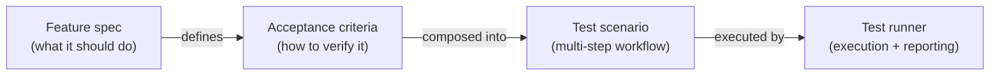

# Feature: Testing Framework

**Status:** Conceptual

## Summary

Synchestra's testing framework turns specifications into executable verification — without leaving markdown. [Acceptance criteria](../acceptance-criteria/README.md) define what "correct" means for each feature. Test scenarios compose those criteria into multi-step workflows. The runner executes everything and reports results. The entire pipeline — from AC definition to test execution — lives in the spec repository, version-controlled alongside the features it verifies. No external test infrastructure. No language coupling. No gap between what the spec says and what the tests check.

## Contents

| Directory | Description |
|---|---|
| [test-scenario](test-scenario/README.md) | The markdown scenario format: steps, outputs, AC references, includes |
| [test-runner](test-runner/README.md) | The Go execution engine: parsing, AC resolution, shell execution, reporting |

### test-scenario

Defines the markdown scenario format — a human-readable `.md` file with named steps, dependency declarations, input/output passing, AC references, and sub-flow includes. Steps execute sequentially by default with opt-in parallel groups. Every scenario doubles as documentation: a product owner reads the step descriptions; the runner executes the bash blocks. Same file, two audiences.

### test-runner

The execution engine that brings scenarios to life. Parses scenario markdown, resolves AC verification scripts from feature `_acs/` directories, executes bash steps, and produces structured pass/fail reports for both humans and CI. Self-contained Go package (`pkg/testscenario/`) with no Synchestra-specific dependencies — give it a spec root path and it handles the rest.

## Problem

Individual [acceptance criteria](../acceptance-criteria/README.md) answer "does this one thing work?" But real-world verification requires answering a harder question: **"does the whole workflow work, end to end?"**

- **No integration harness.** Go unit tests validate package-level behavior. But nobody tests the compiled CLI binary through a realistic workflow: create a project, add repositories, start a container, verify state, shut down, clean up. That requires orchestration across steps, not assertions on function return values.
- **ACs exist in isolation.** An AC like `creates-spec-config` can verify that a config file was written. But it cannot, by itself, verify that the file is still correct after three more CLI commands modify the project. Verification that crosses feature boundaries needs a way to compose ACs into ordered sequences with data flowing between steps.
- **Tests are invisible to non-developers.** Shell scripts in CI and Go test functions are opaque to product owners, business analysts, and testers who wrote the requirements in the first place. They cannot review whether "what we asked for" matches "what the tests check" without reading code.

The testing framework solves this by providing a format that everyone reads (markdown), a composition model that chains ACs into realistic workflows (scenarios), and an engine that executes it all (the runner).



## Behavior

### File locations

| Location | Purpose |
|---|---|
| `spec/tests/` | Cross-feature E2E scenarios |
| `spec/tests/flows/` | Reusable sub-flows |
| `spec/features/{feature}/_tests/` | Feature-scoped integration tests |

Cross-feature scenarios test workflows that span multiple features — the "happy path" from project creation to teardown. Feature-scoped tests focus on one feature's behavior in depth. Sub-flows are reusable building blocks shared across scenarios.

### CLI commands

```
synchestra test run [path]                  — run scenario file or directory
synchestra test run --tag e2e               — filter by tag
synchestra test run --format json           — machine-readable output
synchestra test run --run-manual-tests      — include scenarios tagged 'manual'
synchestra test run --spec-root ./my-spec   — override spec root directory
synchestra test list                        — list available scenarios
synchestra test list --tag e2e              — list filtered by tag
```

| Flag | Default | Description |
|---|---|---|
| `--format` | `text` | Output format: `text` (styled with live progress) or `json` |
| `--spec-root` | `spec` | Override the spec root directory |
| `--tag` | | Filter scenarios by tag (repeatable) |
| `--run-manual-tests` | `false` | Include scenarios tagged `manual` (see [Reserved tags](test-scenario/README.md#reserved-tags)) |

These follow the existing `synchestra <resource> <action>` command pattern.

Scenarios tagged `manual` are skipped during directory scans unless `--run-manual-tests` is set, but always run when a specific file path is passed. This keeps demo and stress-test scenarios discoverable but out of default CI runs.

### Configurable spec root

The spec root directory name is configurable via `project_dirs.specifications` in `synchestra-spec.yaml` (default: `spec`). All path resolution — scenario discovery, AC resolution, sub-flow includes — uses this configured root.

### Design principles

1. **Scenarios are documentation.** A scenario file is readable as a step-by-step walkthrough, not just machine input. Product owners and testers review the same artifact that the runner executes.
2. **ACs are the reusable unit.** Scenarios compose ACs; they never re-implement assertions. One AC, many scenarios.
3. **No custom DSL.** The format is standard markdown with lightweight conventions. Any markdown editor renders it. Any developer reads it on day one.
4. **Sequential by default.** Parallelism is opt-in and explicit. The common case — "do A, then B, then check" — requires zero configuration.
5. **Dogfooded from day one.** The testing framework tests itself. The [test runner](test-runner/README.md)'s own acceptance criteria and feature-scoped test scenarios are executed by the runner it verifies. If the runner can parse and execute its own tests, that is direct evidence of correctness. Bootstrap relies on Go unit tests; then the runner becomes self-hosting.

### Why markdown, not Gherkin/Cucumber/YAML?

| Concern | Gherkin/Cucumber | YAML test configs | Synchestra markdown |
|---|---|---|---|
| Readability for non-developers | Good (Given/When/Then) | Poor | Good (natural headings, tables, prose) |
| Executable without tooling translation | No (needs step definitions in code) | No (needs a runner that maps keys to actions) | Yes (code blocks run directly) |
| Script language flexibility | Depends on step definition language | Depends on runner | Bash, Python, SQL, and Starlark out of the box |
| Version control friendliness | Good | Good | Good |
| Renders natively on GitHub/GitLab | No | Partially | Yes — full rendering with diagrams, tables, links |
| Extends to new assertion types | Requires step definition code | Requires schema changes | Add a new `_acs/*.md` file |
| Learning curve | Moderate (Gherkin syntax + step definitions) | Low (but limited expressiveness) | Low (markdown + bash/python) |
| AI agent authoring | Moderate | Easy | Easy — agents already write markdown fluently |

The key insight: **Gherkin separates what from how** (Given/When/Then is the "what," step definitions are the "how"). Synchestra's format keeps them together in one file — the markdown describes the what, the code block is the how, and both are visible in the same document. This makes scenarios self-contained and auditable without jumping between files. And because code blocks support bash, Python, SQL, and Starlark, authors choose the right tool for each verification — shell commands for CLI checks, Python for data validation, SQL for schema and data state verification, Starlark for hermetic logic.

## Interaction with Other Features

| Feature | Interaction |
|---|---|
| [Acceptance Criteria](../acceptance-criteria/README.md) | ACs are the atomic verification units that scenarios compose. The runner resolves and executes their verification scripts. |
| [Feature](../feature/README.md) | Features gain `_tests/` directories for feature-scoped test scenarios. |
| [Development Plan](../development-plan/README.md) | Plan step ACs can reference feature ACs; scenarios verify both during and after implementation. |
| [CLI](../cli/README.md) | New `synchestra test` command group: `run`, `list`. |

## Acceptance Criteria

Not defined yet.

## Outstanding Questions

- Acceptance criteria not yet defined for this feature.
- Should the framework support test fixtures or shared setup beyond sub-flows (e.g., a `spec/tests/fixtures/` directory for static test data)?
- Should there be a `spec/tests/config.yaml` for framework-level settings (default timeouts, parallelism limits, reporter format)?
