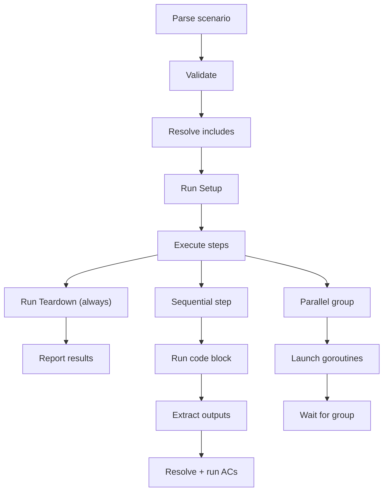

# Feature: Test Runner

**Status:** Conceptual

## Summary

A Go package (`pkg/testscenario/`) that parses [test scenarios](../test-scenario/README.md), resolves [acceptance criteria](../../acceptance-criteria/README.md) verification scripts from feature `_acs/` directories, executes bash steps sequentially (with opt-in parallel groups), and reports pass/fail results. The runner has no dependencies on Synchestra-specific code — it receives a configurable spec root path and resolves everything from the filesystem.

## Problem

The [test scenario](../test-scenario/README.md) format defines what to test. The runner is the engine that executes it. Without a dedicated runner:

- **Scenarios are inert documentation.** A markdown file with bash blocks is just a README unless something parses and executes it.
- **AC resolution is manual.** Linking a scenario step to feature ACs, locating the verification scripts, validating inputs, and executing them requires tooling.
- **Reporting is ad-hoc.** Without structured output, test results are buried in terminal output with no aggregation, filtering, or CI integration.

## Behavior

### Package structure

```
pkg/testscenario/
  types.go          — Scenario, Step, Output, ACRef, ACFile structs
  parser.go         — Markdown → Scenario struct parser
  context.go        — Execution context: context/step output storage, variable resolution
  ac.go             — AC file parser + resolver (reads _acs/*.md, extracts verification scripts)
  runner.go         — Step executor: sequential/parallel, shell execution, output capture
  include.go        — Sub-flow resolution and cycle detection
  reporter.go       — Result formatting (text, JSON, future: TAP/JUnit)
```

The package is self-contained. It depends only on the Go standard library and a markdown parser.

### Parsing

The parser reads a scenario `.md` file and produces a `Scenario` struct:

1. Extract title from `# Scenario: {name}`
2. Extract metadata (Description, Tags) from bold key-value pairs
3. Split on `## ` headings to identify steps
4. For each step, parse: Depends on, Parallel, Inputs, Outputs (table), ACs (table), Include, code block
5. Validate: unique step names, no circular dependencies, reserved step names used correctly, every step has a code block or Include

Parse errors are returned with line numbers for debugging.

### AC resolution

When a step declares AC references, the runner resolves them:

1. **Wildcard (`*`):** Read all `.md` files (except README.md) from `{spec_root}/features/{feature}/_acs/`. Execute in alphabetical order by slug.
2. **Specific ACs:** Resolve each named AC to its `.md` file. Execute in the order listed in the table.

For each AC file:
1. Parse the AC markdown to extract Inputs and Verification script
2. Validate that all required inputs are available (from step outputs, context, or environment)
3. Execute the verification script with inputs as environment variables
4. Record pass (exit 0) or fail (non-zero exit) per AC

### Execution flow



1. **Parse** the scenario markdown into a `Scenario` struct
2. **Validate:** unique step names, no circular includes, no duplicate context keys, `Depends on` references point to earlier steps
3. **Resolve** `Include` references recursively (cycle-detected)
4. **Run Setup** block (if present). On failure, skip all steps, run Teardown, report failure.
5. **Execute steps** in file order:
   - **Sequential steps:** execute one at a time
   - **Parallel groups:** consecutive `Parallel: true` steps launch as goroutines; the runner waits for all to complete before continuing
   - For each step:
     a. Resolve context and step output variable references in the code block
     b. Execute the code block via `exec.Command("bash", "-c", script)`
     c. Capture stdout, stderr, exit code
     d. If exit code != 0, mark step as failed (continue to next step unless `--fail-fast`)
     e. Extract declared outputs, store to context and/or step scope
     f. Resolve AC references → find AC `.md` files → extract verification scripts
     g. Execute each AC verification script with context + step outputs as env vars
     h. Record per-step and per-AC pass/fail
6. **Run Teardown** block (always, even on failure)
7. **Report** results

### Spec root resolution

The runner resolves the spec root from the project's `synchestra-spec.yaml` configuration (`project_dirs.specifications`, default: `spec`). All AC references (e.g., `cli/project/remove/*`) resolve to `{spec_root}/features/{feature}/_acs/`. This configuration is read once at runner initialization and passed to the AC resolver.

### Reporting

The runner produces structured results:

```
Scenario: Project lifecycle
  [PASS] setup                          (0.3s)
  [PASS] create-project                 (1.2s)
    AC cli/project/new/creates-spec-config   [PASS]
    AC cli/project/new/creates-state-config  [PASS]
  [FAIL] verify-configs                 (0.1s)
    AC cli/project/list/in-list              [FAIL] exit code 1
  [PASS] teardown                       (0.2s)

Result: FAIL (3 passed, 1 failed, 4 ACs: 2 passed, 1 failed)
```

Output formats:
- **Text** (default): human-readable, colored terminal output
- **JSON**: machine-readable for CI integration

### Error handling

| Error | Behavior |
|---|---|
| Parse error | Fail before execution, report line number |
| Setup failure | Skip all steps, run Teardown, report failure |
| Step failure | Record failure, continue to next step (or stop if `--fail-fast`) |
| AC failure | Record per-AC failure, step is marked failed |
| Teardown failure | Report warning, do not mask step results |
| Include cycle | Fail at validation, before execution |
| Missing AC file | Fail at AC resolution, step is marked failed |
| Missing required AC input | Fail at AC execution, AC is marked failed |

## Interaction with Other Features

| Feature | Interaction |
|---|---|
| [Test Scenario](../test-scenario/README.md) | The runner parses and executes the scenario format defined by this sibling feature. |
| [Acceptance Criteria](../../acceptance-criteria/README.md) | The runner resolves AC files from `_acs/` directories and executes their verification scripts. |
| [Testing Framework](../README.md) | Parent feature — defines CLI commands that invoke the runner. |
| [CLI](../../cli/README.md) | `synchestra test run` and `synchestra test list` wire the runner to the command tree. |

## Dogfooding

The test runner is tested by itself — the feature-scoped test scenarios in `_tests/` are executed by the very runner they verify. This circular validation is intentional: if the runner can successfully parse and execute its own test scenarios, that is itself strong evidence of correctness. The initial bootstrap requires Go unit tests (`pkg/testscenario/*_test.go`) to validate core parsing and execution before the runner is capable of self-testing.

## Acceptance Criteria

| AC | Description | Status |
|---|---|---|
| [parses-valid-scenario](_acs/parses-valid-scenario.md) | Valid scenario file parsed into structured result | planned |
| [rejects-malformed-scenario](_acs/rejects-malformed-scenario.md) | Malformed scenario rejected with line-number error | planned |
| [executes-sequential-steps](_acs/executes-sequential-steps.md) | Steps execute in file order by default | planned |
| [executes-parallel-group](_acs/executes-parallel-group.md) | Consecutive Parallel: true steps run concurrently | planned |
| [resolves-ac-wildcard](_acs/resolves-ac-wildcard.md) | Wildcard (*) resolves all ACs in feature _acs/ directory | planned |
| [resolves-ac-specific](_acs/resolves-ac-specific.md) | Named AC references resolve to correct _acs/ files | planned |
| [runs-setup-before-steps](_acs/runs-setup-before-steps.md) | Setup block runs before all steps | planned |
| [runs-teardown-on-failure](_acs/runs-teardown-on-failure.md) | Teardown runs even when steps fail | planned |
| [propagates-context-outputs](_acs/propagates-context-outputs.md) | Context-scoped outputs accessible to subsequent steps | planned |
| [reports-pass-fail-exit-code](_acs/reports-pass-fail-exit-code.md) | Exit 0 on all pass, non-zero on any failure | planned |
| [detects-include-cycles](_acs/detects-include-cycles.md) | Circular includes rejected at validation | planned |

## Outstanding Questions
- What is the exact reporting format for CI — should the runner support TAP and/or JUnit XML in addition to text and JSON?
- Should the runner support a `--dry-run` mode that parses and validates scenarios without executing them?
- Should there be a `--timeout` flag for per-scenario or per-step time limits?
- Should the runner cache parsed AC files across steps that reference the same feature, or re-parse each time?
