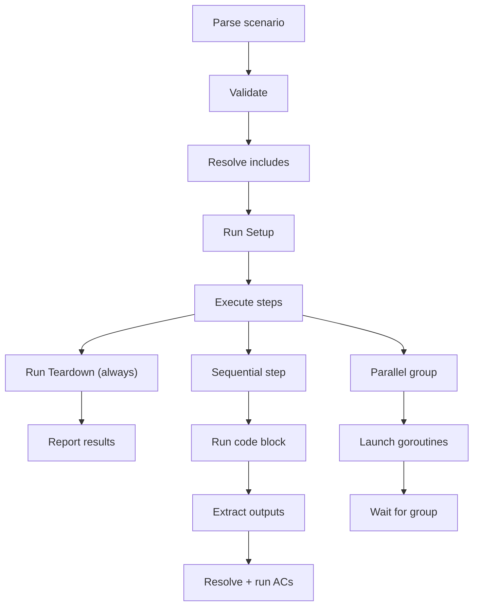

# Feature: Test Runner

**Status:** Conceptual

## Summary

The test runner is the engine that turns [test scenarios](../test-scenario/README.md) from readable documentation into executable verification. It parses scenario markdown, resolves [acceptance criteria](../../acceptance-criteria/README.md) from feature `_acs/` directories, executes bash steps (sequentially or in parallel groups), and produces structured pass/fail reports for both terminal output and CI pipelines. The runner is self-contained — give it a spec root path and a scenario file, and it handles discovery, resolution, execution, and reporting with no external dependencies.

## Problem

A [test scenario](../test-scenario/README.md) without a runner is a well-formatted README. The runner bridges the gap between format and execution:

- **Scenarios are inert without parsing.** A markdown file with bash blocks, AC references, and output declarations is readable but not runnable. Something must parse the structure, resolve the references, and orchestrate execution in the correct order.
- **AC resolution requires filesystem awareness.** When a scenario step says "verify all ACs for `cli/project/new`," something must walk the `_acs/` directory, parse each AC file, validate that required inputs are available, and execute each verification script with the right environment variables. This is not trivial — it is the core value the runner provides.
- **Reporting must be structured.** Terminal output from bash scripts is a stream of text. Teams need per-step and per-AC pass/fail results, durations, and machine-readable output for CI dashboards. Ad-hoc scripts cannot provide this without significant scaffolding.

## Behavior

### Package structure

```
pkg/testscenario/
  types.go          — Scenario, Step, Output, ACRef, ACFile structs
  parser.go         — Markdown → Scenario struct parser
  context.go        — Execution context: context/step output storage, variable resolution
  ac.go             — AC file parser + resolver (reads _acs/*.md, extracts verification scripts)
  runner.go         — Step executor: sequential/parallel, shell execution, output capture
  include.go        — Sub-flow resolution and cycle detection
  reporter.go       — Result formatting (text, JSON, future: TAP/JUnit)
```

The package is self-contained with no Synchestra-specific dependencies. It depends only on the Go standard library and a markdown parser. This means it can be extracted, embedded in other projects, or tested in isolation.

### Parsing

The parser reads a scenario `.md` file and produces a typed `Scenario` struct:

1. Extract title from `# Scenario: {name}`
2. Extract metadata (Description, Tags) from bold key-value pairs
3. Split on `## ` headings to identify steps
4. For each step: parse Depends on, Parallel, Inputs, Outputs (table), ACs (table), Include, and the code block
5. Validate: unique step names, no circular dependencies, reserved step names used correctly, every step has a code block or Include

Parse errors include line numbers — when a scenario fails to parse, the author knows exactly where to look.

### AC resolution

When a step declares AC references, the runner resolves them against the filesystem:

1. **Wildcard (`*`):** Read all `.md` files (except README.md) from `{spec_root}/features/{feature}/_acs/`. Execute in alphabetical order by slug.
2. **Specific ACs:** Resolve each named AC to its `.md` file. Execute in the order listed in the table.

For each resolved AC file:
1. Parse the markdown to extract the Inputs table and Verification script
2. Validate that all required inputs are available (from step outputs, context, or environment variables)
3. Execute the verification script with inputs passed as environment variables
4. Record pass (exit 0) or fail (non-zero exit) per AC

This is the heart of the runner: it connects the abstract reference `cli/project/new/*` to concrete bash scripts on disk and runs them with the right data.

### Execution flow



1. **Parse** the scenario markdown into a `Scenario` struct
2. **Validate:** unique step names, no circular includes, no duplicate context keys, `Depends on` references point to earlier steps
3. **Resolve** `Include` references recursively (cycle detection fails fast)
4. **Run Setup** (if present). On failure: skip all steps, run Teardown, report failure
5. **Execute steps** in file order:
   - **Sequential steps:** one at a time, in order
   - **Parallel groups:** consecutive `Parallel: true` steps launch as goroutines; the runner waits for all to complete before continuing
   - For each step:
     a. Resolve `${{ context.* }}` and `${{ steps.*.outputs.* }}` references in the code block
     b. Execute via the appropriate interpreter based on the code block's language annotation (bash, python, starlark — see [Supported languages](../../acceptance-criteria/README.md#supported-languages))
     c. Capture stdout, stderr, exit code
     d. If exit code != 0, mark step as failed (continue unless `--fail-fast`)
     e. Extract declared outputs and store to context and/or step scope
     f. Resolve AC references → locate AC files → extract verification scripts
     g. Execute each verification script with context + step outputs as env vars
     h. Record per-step and per-AC pass/fail
6. **Run Teardown** (always, even on failure — this is unconditional)
7. **Report** results

### Language dispatch

The runner supports multiple script languages in both scenario step code blocks and AC verification scripts. The language is determined by the code fence annotation:

| Annotation | Interpreter | Execution |
|---|---|---|
| `` ```bash `` | `bash -c` | Script passed via stdin; inputs as env vars |
| `` ```python `` | `python3 -c` | Script passed as argument; inputs as env vars |
| `` ```sql `` | Database CLI (`psql`, `sqlite3`, etc.) | Query executed against configured connection; inputs as query parameters or env vars |
| `` ```starlark `` | Embedded Starlark interpreter | Script evaluated in sandbox; inputs as global variables |

**The language annotation is mandatory.** A code block without an annotation is a validation error — the runner rejects it before execution. This eliminates guesswork: every script explicitly declares its interpreter.

Bash handles the majority of CLI-driven verification. Python is available for complex data manipulation (parsing JSON responses, validating YAML structures). SQL verifies database schema and data state — schema existence, row counts, constraint validation, and data integrity after workflow steps. The database connection is configured via environment variables (e.g., `DATABASE_URL`) or step context. Starlark provides hermetic, deterministic execution with no filesystem side effects — ideal for pure logic verification.

The runner detects the language once per code block and dispatches to the appropriate interpreter. All interpreters receive the same inputs (context variables, step outputs) — only the delivery mechanism differs (env vars for bash/python, globals for Starlark).

### Spec root resolution

The runner reads `project_dirs.specifications` from `synchestra-spec.yaml` (default: `spec`). All AC references resolve relative to this root — `cli/project/remove/*` becomes `{spec_root}/features/cli/project/remove/_acs/`. Configuration is read once at initialization and threaded through the AC resolver.

### Reporting

The runner produces structured, readable results:

```
Scenario: Project lifecycle
  [PASS] setup                          (0.3s)
  [PASS] create-project                 (1.2s)
    AC cli/project/new/creates-spec-config   [PASS]
    AC cli/project/new/creates-state-config  [PASS]
  [FAIL] verify-configs                 (0.1s)
    AC cli/project/list/in-list              [FAIL] exit code 1
  [PASS] teardown                       (0.2s)

Result: FAIL (3 passed, 1 failed, 4 ACs: 2 passed, 1 failed)
```

Output formats:
- **Text** (default): human-readable, colored terminal output with real-time progress and step-level/AC-level detail. Uses lipgloss for styled output with color, checkmarks/crosses, and inline duration.
- **JSON**: machine-readable for CI integration, dashboards, and programmatic analysis

### Real-time progress

In text mode, the runner reports progress as steps execute — not just a batch summary at the end. Each step shows a dimmed `▸ step-name` indicator while running, which is replaced in-place with a colored `✔`/`✘` result and duration when the step completes. AC verifications nest under their parent step with the same live treatment. This makes long-running scenarios observable without waiting for the final report.

### Manual scenario filtering

Scenarios tagged `manual` are excluded from directory-scanned runs by default. This prevents demo scenarios, stress tests, and interactive verification from running in CI or routine `test run` sweeps.

Manual scenarios run when:
- The scenario file is **passed directly by path** (e.g., `synchestra test run path/to/demo.md`)
- The `--run-manual-tests` flag is set (e.g., `synchestra test run tests/ --run-manual-tests`)

Every failure is attributable — you can see which step failed, which AC within that step failed, and what exit code it produced. No hunting through logs.

### Error handling

The runner handles errors predictably — no silent swallowing, no ambiguous states:

| Error | Behavior |
|---|---|
| Parse error | Fail before execution, report file path and line number |
| Missing language annotation | Fail at parse time — code blocks must specify `bash`, `python`, `sql`, or `starlark` |
| Setup failure | Skip all steps, run Teardown, report failure |
| Step failure | Record failure, continue to next step (stop if `--fail-fast`) |
| AC failure | Record per-AC failure, mark the containing step as failed |
| Teardown failure | Report as warning, do not mask step results |
| Include cycle | Fail at validation (before any execution) |
| Missing AC file | Fail at AC resolution, mark the containing step as failed |
| Missing required AC input | Fail at AC execution, mark the AC as failed |

The principle: **failures are precise**. A step failure does not prevent Teardown. A Teardown failure does not hide the real problem. A missing AC file does not crash the runner — it marks exactly what failed and continues.

## Interaction with Other Features

| Feature | Interaction |
|---|---|
| [Test Scenario](../test-scenario/README.md) | The runner parses and executes the scenario format defined by this sibling feature. |
| [Acceptance Criteria](../../acceptance-criteria/README.md) | The runner resolves AC files from `_acs/` directories and executes their verification scripts. |
| [Testing Framework](../README.md) | Parent feature — defines CLI commands that invoke the runner. |
| [CLI](../../cli/README.md) | `synchestra test run` and `synchestra test list` wire the runner to the CLI command tree. |

## Dogfooding

The test runner tests itself. The feature-scoped test scenarios in `_tests/` are parsed and executed by the very runner they verify. This is not a philosophical curiosity — it is a practical bootstrap strategy:

1. **Phase 1 (bootstrap):** Go unit tests in `pkg/testscenario/*_test.go` validate core parsing and execution. These are traditional tests with no self-reference.
2. **Phase 2 (self-hosting):** Once the runner can parse a scenario, resolve ACs, and execute bash steps, the runner's own `_tests/runner-core.md` scenario is added to CI. From this point forward, the runner is validated by its own output.

If the runner can successfully parse and execute a scenario that tests its own parsing and execution, that is direct, non-circular evidence of correctness. The Go unit tests remain as the safety net; the dogfood scenario is the confidence multiplier.

## Acceptance Criteria

| AC | Description | Status |
|---|---|---|
| [parses-valid-scenario](_acs/parses-valid-scenario.md) | Valid scenario file parsed into structured result | planned |
| [rejects-malformed-scenario](_acs/rejects-malformed-scenario.md) | Malformed scenario rejected with line-number error | planned |
| [executes-sequential-steps](_acs/executes-sequential-steps.md) | Steps execute in file order by default | planned |
| [executes-parallel-group](_acs/executes-parallel-group.md) | Consecutive Parallel: true steps run concurrently | planned |
| [resolves-ac-wildcard](_acs/resolves-ac-wildcard.md) | Wildcard (*) resolves all ACs in feature _acs/ directory | planned |
| [resolves-ac-specific](_acs/resolves-ac-specific.md) | Named AC references resolve to correct _acs/ files | planned |
| [runs-setup-before-steps](_acs/runs-setup-before-steps.md) | Setup block runs before all steps | planned |
| [runs-teardown-on-failure](_acs/runs-teardown-on-failure.md) | Teardown runs even when steps fail | planned |
| [propagates-context-outputs](_acs/propagates-context-outputs.md) | Context-scoped outputs accessible to subsequent steps | planned |
| [reports-pass-fail-exit-code](_acs/reports-pass-fail-exit-code.md) | Exit 0 on all pass, non-zero on any failure | planned |
| [detects-include-cycles](_acs/detects-include-cycles.md) | Circular includes rejected at validation | planned |

## Outstanding Questions

- What is the exact reporting format for CI — should the runner support TAP and/or JUnit XML in addition to text and JSON?
- Should the runner support a `--dry-run` mode that parses and validates scenarios without executing them?
- Should there be a `--timeout` flag for per-scenario or per-step time limits?
- Should the runner cache parsed AC files across steps that reference the same feature, or re-parse each time for simplicity?
