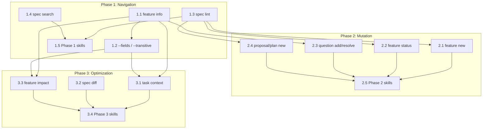

# Plan: Agent Skills Roadmap

**Status:** draft
**Features:**
  - [agent-skills](../../features/agent-skills/README.md)
  - [cli/feature](../../features/cli/feature/README.md)
**Source type:** feature
**Source:** [Agent Skills feature spec](../../features/agent-skills/README.md), [Skills Vision](../../../ai-plugin/skills/README.md)
**Author:** @alex

## Context

Synchestra's specification tree — features, dependencies, proposals, plans — is powerful for humans but expensive for AI agents. An agent that needs to understand a feature's context today must read full README files (thousands of tokens each), manually chase dependency links, and hope it doesn't miss a transitive reference. The agent-skills feature spec and the skills vision document define what we want: a CLI that makes specs machine-readable. This plan captures how we get there.

The gap is concrete:

- **Task lifecycle is fully covered.** 14 skills (100%) wrap every `task` CLI command — create, claim, start, complete, fail, block, unblock, release, abort, aborted, list, info, enqueue, status. This is the proof-of-concept that the skills model works.
- **Feature queries exist but are shallow.** 5 skills cover `feature info`, `list`, `tree`, `deps`, and `refs`. These are read-only and useful, but they return raw data without the composability agents need (e.g., "give me deps with their statuses" requires multiple calls today).
- **The expensive operations have no tooling.** Understanding a feature's full context (metadata + section map + children + dependency chain), creating features safely (scaffold + update parent + update index atomically), and validating spec consistency (README exists, OQ section present, index up-to-date) are all manual multi-step processes.
- **Token cost is 5–10× higher than necessary.** A full feature README averages ~3,000 tokens. `feature info` with a section TOC can deliver the same navigational value in ~500 tokens. Multiply by the number of features an agent touches per task, and the savings compound.

## Acceptance criteria

- All Phase 1 CLI commands (`feature info`, `spec lint`, `spec search`) pass end-to-end tests against the Synchestra spec repo itself
- `feature info` output is under 600 tokens for any feature in the repo
- `--fields` and `--transitive` flags work composably (e.g., `feature deps --fields status,oq --transitive`)
- Every new CLI command has a corresponding skill in `ai-plugin/skills/`
- Phase 2 mutation commands produce atomic commits (no partial scaffolds on failure)
- All skill descriptions include trigger phrases that match common agent intents

## Competitive landscape

Understanding what exists clarifies what Synchestra uniquely provides.

- **GitHub Spec Kit**: Closest competitor. Uses a simpler flat `.specify/` directory. No multi-agent coordination, no task claiming, no feature hierarchy. Good for single-agent projects; insufficient for orchestrated multi-agent work.
- **AGOR (AgentOrchestrator)**: Similar git-backed philosophy. More focused on agent runtime (who runs where) than structured specification (what to build). Complementary rather than directly competing.
- **Kiro (AWS)**: Similar spec → plan → task pipeline. Narrower scope (AWS ecosystem). No open multi-agent coordination protocol.
- **Agent frameworks (CrewAI, AutoGen, LangGraph, Google ADK)**: Runtime-focused — they orchestrate agent execution, not specification structure. These are complementary: an agent running in CrewAI could use Synchestra skills to navigate specs.

**Synchestra's unique position:** No existing tool combines structured spec management + git-backed distributed coordination + agent-native CLI interface. The closest competitors optimize for code navigation; Synchestra optimizes for specification navigation.

### What we can learn from competitors

- **From Spec Kit:** Simplicity wins adoption. `synchestra init` should scaffold a project in 30 seconds. If onboarding takes longer than reading the README, we've failed.
- **From CrewAI:** Role-based agent assignment could improve task routing. Today Synchestra's task claiming is first-come-first-served; role hints in task metadata could let specialized agents self-select.
- **From LangGraph:** Checkpoint/resume semantics would help agents that crash mid-task. Currently a crashed agent's claimed task stays claimed until timeout. Explicit checkpointing could reduce wasted work.

## Honest assessment

Before committing to this roadmap, the risks need to be named explicitly.

### Case against

1. **Premature abstraction risk.** Skills that wrap unimplemented commands are documentation, not tools. If we define 36 skills before the underlying CLI works, we're writing fiction. Mitigation: build incrementally — each phase ships working commands before defining skills.

2. **Git-as-database limitations.** Optimistic locking via git works for low-frequency operations (task claims happen at most every few minutes per agent). But if agent density increases — 50 agents claiming tasks simultaneously — git push conflicts become a bottleneck. A state store abstraction is needed before that scale, and this plan does not address it.

3. **Naming conventions fragility.** The entire system assumes features have README.md files, OQ sections use a specific heading, and indexes follow a specific format. `spec lint` is critical infrastructure that must exist before mutation commands (Phase 2), not a nice-to-have. This plan sequences it correctly, but if Phase 1 slips, Phase 2 becomes unsafe.

4. **Agent platforms are evolving fast.** Every month brings new agent frameworks, new tool-calling conventions, new context window sizes. But they all optimize for code navigation (find function, read file, run test), not specification navigation (what features exist, what depends on what, what's the blast radius of this change). Synchestra's domain-specific value persists even as the underlying platforms shift.

5. **Adoption friction from skill count.** 36+ skills is significant cognitive overhead for an agent (and for the humans configuring agent tool sets). Skill descriptions must be exceptional — clear trigger phrases, obvious when-to-use guidance. Poorly described skills are worse than no skills.

## Steps

### Phase 1: Machine-Readable Specs (Navigation)

Read-only commands. Highest ROI. Can be validated against existing spec files with no risk of mutation.

| Item | Type | Status | Description |
|---|---|---|---|
| `feature info` | CLI command | ✅ Implemented | Metadata + section TOC with line ranges (~500 tokens vs ~3,000 for full README) |
| `--fields` flag | CLI flag | Specified | Composable metadata enrichment for list/tree/deps/refs. Auto-switches to YAML. |
| `--transitive` flag | CLI flag | Specified | Follow full dep/ref chains in one call. Eliminates recursive agent reads. |
| `synchestra-feature-info` skill | Skill | Created | Wraps `feature info` for agent discovery |
| Updated feature skills | Skill updates | Done | list/tree/deps/refs skills updated with --fields/--transitive docs |
| `code deps` | CLI command | ✅ Implemented | Show Synchestra resources (features, plans, docs) that source files depend on via comment annotations |
| `synchestra-code-deps` skill | Skill | ✅ Implemented | Wraps `code deps` for querying code-to-spec relationships |
| `spec lint` | CLI command | ✅ Implemented | Structural convention checking (README exists, OQ section present, index up-to-date) |
| `spec search` | CLI command | Not specified | Keyword/semantic search across spec documents |

#### 1.1. Implement `feature info`

Parse feature README to extract metadata (status, summary, dependencies) and produce a section table-of-contents with heading levels and line ranges. Output ~500 tokens in YAML.

**Depends on:** (none)
**Produces:**
  - `feature info` CLI command in Go
  - Unit tests against fixture feature specs
**Task mapping:** `agent-skills-roadmap/feature-info`

**Acceptance criteria:**
- Output includes status, summary, dependencies, children, and section TOC
- Section TOC includes heading text, level, start line, and end line
- Output is valid YAML when `--fields` is used
- Total output under 600 tokens for any feature in the Synchestra spec repo

#### 1.2. Implement `--fields` and `--transitive` flags

Add composable flags to `feature list`, `feature tree`, `feature deps`, and `feature refs`. `--fields` enriches output with metadata columns. `--transitive` follows dependency/reference chains recursively.

**Depends on:** Step 1.1
**Produces:**
  - `--fields` flag on list/tree/deps/refs commands
  - `--transitive` flag on deps/refs commands
**Task mapping:** `agent-skills-roadmap/composable-flags`

**Acceptance criteria:**
- `--fields status,oq` adds status and open-question-count columns
- `--transitive` on `deps` returns the full transitive closure
- `--fields` auto-switches output to YAML; `--format text` overrides back to text
- No `--transitive` on list/tree/info (those don't operate on relationship chains)

#### 1.3. Implement `spec lint`

Check structural conventions across the entire spec tree. This is prerequisite infrastructure for Phase 2 mutation commands.

**Depends on:** (none)
**Produces:**
  - `spec lint` CLI command
  - Linting rules: README exists, OQ section present, index references valid
**Task mapping:** `agent-skills-roadmap/spec-lint`

**Acceptance criteria:**
- Reports all violations in a single run (does not fail-fast on first error)
- Exit code 0 = clean, exit code 1 = violations found
- Output lists each violation with file path and human-readable description
- Running against the Synchestra spec repo produces zero violations (or known/documented exceptions)

#### 1.4. Implement `spec search`

Keyword search across spec documents with context snippets.

**Depends on:** (none)
**Produces:**
  - `spec search` CLI command
  - Results include file path, line number, and surrounding context
**Task mapping:** `agent-skills-roadmap/spec-search`

**Acceptance criteria:**
- Searches all markdown files under `spec/`
- Returns file path, line number, and ±2 lines of context per match
- Supports `--feature` flag to scope search to a specific feature subtree
- Results sorted by relevance (exact match > partial match)

#### 1.5. Create skills for new Phase 1 commands

Wrap `spec lint` and `spec search` as agent skills.

**Depends on:** Steps 1.3, 1.4
**Produces:**
  - `ai-plugin/skills/synchestra-spec-lint/README.md`
  - `ai-plugin/skills/synchestra-spec-search/README.md`
**Task mapping:** `agent-skills-roadmap/phase1-skills`

**Acceptance criteria:**
- Each skill has YAML frontmatter with name and description
- Descriptions include trigger phrases matching common agent intents
- Exit code tables match the CLI implementations

#### 1.6. Implement `code deps` (COMPLETE)

Show Synchestra resources (features, plans, docs) that source files depend on. Scans source files for `synchestra:` annotations and `https://synchestra.io/` URLs embedded in comments (multi-language support: Go, Python, SQL, Lisp, LaTeX, etc.), resolving type shortcuts and cross-repo references.

**Status:** ✅ Implemented

**Depends on:** (none)
**Produces:**
  - `code deps` CLI command in Go
  - `pkg/sourceref/` package for reference scanning/parsing (reusable for future linting)
  - 70+ unit tests covering all parsing scenarios
  - `synchestra-code-deps` skill

**Acceptance criteria:**
- ✅ Multi-language comment detection
- ✅ Short notation parsing (synchestra:feature/...)
- ✅ Expanded URL parsing (https://synchestra.io/...)
- ✅ Type shortcuts (feature/ → spec/features/, plan/ → spec/plans/, doc/ → docs/)
- ✅ Cross-repo references (@host/org/repo)
- ✅ Glob pattern support (--path parameter)
- ✅ Type filtering (--type=feature|plan|doc)
- ✅ Spec-compliant output formatting (single file flat vs. multiple files grouped)
- ✅ Exit codes (0 success, 2 invalid args, 10+ errors)
- ✅ Feature annotations in all source files

### Phase 2: Safe Mutation

Structural safety for spec editing. Builds on Phase 1 validation to ensure mutations leave the spec tree consistent.

| Item | Type | Status | Description |
|---|---|---|---|
| `feature new` | CLI command | ✅ Implemented | Scaffold feature dir + README template + update parent + update index. Local by default; `--commit`/`--push` optional. Returns `feature info` output. |
| `feature status` | CLI command | Not specified | Update feature status in README and index atomically |
| `question add` | CLI command | Not specified | Add OQ to a feature with proper formatting |
| `question resolve` | CLI command | Not specified | Move OQ from open to resolved with resolution text |
| `proposal new` | CLI command | Not specified | Scaffold proposal directory under a feature |
| `plan new` | CLI command | Not specified | Scaffold plan in spec/plans/ with template and feature references |

#### 2.1. Implement `feature new` — ✅ Done

Scaffold a new feature directory with README template, update parent feature's children list, and update the feature index. Local changes by default; `--commit` and `--push` flags for git operations. Returns `feature info`-compatible output with section line ranges.

**Depends on:** Step 1.3 (spec lint — needed to verify post-mutation consistency)
**Produces:**
  - `feature new` CLI command ([spec](../../features/cli/feature/new/README.md)) — ✅ implemented
  - `synchestra-feature-new` skill ([skill](../../../ai-plugin/skills/synchestra-feature-new/SKILL.md)) — ✅ created
  - README template with standard sections (Summary, Problem, Behavior, Dependencies, Acceptance Criteria, Outstanding Questions)
**Task mapping:** `agent-skills-roadmap/feature-new`

**Acceptance criteria:**
- ✅ Creates `spec/features/{id}/README.md` with all required sections
- ✅ Updates parent feature's children list if creating a nested feature
- ✅ Updates feature index
- ✅ Returns `feature info`-compatible YAML output with section line ranges
- ✅ `--commit` and `--push` flags for optional git operations (`--push` implies `--commit`)
- ⬚ Rollback on any failure
- ✅ `spec lint` passes after creation

#### 2.2. Implement `feature status`

Update a feature's status in both its README and the feature index atomically.

**Depends on:** Step 1.3
**Produces:**
  - `feature status` CLI command
**Task mapping:** `agent-skills-roadmap/feature-status`

**Acceptance criteria:**
- Updates status field in feature README
- Updates status in feature index
- Single atomic commit
- Rejects invalid status transitions with clear error message

#### 2.3. Implement `question add` and `question resolve`

Structured OQ management: add questions with proper formatting, resolve them with resolution text.

**Depends on:** Step 1.1 (feature info — needs section line ranges for safe insertion)
**Produces:**
  - `question add` CLI command
  - `question resolve` CLI command
**Task mapping:** `agent-skills-roadmap/question-commands`

**Acceptance criteria:**
- `question add` appends to the Outstanding Questions section with correct markdown formatting
- `question resolve` moves question from open to resolved with resolution text and date
- Both commands handle the case where OQ section doesn't exist (create it)

#### 2.4. Implement `proposal new` and `plan new`

Scaffold proposal and plan directories with templates and cross-references.

**Depends on:** Step 1.3
**Produces:**
  - `proposal new` CLI command
  - `plan new` CLI command
**Task mapping:** `agent-skills-roadmap/scaffold-commands`

**Acceptance criteria:**
- `proposal new` scaffolds `spec/features/{feature}/proposals/{slug}/README.md`
- `plan new` scaffolds `spec/plans/{slug}/README.md` with feature back-references
- Both update relevant indexes
- Atomic commits; rollback on failure

#### 2.5. Create skills for Phase 2 commands

Wrap all Phase 2 commands as agent skills.

**Depends on:** Steps 2.1–2.4
**Produces:**
  - Skills for feature-new, feature-status, question-add, question-resolve, proposal-new, plan-new
**Task mapping:** `agent-skills-roadmap/phase2-skills`

**Acceptance criteria:**
- Each skill documents the atomicity guarantee
- Trigger phrases cover both direct requests ("create a feature") and contextual triggers ("I need to add a sub-feature under cli")

### Phase 3: Agent Workflow Optimization

Composite operations that reduce multi-step workflows to single calls. After task commands are implemented in Go.

| Item | Type | Status | Description |
|---|---|---|---|
| `task context` | CLI command | Not specified | Pre-assembled context for task execution (task + feature + deps + plan) |
| `spec diff` | CLI command | Not specified | What specs changed since a commit, with summaries |
| `feature impact` | CLI command | Not specified | Blast radius analysis: transitive refs + linked tasks + plans |

#### 3.1. Implement `task context`

Assemble everything an agent needs to start working on a task: the task itself, its parent feature spec (via `feature info`), transitive dependencies, and the relevant plan section.

**Depends on:** Steps 1.1, 1.2 (feature info + composable flags)
**Produces:**
  - `task context` CLI command
  - YAML output combining task, feature, dependency, and plan data
**Task mapping:** `agent-skills-roadmap/task-context`

**Acceptance criteria:**
- Single command replaces 3–5 separate CLI calls
- Output is structured YAML with clear section boundaries
- Total output stays under 2,000 tokens for typical tasks
- Gracefully handles missing plan (task exists but no plan references it)

#### 3.2. Implement `spec diff`

Show what specifications changed between two git refs, with human-readable summaries.

**Depends on:** (none)
**Produces:**
  - `spec diff` CLI command
**Task mapping:** `agent-skills-roadmap/spec-diff`

**Acceptance criteria:**
- Accepts `--since <ref>` flag (commit SHA, tag, or branch)
- Lists changed spec files with change type (added/modified/deleted)
- Groups changes by feature
- Includes one-line summary per changed file

#### 3.3. Implement `feature impact`

Blast radius analysis: given a feature, show everything that would be affected by a change — transitive reverse dependencies, linked tasks, and plans.

**Depends on:** Steps 1.1, 1.2 (feature info + transitive refs)
**Produces:**
  - `feature impact` CLI command
**Task mapping:** `agent-skills-roadmap/feature-impact`

**Acceptance criteria:**
- Shows transitive reverse dependency chain
- Lists all tasks linked to affected features
- Lists all plans referencing affected features
- Output is structured YAML with counts and details

#### 3.4. Create skills for Phase 3 commands

Wrap Phase 3 commands as agent skills.

**Depends on:** Steps 3.1–3.3
**Produces:**
  - Skills for task-context, spec-diff, feature-impact
**Task mapping:** `agent-skills-roadmap/phase3-skills`

**Acceptance criteria:**
- `task context` skill triggers when an agent claims a task and needs to understand what to do
- `feature impact` skill triggers when an agent is about to modify a feature and needs to understand the blast radius

## Dependency graph

## Key design decisions already made

These decisions were made during feature specification and should not be revisited in this plan.

- **`feature info` = metadata + section TOC merged.** No separate `feature sections` command. By the time an agent calls `info`, it wants both. ~500 tokens total.
- **`feature context` dropped.** Agents have parallel tool calls. Composable `--fields`/`--transitive` flags replace monolithic context bundles.
- **Format convention.** No `--fields` → text output. With `--fields` → auto-switches to YAML. `--format` flag overrides either default.
- **YAML agent-first.** CLI defaults to YAML for structured output. Agents parse YAML more reliably than free-form text.
- **`children` with `in_readme` field.** Navigation aid + consistency check in one response. Agents can detect stale indexes without a separate validation call.
- **`--transitive` only on `deps` and `refs`.** Not on list/tree/info — those commands don't operate on relationship chains.
- **`feature tree` absorbs ancestors/successors.** `--direction up|down` flag replaces what would otherwise be separate `feature ancestors` and `feature successors` commands.

## Risks and open decisions

- **Git concurrency under load.** Optimistic locking works today at low agent density. If adoption grows to 50+ concurrent agents, push conflicts will spike. Mitigation path: abstract state store behind an interface, swap git for a proper database when needed.
- **Skill discoverability at scale.** 36+ skills may overwhelm agent tool selectors. May need skill grouping, priority tiers, or a meta-skill that recommends which skill to use.
- **Spec format evolution.** If feature README format changes (new required sections, renamed headings), all parsing commands break. `spec lint` partially mitigates this by catching drift early.

## Outstanding Questions

- Should skills include platform-specific instructions (e.g., "in Claude Code, add this to your CLAUDE.md")?
- Should `spec search` be keyword-based, semantic/embedding-based, or both with a flag?
- Should `feature info` support `--sections-only` / `--meta-only` for even more surgical token savings?
- How deep should section TOC nesting go? Only h2+h3, or all heading levels?
- What computed fields should `--fields` support beyond status/oq/deps/refs/children/plans/proposals?
- Should Phase 2 mutation commands support `--dry-run` to preview changes without committing?
- Is there a role for a `skill recommend` meta-command that suggests which skill to use given a natural language intent?
