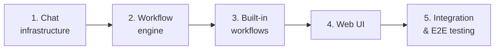

# Plan: Chat feature — high-level roadmap

**Status:** draft
**Features:**
  - [chat](../../features/chat/README.md)
  - [chat/workflow](../../features/chat/workflow/README.md)
**Source type:** feature
**Source:** [Chat feature spec](../../features/chat/)
**Author:** @alex
**Created:** 2026-03-14

## Context

The Chat feature introduces a guided conversational interface that produces Synchestra artifacts (proposals, features, issues, PRs) through AI-assisted workflows. This is a large feature spanning multiple subsystems: server-side chat infrastructure, a workflow engine, individual workflow implementations, web UI, API endpoints, and CLI commands.

This high-level plan decomposes the Chat feature into implementation phases. Each phase has its own detailed development plan. The phases are designed so that each produces working, testable software independently and builds on the previous phase.

## Acceptance criteria

- All phases are covered by detailed development plans
- Each phase can be implemented and tested independently
- Dependencies between phases are explicit and unidirectional (later phases depend on earlier ones, never the reverse)

## Steps

### 1. Chat infrastructure

Build the server-side foundation: chat data model, state repo storage, server-side message management, context assembly, and lifecycle management (create, active, finalize, abandon).

**Depends on:** (none)
**Produces:**
  - Chat server capable of creating, managing, and finalizing chats
  - State repo integration (chat directories, metadata, history flushing)
  - Context assembly pipeline (anchor loading, conversation windowing, artifact state)
  - Chat REST API endpoints (create, send message, get status, finalize)
  - CLI admin commands (`synchestra chat list`, `synchestra chat info`)
**Task mapping:** `chat-infrastructure/*`
**Plan:** [chat-infrastructure](../chat-infrastructure/)

**Acceptance criteria:**
- A chat can be created with an anchor reference (document, section, code file, or new entity)
- Messages can be exchanged via API with AI agent responses
- Chat metadata and artifacts are persisted in the state repo
- Chat history is flushed to git on finalization
- Context assembly correctly loads anchor document + conversation window + artifact state
- Retention policies (archive, summarize, dispose) work as configured
- CLI commands list and inspect chats

### 2. Workflow engine

Build the workflow orchestration layer: YAML workflow parsing, step sequencing, project customization (additional questions, rules, checks), artifact production pipeline, and workflow discovery for the UI.

**Depends on:** Step 1
**Produces:**
  - Workflow YAML parser and validator
  - Step orchestrator (transitions between steps based on AI assessment)
  - Project customization loader (prompts, rules, checks from `synchestra-project.yaml`)
  - Artifact production pipeline (creating and committing artifacts to appropriate repos)
  - Workflow discovery API (which workflows are available for a given document type and user role)
**Task mapping:** `chat-workflow-engine/*`
**Plan:** [chat-workflow-engine](../chat-workflow-engine/)

**Acceptance criteria:**
- Built-in workflow YAML definitions are parsed and validated
- Steps execute in sequence with AI-driven transitions
- Project-configured questions are woven into conversations
- Project-configured rules are enforced before artifact finalization
- Project-configured checks run against produced artifacts
- Workflow discovery returns correct workflows based on anchor type and user role

### 3. Built-in workflows

Implement the four shipped workflows: Create Proposal, Create Feature, Raise Issue, Tweak Document. Each workflow has its own prompt/skill chain, artifact production logic, and role-based behavior (fast path vs standard path).

**Depends on:** Step 2
**Produces:**
  - Create Proposal workflow (standard + fast path)
  - Create Feature workflow (branch creation, spec scaffolding)
  - Raise Issue workflow (code search, issue tracker integration)
  - Tweak Document workflow (spec + code changes, role-based submission)
  - AI prompts/skills for each workflow step

**Acceptance criteria:**
- Create Proposal: produces a valid proposal document under `features/{name}/proposals/`; fast path creates tasks, implementation branch, and plan-as-report
- Create Feature: creates a feature directory and README on a new branch; submits as PR
- Raise Issue: posts a well-structured issue to GitHub Issues with backlinks
- Tweak Document: applies small changes with role-based submission (direct commit vs PR)
- All workflows respect project-configured questions, rules, and checks

### 4. Web UI — chat interface

Build the web UI components: chat interface (message input, AI responses, progress indicators), workflow action buttons on documents, and artifact preview/editing within the chat.

**Depends on:** Step 3
**Produces:**
  - Chat UI component (message list, input, streaming responses)
  - Workflow action buttons rendered on document pages
  - Step progress indicator
  - Artifact preview and inline editing
  - Role-aware button visibility and fast-path toggle

**Acceptance criteria:**
- Users can initiate workflows from document pages via action buttons
- Chat interface shows real-time AI responses
- Step progress is visible to the user
- Produced artifacts can be previewed and edited within the chat
- Button visibility correctly reflects anchor type and user role

### 5. Integration and end-to-end testing

End-to-end testing of the full pipeline: user action → chat → workflow → artifacts → Synchestra pipeline entry. Includes cross-feature integration testing with proposals, development plans, and tasks.

**Depends on:** Step 4
**Produces:**
  - End-to-end test suite
  - Integration tests with existing Synchestra features
  - Documentation updates (root README, feature index)

**Acceptance criteria:**
- A complete proposal workflow produces a valid proposal that can trigger a development plan
- A fast-path workflow produces tasks, code changes, and a plan-as-report
- A raise-issue workflow posts to GitHub Issues and optionally creates a linked Synchestra task
- A tweak-document workflow produces a commit (maintainer) or PR (contributor)
- All workflows work with project-level customization

## Dependency graph

All steps are sequential. Each phase builds on the previous one's outputs. Phases 1 and 2 have their own detailed development plans.

## Risks and open decisions

- **AI prompt quality.** The effectiveness of chat workflows depends heavily on prompt engineering. The prompts/skills for each workflow step need careful design and iteration. Consider allocating time for prompt tuning after initial implementation.
- **Context window limits.** Long conversations with large anchor documents may exceed context limits. The context assembly strategy (first N + last M + summary) needs testing with real-world document sizes.
- **External service integration.** The Raise Issue workflow depends on GitHub Issues API integration. This adds an external dependency and potential failure modes (rate limiting, authentication, API changes).
- **Fast-path complexity.** The fast path (implement during conversation) involves coordinating real-time task creation, agent dispatch, and code generation while maintaining a conversational UX. This is architecturally complex and may need simplification in v1.

## Outstanding Questions

- Should phases 3-5 have their own detailed development plans, or are the step descriptions in this high-level plan sufficient for task generation?
- What is the target technology stack for the server-side components — Go (matching the existing CLI), or a different language better suited for real-time chat (e.g., TypeScript/Node.js)?
- Should the web UI be part of the existing [UI](../../features/ui/README.md) feature's implementation plan, or does it warrant its own plan?
