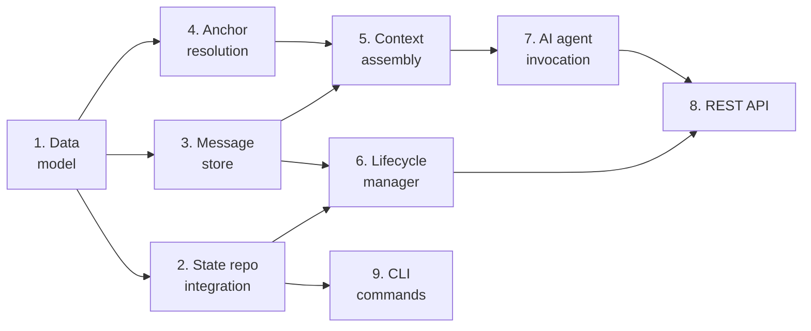

# Plan: Chat infrastructure

**Status:** draft
**Features:**
  - [chat](../../../features/chat/README.md)
**Source type:** feature
**Source:** [Chat feature spec](../../../features/chat/)
**Author:** @alex
**Created:** 2026-03-14

## Context

This plan covers the foundational server-side infrastructure for the Chat feature. It builds the data model, state repo integration, server-side message management, context assembly pipeline, lifecycle management, REST API endpoints, and CLI admin commands. This is Phase 1 of the [chat-feature high-level plan](../) — everything else (workflow engine, built-in workflows, UI) builds on this foundation.

The key architectural decision is the hybrid storage approach: messages are held server-side during active chats for real-time interaction, and flushed to git (state repo) on finalization or at periodic checkpoints.

## Acceptance criteria

- A chat can be created with an anchor reference to any document type (spec document, section, code file, or not-yet-existing entity) across any configured repository
- Messages can be sent and received via REST API with AI agent invocation and streaming responses
- Chat metadata (anchor, workflow, status, user, timestamps) is persisted in the state repo as a `README.md` in the chat directory
- Produced artifacts are committed to the chat's `artifacts/` directory in the state repo
- Chat history is flushed to `history.jsonl` on finalization and at configurable checkpoints
- The context assembly pipeline correctly constructs agent input from: anchored document, current artifact state, conversation window (first N + last M + summary), and workflow prompt
- Lifecycle transitions work correctly: created → active → finalized/abandoned
- Retention policies (archive, summarize, dispose) execute correctly on finalization
- Abandoned chat detection works with configurable timeout
- CLI commands `synchestra chat list` and `synchestra chat info` display correct data
- REST API endpoints handle concurrent access safely

## Steps

### 1. Define chat data model

Design the core data structures for chat: metadata schema (anchor, repo, branch, workflow, status, user, timestamps), message format (role, content, timestamp, step), and artifact reference format. Define the state repo directory structure.

**Depends on:** (none)
**Produces:**
  - `chat-data-model.md` — data model documentation with type definitions
  - `chat-state-repo-schema.md` — state repo directory layout and file format specifications

**Acceptance criteria:**
- Data model covers all metadata fields from the Chat feature spec (anchor, repo, branch, workflow, status, user, created, updated)
- Message format supports role (user, assistant, system), content, timestamp, and current workflow step reference
- Artifact reference format supports typed artifacts (proposal, issue, feature, pull-request, commit) with paths
- State repo schema defines `chats/{chat-id}/README.md`, `artifacts/`, and `history.jsonl` formats
- Chat ID generation strategy is defined (format, uniqueness guarantees)

### 2. Implement state repo integration

Build the layer that reads and writes chat data to the state repo. This includes creating chat directories, writing/updating metadata READMEs, committing artifacts, and flushing message history to `history.jsonl`.

**Depends on:** Step 1
**Produces:**
  - State repo read/write module for chat data
  - Git operations for chat lifecycle (create directory, update metadata, commit artifacts, flush history)

**Acceptance criteria:**
- Can create a new chat directory with metadata README in the state repo
- Can update chat metadata (status, timestamps) via atomic git commits
- Can write artifacts to `chats/{chat-id}/artifacts/` and commit them
- Can flush message history to `history.jsonl` in JSONL format
- Git operations handle concurrent access (commit-and-push with conflict retry, consistent with Synchestra's optimistic locking pattern)
- Can read chat metadata and artifact listings from state repo
- Can list all chats with filtering by status

### 3. Build server-side message store

Implement the in-memory (or lightweight persistent) message store that holds active chat messages server-side. This is the real-time layer — messages live here during active chats and are flushed to git on finalization.

**Depends on:** Step 1
**Produces:**
  - Server-side message store with append, read, and flush operations
  - Checkpoint mechanism for periodic flushing to git

**Acceptance criteria:**
- Messages can be appended to an active chat's store
- Full message history can be retrieved for an active chat
- Messages can be flushed to the state repo (via Step 2's integration layer)
- Checkpoint mechanism periodically flushes to git at configurable intervals
- Message store survives server restarts (messages are not lost if server crashes mid-chat) — at minimum, checkpoint-flushed messages are preserved
- Store handles multiple concurrent active chats

### 4. Implement anchor resolution

Build the anchor resolution system that loads the correct document content based on the chat's anchor configuration (document path, section reference, repo, branch).

**Depends on:** Step 1
**Produces:**
  - Anchor resolver that loads documents from spec repo, code repos, or specific branches
  - Section extractor for `#section` anchors

**Acceptance criteria:**
- Can resolve an anchor to a full document in the spec repo (default branch)
- Can resolve an anchor to a specific section of a document (using `#section-slug` syntax)
- Can resolve an anchor to a file in a code repo (using `repo` field to identify which repo)
- Can resolve an anchor on a specific branch (using `branch` field)
- Handles the four anchor resolution combinations: (repo omitted/set) x (branch omitted/set)
- Returns an error with a clear message for anchors that cannot be resolved (missing file, invalid section, unknown repo)
- Can resolve anchors to not-yet-existing entities (returns empty content with metadata indicating the entity should be created)

### 5. Build context assembly pipeline

Implement the pipeline that constructs the context payload sent to AI agents for each chat turn. This combines the anchored document, current artifact state, conversation window, and workflow prompt.

**Depends on:** Step 3, Step 4
**Produces:**
  - Context assembler that combines anchor content, artifacts, conversation window, and system prompt
  - Conversation windowing logic (first N + last M + compacted summary)

**Acceptance criteria:**
- Context includes the full anchored document content (from Step 4's resolver)
- Context includes the latest version of any in-progress artifacts
- Conversation window correctly selects first N and last M messages from the message store
- Conversation window generates a compacted summary for messages between the first N and last M
- Context includes the workflow step's system prompt
- Context includes project-configured additional context documents (from workflow's `context.load`)
- Total assembled context respects configurable size limits
- Context assembly is deterministic — same inputs produce same outputs

### 6. Implement chat lifecycle manager

Build the lifecycle state machine: create, activate (on first message), finalize, and abandon. Handles status transitions, retention policy execution, and timeout-based abandonment.

**Depends on:** Step 2, Step 3
**Produces:**
  - Lifecycle state machine with transition validation
  - Retention policy executor (archive, summarize, dispose)
  - Abandonment detector with configurable timeout

**Acceptance criteria:**
- Chat creation sets status to `created` and writes metadata to state repo
- First message transitions status to `active`
- Finalization transitions status to `finalized`, flushes messages, and executes retention policy
- `archive` retention: marks as finalized, keeps all data
- `summarize` retention: generates summary, attaches to artifacts, removes raw history
- `dispose` retention: removes the chat directory after artifacts are committed elsewhere
- Invalid transitions are rejected with clear error messages (e.g., cannot finalize a chat that is already finalized)
- Abandonment detector identifies chats inactive beyond the configured timeout
- Abandoned chats are either auto-finalized or flagged for user notification (configurable)

### 7. Build AI agent invocation layer

Implement the service that invokes stateless AI agents with the assembled context and returns streaming responses. This is the bridge between the chat server and the AI backend.

**Depends on:** Step 5
**Produces:**
  - AI agent invocation service with streaming response support
  - Integration with model selection (if available) or direct API invocation

**Acceptance criteria:**
- Can invoke an AI agent with assembled context and receive a streaming response
- Streaming responses are forwarded to the client in real-time (for the API layer)
- Agent responses are appended to the message store
- Agent invocation handles errors gracefully (timeout, rate limiting, model unavailable)
- Supports configurable model selection (falls back to a default model if model selection feature is not available)

### 8. Implement REST API endpoints

Build the REST API endpoints for chat lifecycle: create a chat, send a message (with streaming response), get chat status/history, finalize a chat, and list chats.

**Depends on:** Step 6, Step 7
**Produces:**
  - REST API endpoints for chat operations
  - API documentation (OpenAPI spec additions)

**Acceptance criteria:**
- `POST /api/v1/chat` creates a new chat with anchor, workflow, and user
- `POST /api/v1/chat/{id}/message` sends a message and returns a streaming AI response
- `GET /api/v1/chat/{id}` returns chat metadata, status, and artifact list
- `GET /api/v1/chat/{id}/messages` returns message history (with pagination)
- `POST /api/v1/chat/{id}/finalize` finalizes the chat and triggers retention
- `GET /api/v1/chats` lists chats with filtering (by status, user, workflow)
- Endpoints validate input and return appropriate HTTP status codes
- Streaming responses use Server-Sent Events (SSE) or equivalent
- API follows existing Synchestra API conventions (auth, error format, query parameters)

### 9. Implement CLI admin commands

Add `synchestra chat list` and `synchestra chat info` CLI commands for admin and debugging.

**Depends on:** Step 2
**Produces:**
  - CLI commands for chat inspection

**Acceptance criteria:**
- `synchestra chat list` shows all chats with status, workflow, user, and timestamps
- `synchestra chat list --status active` filters by status
- `synchestra chat info {chat-id}` shows full chat metadata, anchor, artifacts, and message count
- Output follows existing CLI formatting conventions
- Exit codes follow existing conventions (0 success, 3 not found, etc.)

## Dependency graph

Steps 2, 3, and 4 can run in parallel after Step 1. Steps 5 and 6 can run in parallel. Step 8 depends on both 6 and 7. Step 9 can run anytime after Step 2.

## Risks and open decisions

- **Message store persistence.** The spec says messages are held server-side. If the server crashes mid-chat, unflushed messages are lost. The checkpoint mechanism mitigates this, but the checkpoint interval trades durability for performance. Consider a write-ahead log or lightweight embedded database (SQLite, bbolt) for the message store.
- **Context assembly token counting.** The context pipeline needs to respect model token limits. This requires either a tokenizer or a character-based heuristic. Token counting adds a dependency on model-specific tokenizers.
- **Conversation compaction.** The "compacted summary of the middle" requires invoking an AI model to summarize. This is an additional AI call per chat turn for long conversations, adding latency and cost. Consider caching summaries and only regenerating when the middle segment changes.
- **Concurrent chat access.** If the same user opens the same chat in multiple browser tabs, the message store needs to handle concurrent writes. The current design assumes single-writer per chat.

## Outstanding Questions

- What is the technology choice for the server-side message store — in-memory with periodic flush, embedded database (SQLite/bbolt), or external store (Redis)?
- Should the conversation compaction (summary generation) be synchronous (blocking the chat turn) or asynchronous (using a slightly stale summary)?
- How should the API handle authentication — reuse existing Synchestra API auth, or introduce chat-specific session tokens?
- Should the checkpoint interval be time-based (every N minutes), message-count-based (every N messages), or both?
