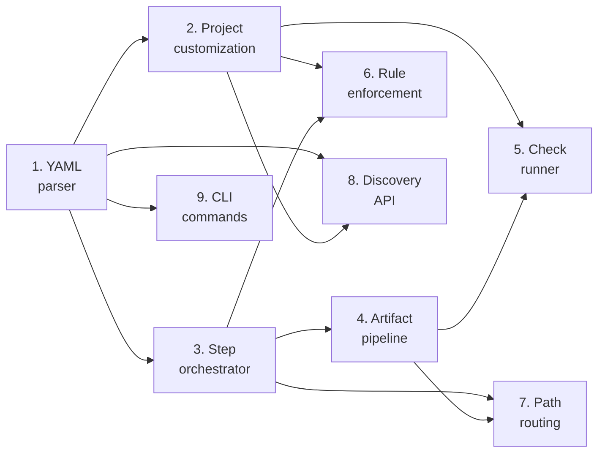

# Plan: Chat workflow engine

**Status:** draft
**Features:**
  - [chat/workflow](../../features/chat/workflow/README.md)
**Source type:** feature
**Source:** [Workflow feature spec](../../features/chat/workflow/)
**Author:** @alex
**Created:** 2026-03-14

## Context

This plan covers the workflow orchestration layer for the Chat feature. It builds on the [chat infrastructure](../chat-infrastructure/) (Phase 1) and adds: YAML workflow parsing and validation, step sequencing and AI-driven transitions, project customization (additional questions, rules, checks), artifact production pipeline, fast path vs standard path routing, and workflow discovery for the UI.

This is Phase 2 of the [chat-feature high-level plan](../chat-feature/). After this, the built-in workflows (Phase 3) can be implemented as configurations of this engine rather than custom code.

## Acceptance criteria

- Built-in workflow YAML definitions are parsed and validated against the workflow schema
- The step orchestrator executes steps in sequence, with AI-driven transitions between steps
- Project-configured additional questions are injected into the AI's system prompt and woven into conversations naturally
- Project-configured rules are enforced before artifact finalization (the AI validates rules and blocks finalization if violated)
- Project-configured checks (shell commands) run against produced artifacts and surface pass/fail results to the user
- The artifact production pipeline creates, versions, and commits artifacts to the correct repository (spec repo, state repo, or code repo)
- Workflow discovery correctly returns available workflows for a given document type and user role
- The fast-path/standard-path routing works based on user role and AI complexity assessment
- The `allow-create` flag correctly enables entity creation workflows on index pages

## Steps

### 1. Implement workflow YAML parser

Build the parser that reads workflow YAML definitions and validates them against the workflow schema. This includes parsing top-level fields, UI fields, step definitions, and the `enabled`/`optional` step modifiers.

**Depends on:** (none)
**Produces:**
  - Workflow YAML parser with schema validation
  - In-memory workflow definition model (typed data structures)
  - Built-in workflow YAML files (the four shipped workflows)

**Acceptance criteria:**
- Parses all fields from the workflow schema: name, title, description, anchor-types, prompt/steps, produces, roles, context.load, retention, ui.*, allow-create
- Validates required fields and rejects invalid definitions with clear error messages
- Supports both simple (single `prompt`) and multi-step (`steps` array) workflow formats
- Parses step fields: name, prompt, description, produces, optional, enabled
- Handles `enabled: auto` by deferring resolution to runtime
- Loads workflow definitions from a configurable directory
- Rejects unknown fields to catch typos in YAML definitions

### 2. Implement project customization loader

Build the loader that reads project-level workflow customizations from `synchestra-spec.yaml` and merges them with the built-in workflow definitions.

**Depends on:** Step 1
**Produces:**
  - Project customization loader for workflow overrides
  - Merged workflow definition model (built-in + project overrides)

**Acceptance criteria:**
- Reads `workflows:` section from `synchestra-spec.yaml`
- Merges project-level `context.guidelines` into the workflow's context
- Merges project-level `checks` into the workflow's finalization pipeline
- Merges project-level `prompts.additional-questions` into the workflow's conversational steps
- Merges project-level `prompts.rules` into the workflow's validation logic
- Project-level `allow-code-changes`, `code-repos`, and `escalate-on-multi-repo` override defaults for tweak-document
- Workflow-level `retention` overrides project-level `chat.retention` default
- Merging is additive for lists (questions, rules, checks) and override for scalars (retention, enabled)
- Missing `workflows:` section in project config means all built-in defaults are used

### 3. Build step orchestrator

Implement the orchestration engine that manages step transitions within a chat. The orchestrator tracks the current step, invokes the AI with the step's prompt, and transitions to the next step when the AI determines the current step's goal is met.

**Depends on:** Step 1
**Produces:**
  - Step orchestrator with state tracking per chat
  - AI-driven transition detection logic
  - Step skip handling for `optional: true` steps
  - Step enable/disable resolution for `enabled: auto`

**Acceptance criteria:**
- Tracks the current step index for each active chat
- Prepends the current step's prompt/skill to the AI context for each turn
- Detects when the AI signals a step transition (via structured output or convention)
- Transitions to the next step and updates the step's prompt in the context
- Skips steps marked `optional: true` when the user or AI opts to skip
- Resolves `enabled: auto` at runtime (e.g., based on repository visibility for the find-relevant-code step)
- Skips steps where `enabled: false`
- Reports current step to the client (for progress indicator rendering)
- Handles reaching the final step (transitions to finalization)

### 4. Build artifact production pipeline

Implement the pipeline that creates, versions, and commits artifacts produced during a chat. Artifacts may land in different repositories (spec repo, state repo, code repo) depending on their type.

**Depends on:** Step 3
**Produces:**
  - Artifact producer that creates typed artifacts (proposal, feature, issue, commit, pull-request)
  - Artifact versioning within the chat (draft iterations)
  - Artifact commit logic for each target repository

**Acceptance criteria:**
- Can create a proposal artifact: generates the proposal markdown following the proposal format, writes to `artifacts/` during drafting, commits to `spec/features/{feature}/proposals/{slug}/README.md` on finalization
- Can create a feature artifact: scaffolds the feature directory and README on a new branch, commits to spec repo
- Can create an issue artifact: generates structured issue content, posts to GitHub Issues via API
- Can create a pull-request artifact: creates a branch, commits changes, opens a PR via GitHub API
- Can create a commit artifact: directly commits changes to the spec repo (maintainer tweak path)
- Artifacts support draft iterations — the user can request changes and the artifact is updated in place
- Each artifact type has a validator that checks format compliance before finalization

#### 4.1. Implement branch management for entity creation

Handle the branch creation and management needed when a chat creates a new entity (new feature, new proposal on a fresh branch).

**Acceptance criteria:**
- Creates a branch with a conventional name (e.g., `feature/{slug}`, `proposal/{feature}/{slug}`)
- Commits the initial artifact to the branch
- Subsequent artifact updates are committed to the same branch
- Branch reference is stored in the chat metadata
- On finalization, the branch is ready for PR creation or direct merge

### 5. Implement check runner

Build the runner that executes project-configured checks (shell commands) against produced artifacts before finalization.

**Depends on:** Step 2, Step 4
**Produces:**
  - Check runner that executes shell commands against artifacts
  - Check result reporting to the chat (pass/fail with output)

**Acceptance criteria:**
- Reads `checks` from the merged workflow definition
- Substitutes `{artifact}` placeholder with the artifact file path
- Executes each check as a subprocess with a configurable timeout
- Captures stdout and stderr from each check
- Reports pass/fail results to the user within the chat
- Blocks finalization if any check fails
- User can iterate on the artifact and re-run checks
- Checks run in the context of the correct repository (spec repo or code repo)

### 6. Implement rule enforcement

Build the system that injects project-configured rules into the AI's context and validates compliance before allowing artifact finalization.

**Depends on:** Step 2, Step 3
**Produces:**
  - Rule injection into AI system prompts
  - Rule compliance validation before finalization

**Acceptance criteria:**
- Project-configured `prompts.rules` are appended to the AI's system prompt during drafting and review steps
- The AI is instructed to validate all rules before allowing the user to finalize
- Additional questions from `prompts.additional-questions` are injected into the system prompt for conversational steps
- The AI weaves additional questions naturally into the conversation (not presented as a checklist)
- Rule violations surfaced by the AI block finalization with clear explanations

### 7. Implement fast-path / standard-path routing

Build the routing logic that determines which execution path a chat follows based on user role and change complexity.

**Depends on:** Step 3, Step 4
**Produces:**
  - Path router based on user role and AI complexity assessment
  - Fast-path executor (task creation, agent dispatch, plan-as-report generation)

**Acceptance criteria:**
- Standard path is the default for all users
- Fast path is available only to users with maintainer or authorized contributor roles
- AI can suggest the fast path when it assesses the change as straightforward
- User can request the fast path explicitly
- Fast path creates tasks in the state repo
- Fast path dispatches agents to implement changes in a code branch
- Fast path produces a development plan as a report documenting what was done
- Fast path is limited to a single code repository — multi-repo changes redirect to standard path with a clear explanation
- All fast-path code changes go through a PR with CI validation

### 8. Build workflow discovery API

Implement the API endpoint that returns available workflows for a given document type and user role. This powers the UI's action button rendering.

**Depends on:** Step 1, Step 2
**Produces:**
  - Workflow discovery endpoint
  - Workflow filtering logic (by anchor type, user role, allow-create)

**Acceptance criteria:**
- `GET /api/v1/workflows?anchor-type={type}&role={role}` returns matching workflows
- Filters by `anchor-types` (only workflows matching the document type)
- Filters by `roles` (only workflows the user's role has access to)
- Includes `allow-create: true` workflows when querying from an index page
- Returns UI metadata (icon, variant, sort-order) for button rendering
- Returns workflows sorted by `ui.sort-order`
- Results include the workflow's title, description, and name (for API invocation)

### 9. Implement CLI workflow commands

Add `synchestra workflow list` CLI command for inspecting available workflows.

**Depends on:** Step 1
**Produces:**
  - CLI command for workflow inspection

**Acceptance criteria:**
- `synchestra workflow list` shows all registered workflows with name, title, anchor-types, and roles
- Output follows existing CLI formatting conventions
- Exit codes follow existing conventions

## Dependency graph

Steps 2, 3, 8, and 9 can start in parallel after Step 1. Step 4 depends on Step 3. Steps 5, 6, and 7 depend on their respective prerequisites. Maximum parallelism: 4 tasks (steps 2, 3, 8, 9) after Step 1 completes.

## Risks and open decisions

- **AI-driven step transitions.** Detecting when a step's goal is met relies on AI judgment. This is inherently fuzzy — the AI might transition too early (before gathering enough info) or too late (asking redundant questions). Consider a structured output format (JSON) for transition signals rather than inferring from free-text responses.
- **Check execution security.** Running arbitrary shell commands from project config (`checks`) introduces a security surface. Checks should run in a sandboxed environment with restricted filesystem access and network isolation.
- **Fast-path agent orchestration.** The fast path requires dispatching agents to implement code changes in real-time during a conversation. This couples the chat server to the task execution engine — a tight integration that may be fragile. Consider making the fast path asynchronous (chat finishes, tasks run independently) rather than synchronous (chat waits for implementation).
- **Artifact format validation.** Each artifact type (proposal, feature, issue) has its own format conventions. Validating that AI-produced artifacts comply requires either schema-based validation or AI-based review. Schema validation is more reliable but less flexible.

## Outstanding Questions

- How should the step orchestrator communicate with the AI about transitions — structured JSON tool calls, special tokens in the response, or a separate classification call?
- Should the check runner support parallel execution of independent checks, or always run checks sequentially?
- How should the fast path handle CI failures — keep the chat open until CI passes, or finalize the chat and let the user handle failures through the normal PR workflow?
- Should workflow discovery cache results, or resolve dynamically on each request?
