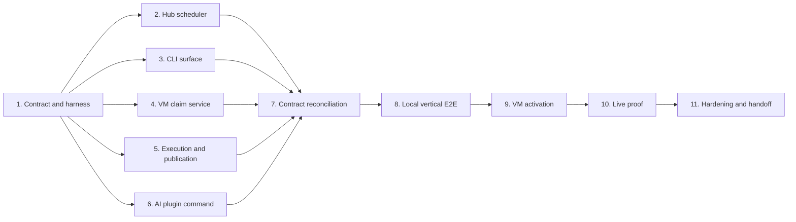

# Plan: Remote Task Dispatch MVP

**Status:** Approved
**Source Feature:** dispatch
**Date:** 2026-07-22
**Owner:** @alex
**Supersedes:** —
**Effort:** XL (approximately 11–15 agent-days; 6–9 elapsed days with parallel execution)
**Impact:** critical

## Summary

Implements the complete first-value path from `/dispatch @sonnet Update dal-go deps to latest` to a durable Hub record, an outbound lease claimed by the existing personal VM, an isolated agent run, and a pushed review branch with logs and validation evidence. The same contracts support ad-hoc prompts and SpecScore Plan/Task targets without making SpecStudio a runtime dependency.

The implementation is designed for autonomous execution by one Sol integration agent and bounded parallel subagents. The main agent owns shared contracts, integration, live proof, and safety decisions; repository-specific work is delegated only after the vertical contract is frozen.

## Approach

Deliver two value streams through one architecture:

1. **Immediate proof:** implement one ad-hoc dispatch, one registered VM worker, Claude Code with `sonnet`, branch-only publication, status/logs/cancel, and the human `/dispatch` entry point.
2. **Durable foundation:** preserve separate Dispatch/Attempt/Session records, transactional leases, capability matching, provider-neutral profiles, SpecScore target references, retry/cancellation semantics, and an outbound worker protocol.

Task 1 freezes the cross-repository contract and creates a mocked vertical harness. Tasks 2–6 then run in parallel in separate repositories/worktrees with disjoint ownership. Task 7 reconciles their generated/client contracts. Task 8 proves the entire path locally. Tasks 9–10 deploy and exercise the personal VM. Task 11 hardens the proof without expanding it into automatic merge, deployment, or a shared runner marketplace.

### Dependency graph



### Parallel execution topology

| Role | Model | Scope | Concurrency rule |
|---|---|---|---|
| Primary integrator | `gpt-5.6-sol`, high or xhigh reasoning | Task 1, integration, E2E, live proof, reviews | Remains active throughout |
| Hub scheduler subagent | `gpt-5.6-sol`, high reasoning | `synchestra-cloud` only | Starts after Task 1 |
| CLI subagent | `gpt-5.6-terra`, medium reasoning | `synchestra` CLI only | Starts after Task 1 |
| Worker subagent | `gpt-5.6-terra`, high reasoning | `synchestra-vm` claim/service files only | Starts after Task 1 |
| Execution subagent | `gpt-5.6-sol`, high reasoning | `synchestra-servers` runner/execution files only | Starts after Task 1 |
| Plugin subagent | `gpt-5.6-luna`, medium reasoning | `ai-plugin-synchestra` only | Starts after Task 1; use Terra low/medium if Luna is unavailable |

Each subagent uses its own branch/worktree, edits only the assigned repository/surface, runs that repository's validation, commits atomically, and returns the commit SHA plus test evidence. The primary integrator reviews and combines results; subagents do not merge, deploy, or modify the live VM.

### E2E control topology

The primary integrator runs on the developer/control machine where the `vm` SSH alias and source checkout are available. It is the independent E2E observer: it submits through the public CLI/plugin surface, queries Hub state, connects through `vm` for worker health and deployment checks, and verifies the returned remote Git branch. The execution agent launched by the worker runs inside the VM and may test its worktree, credentials, agent adapter, and outbound Hub connection, but it MUST NOT replace the independent observer by SSHing to localhost or manually invoking the requested implementation. A VM-local loopback check is a component diagnostic, not E2E evidence.

## Tasks

### Task 1: Freeze the dispatch contract and build a mocked vertical harness

**Verifies:** dispatch#ac:ad-hoc-dispatch-accepted, dispatch#ac:specscore-target-dispatch-accepted, dispatch#ac:profile-resolution-audited
**Depends-On:** —
**Status:** planning
**Model:** large
**Model override:** gpt-5.6-sol

Define versioned request/response schemas for Dispatch, Attempt, lease ownership, worker capabilities, resolved execution configuration, logs, cancellation, and branch results. Reconcile existing model/session/repository fields across `synchestra`, `synchestra-cloud`, `synchestra-vm`, and `synchestra-servers`. Add a mocked vertical test skeleton that submits an ad-hoc prompt, leases it once, records a session, and accepts a terminal branch result. Freeze names and compatibility rules in one commit before parallel work starts.

### Task 2: Implement the durable Hub scheduler and worker API

**Verifies:** dispatch#ac:eligible-worker-leases-once, dispatch#ac:lease-expiry-recovers-work, dispatch#ac:cancellation-stops-publication
**Depends-On:** 1
**Status:** planning
**Model:** large
**Model override:** gpt-5.6-sol

In `synchestra-cloud`, add durable Dispatch and Attempt persistence, idempotent create, transactional eligible-worker leasing, heartbeat/lease extension, start, log append or cursor transport, terminal result, retry, and cancel operations. Reuse host registration/authentication and keep the worker connection outbound. Add concurrency tests proving single ownership, stale-owner rejection, lease expiry recovery, capability filtering, and cancellation visibility.

### Task 3: Implement deterministic CLI create and observation operations

**Verifies:** dispatch#ac:ad-hoc-dispatch-accepted, dispatch#ac:specscore-target-dispatch-accepted, dispatch#ac:caller-worktree-untouched
**Depends-On:** 1
**Status:** planning
**Model:** medium
**Model override:** gpt-5.6-terra

In `synchestra`, implement dispatch create for ad-hoc prompts and SpecScore targets plus status, logs, retry, and cancel. Resolve repository identity and immutable base revision without mutating the caller's checkout. Support general scheduling, optional runner targeting, `fast|balanced|large`, exact/adaptor model selectors, text output, and stable JSON output. Add command, ambiguity, error-code, and no-local-mutation tests.

### Task 4: Turn the existing host into a restart-safe outbound worker

**Verifies:** dispatch#ac:eligible-worker-leases-once, dispatch#ac:lease-expiry-recovers-work, dispatch#ac:cancellation-stops-publication
**Depends-On:** 1
**Status:** planning
**Model:** medium
**Model override:** gpt-5.6-terra

In `synchestra-vm`, add the long-running claim loop, capability advertisement, lease heartbeat, cancellation observation, bounded backoff, shutdown handling, and local service configuration. Keep scope to transport and lifecycle; call the execution adapter owned by Task 5. Prove restart behavior and ensure a lost lease cannot publish success.

### Task 5: Implement isolated repository execution and branch publication

**Verifies:** dispatch#ac:worker-publishes-branch-result, dispatch#ac:caller-worktree-untouched, dispatch#ac:profile-resolution-audited
**Depends-On:** 1
**Status:** planning
**Model:** large
**Model override:** gpt-5.6-sol

In `synchestra-servers` and the narrow VM adapter boundary, normalize repository/worktree semantics, fetch the immutable base, create an isolated dispatch branch, invoke the resolved non-interactive agent/model, stream logs, run repository instructions, commit, push, and return structured evidence. Add fake-agent and temporary-remote integration tests. Never merge, deploy, or operate inside the caller's checkout.

### Task 6: Implement the human `/dispatch` plugin surface

**Verifies:** dispatch#ac:ad-hoc-dispatch-accepted, dispatch#ac:specstudio-remains-optional
**Depends-On:** 1
**Status:** planning
**Model:** small
**Model override:** gpt-5.6-luna

In `ai-plugin-synchestra`, add the visible dispatch command and the runner skill's progressive-disclosure reference. Parse only conversational selectors such as `@sonnet` or `@fast`, delegate all behavior to the CLI, and surface structured results/errors. Include status, logs, retry, and cancel routing. Validate the plugin package. If Luna cannot be selected by the execution surface, use Terra at low or medium reasoning without changing scope.

### Task 7: Reconcile generated clients and model/profile routing

**Verifies:** dispatch#ac:profile-resolution-audited, dispatch#ac:eligible-worker-leases-once
**Depends-On:** 2, 3, 4, 5, 6
**Status:** planning
**Model:** medium
**Model override:** gpt-5.6-terra

Regenerate or hand-align the shared clients from Task 1, remove contract drift, and implement versioned mappings for `fast`, `balanced`, and `large` plus adapter aliases. Persist requested and resolved values and routing reason. Run cross-repository contract tests with incompatible-version and unsupported-selector cases.

### Task 8: Prove the local vertical path end to end

**Verifies:** dispatch#ac:ad-hoc-dispatch-accepted, dispatch#ac:worker-publishes-branch-result, dispatch#ac:caller-worktree-untouched, dispatch#ac:cancellation-stops-publication
**Depends-On:** 7
**Status:** planning
**Model:** large
**Model override:** gpt-5.6-sol

From an independent control process, run Hub, CLI, worker, fake/non-interactive agent, and a temporary Git remote as one reproducible E2E scenario. Verify create returns immediately, exactly one worker leases, logs/status progress, cancellation is safe, retries create attempts, the branch is pushed, and the source checkout remains byte-for-byte unchanged. The worker/agent process cannot also act as the E2E verifier. Fix integration defects rather than bypassing the public contracts.

### Task 9: Activate the worker safely on the personal VM

**Verifies:** dispatch#ac:vm-proof-completes, dispatch#ac:profile-resolution-audited
**Depends-On:** 8
**Status:** planning
**Model:** medium
**Model override:** gpt-5.6-terra

From the control machine, connect through the existing `vm` alias, build and install the tested candidate at the predefined per-user Synchestra path, configure a user-level service for the existing `ai` account, reuse the registered host identity without printing secrets, and verify Docker, Git, agent credentials, health, capabilities, and restart behavior. Confirm the alias reaches the expected host/user before mutation. Do not replace system-wide services or expose a public inbound port.

### Task 10: Execute the live proof dispatch

**Verifies:** dispatch#ac:vm-proof-completes, dispatch#ac:worker-publishes-branch-result, dispatch#ac:caller-worktree-untouched
**Depends-On:** 9
**Status:** planning
**Model:** large
**Model override:** gpt-5.6-sol

From the correct `dal-go` repository context on the control machine, invoke `/dispatch @sonnet Update dal-go deps to latest`. Follow the durable dispatch rather than SSH-driving the work. Require the registered VM to claim it and return either a pushed branch with validation evidence or a durable failed result with actionable logs. Verify the local checkout is untouched and record exact proof evidence with secrets redacted. VM-local `ssh localhost`, direct agent invocation, or direct execution of the dependency update does not satisfy this task.

### Task 11: Harden the proof and prepare the review handoff

**Verifies:** dispatch#ac:lease-expiry-recovers-work, dispatch#ac:cancellation-stops-publication, dispatch#ac:specstudio-remains-optional
**Depends-On:** 10
**Status:** planning
**Model:** medium
**Model override:** gpt-5.6-terra

Add operational metrics, log/attempt retention defaults, runbooks, upgrade/rollback instructions, and failure-injection coverage. Update Feature/Plan statuses and implementation evidence. Push review branches and open draft PRs, but leave merging, production rollout, SpecStudio delegation, and shared-worker credential hardening for explicit approval or follow-on plans.

## Delivery Checkpoints

| Checkpoint | Expected elapsed time | User value |
|---|---:|---|
| Contract plus parallel component branches | 2–4 days | Architecture is executable and reviewable; component tests pass |
| Local vertical E2E | 4–7 days | Real queue/lease/worker/branch flow works without live VM risk |
| Personal VM proof | 6–9 days | `/dispatch @sonnet ...` produces a review branch remotely |
| Follow-on production hardening | Additional 3–6 days | Multi-user credentials, retention, fairness, UI, and broader scheduling readiness |

## Autonomous Implementer Prompt

```text
You are the primary implementation agent for the Synchestra Remote Task Dispatch MVP.

Model: use gpt-5.6-sol with high or xhigh reasoning for the primary/integration role.

Run this primary agent on the developer/control machine, not inside the worker VM. The control machine must have the source workspace and the user's existing `vm` SSH alias. A worker-spawned agent inside the VM is a system-under-test participant, not the independent E2E verifier.

Objective:
Implement spec/plans/remote-task-dispatch-mvp.md end to end, culminating in a real dispatch from the user's repository that is claimed by the already-registered personal VM and returns a pushed review branch or a durable actionable failure. Do not merge or deploy application changes.

Read first, completely:
- every applicable AGENTS.md in the workspace
- docs/research/2026-07-22-remote-task-dispatch-assessment.md
- spec/decisions/0006-queued-remote-dispatch-boundary.md
- spec/features/dispatch/README.md and its scheduler/worker children
- spec/features/agent-skills/dispatch/README.md
- spec/features/cli/runner/dispatch/README.md
- spec/plans/remote-task-dispatch-mvp.md

Execution protocol:
1. Inspect all involved repositories and preserve every unrelated user change.
2. Execute Task 1 yourself. Freeze the shared contract and mocked vertical harness in a reviewable commit before delegation.
3. After Task 1, run Tasks 2–6 in parallel using separate agents and separate repository worktrees/branches:
   - Task 2 Hub scheduler: gpt-5.6-sol, high.
   - Task 3 CLI: gpt-5.6-terra, medium.
   - Task 4 VM worker loop: gpt-5.6-terra, high.
   - Task 5 execution/publication: gpt-5.6-sol, high.
   - Task 6 plugin: gpt-5.6-luna, medium; if Luna is unavailable, gpt-5.6-terra low/medium.
4. Give every subagent only its task, acceptance criteria, repository/file ownership, dependency contract, and required validation. Require an atomic commit SHA and test evidence. Subagents must not merge, deploy, modify the VM, or edit another agent's surface.
5. Review every returned diff. Reject contract drift, hidden fallbacks, shared-file conflicts, local-checkout mutation, or missing tests. Integrate in dependency order.
6. Execute Tasks 7–8 yourself or with bounded Terra support. Do not touch the live VM until the reproducible local vertical E2E passes.
7. For Tasks 9–10, remain on the control machine and connect through the user's existing `vm` SSH alias as the encoded `ai` user. First verify the remote identity/host non-destructively. Use the predefined per-user Synchestra installation, keep connectivity outbound, redact credentials/tokens, and use a user-level service. Do not expose ports or replace system-wide services.
8. The live proof must use the public dispatch path. Do not SSH to the VM and manually run the requested dal-go implementation as a substitute.
9. Treat the VM execution agent as part of the system under test. It may run repository tests and inspect its outbound Hub connection, but `ssh localhost`, a direct local agent run, or a self-dispatch is not E2E proof and risks recursion.
10. Update task statuses and implementation evidence as work progresses. Run repository-specific tests after each task and all cross-repository/E2E validation before the proof.
11. Commit and push each repository intentionally and open draft PRs. Never merge, deploy, or perform destructive cleanup without explicit user authority.

Autonomy:
- Make reasonable in-contract implementation decisions without asking.
- Diagnose and fix ordinary build, test, schema, and integration failures autonomously.
- Pause only for missing credentials/permissions, an irreversible or production-impacting action, or a product choice that changes the accepted Feature/ADR boundary.
- If one parallel task blocks, continue all independent work and report the exact blocker with evidence.

Definition of done:
- The local vertical E2E proves create -> queue -> single lease -> session/logs -> isolated agent -> pushed branch/result.
- E2E evidence is captured by the independent control-machine agent; the VM worker and its spawned agent cannot certify their own remote path.
- The registered personal VM survives restart and can claim outbound work.
- `/dispatch @sonnet Update dal-go deps to latest` produces a durable terminal result and leaves the caller's checkout untouched.
- All tests and validation evidence are recorded; secrets are absent from logs and commits.
- Draft PRs and a concise handoff list commits, branches, proof dispatch ID, tests, limitations, and explicit follow-on work.
```

## Deferred AC Coverage

None. Every acceptance criterion of the source Feature is covered by at least one task.

## Open Questions

1. Whether the first implementation should expose the deterministic command as `synchestra runner dispatch` or promote `dispatch` to a top-level CLI resource can be decided in Task 1; the plugin command and Hub contract are unaffected.
2. Luna is the right cost/capability fit for the bounded plugin task, but not every orchestration surface exposes it. The documented fallback is Terra at low or medium reasoning.

---
*This document follows the https://specscore.md/plan-specification*
