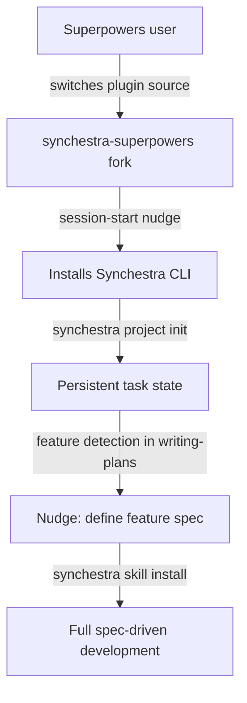

# Plan: Superpowers Integration & Plugin Distribution Strategy

**Status:** draft
**Features:**
  - [embedded-state](../../features/embedded-state/README.md)
  - [cli/project/init](../../features/cli/project/init/README.md)
  - [agent-skills](../../features/agent-skills/README.md)
**Source type:** strategy
**Source:** [Superpowers repo](https://github.com/obra/superpowers), [synchestra-superpowers fork](https://github.com/synchestra-io/synchestra-superpowers)
**Author:** @alex

## Context

[Superpowers](https://github.com/obra/superpowers) by Jesse Vincent is a popular skills library for AI coding agents — 14 skills covering the full dev workflow (brainstorm, plan, execute, review). It works across Claude Code, Cursor, Codex, OpenCode, and Gemini CLI.

Superpowers has no persistent task state management. Plans use markdown checklists (`- [ ]`). State is ephemeral — lost between sessions. Multi-agent coordination relies on platform-native tools that don't persist or interoperate.

Synchestra solves exactly this gap. The two systems are complementary: superpowers defines *workflow*, Synchestra provides *state*. The strategic goal is for upstream `obra/superpowers` to adopt Synchestra as its state management layer.

## Strategic Goal

Get `obra/superpowers` to adopt Synchestra as their standard task state management system. Constraints:
- Don't replace superpowers — augment it
- Keep the fork in sync with upstream
- All integration is opt-in
- Superpowers works identically without Synchestra installed

## User Growth Funnel

The primary user is a **superpowers user discovering Synchestra** (not the other way around). The superpowers plugin is the discovery channel.



| Stage | What they have | Trigger to next stage |
|---|---|---|
| 0. Vanilla superpowers | Workflow skills, no state | Hears about synchestra-superpowers |
| 1. Fork installed | Superpowers + 4 Synchestra workflow skills | `install-synchestra` skill or session-start hint |
| 2. CLI + task state | Persistent tasks, cross-session continuity | Feature detection step in `writing-plans` |
| 3. Full spec-driven | All Synchestra skills via `synchestra skill install` | Natural progression |

## Plugin Distribution Model

### What ships where

| Component | Where it lives | How users get it |
|---|---|---|
| Synchestra CLI | `synchestra` repo, per-platform release artifacts | Download from GitHub releases |
| Synchestra skills | `synchestra` repo (`ai-plugin/skills/`), platform-independent release artifact | `synchestra skill install` |
| Superpowers + integration | `synchestra-superpowers` fork | Replace `obra/superpowers` as their plugin |

### Design decisions

**The fork is a full replacement, not a layer.** Users switch from `obra/superpowers` to `synchestra-io/synchestra-superpowers`. They get all superpowers skills plus Synchestra integration. We can't layer on top because we modify existing skills (writing-plans, executing-plans, subagent-driven-development, dispatching-parallel-agents) and the session-start hook.

**The fork ships workflow skills only, not atomic Synchestra skills.** The fork includes:
- `synchestra-state` — core integration (detection, task lifecycle, graceful degradation)
- `install-synchestra` — guides CLI installation and `project init`
- `task-board` — view current task state
- `deviation-report` — compare plan vs actual execution
- Modifications to 4 existing skills with optional Synchestra sections

It does NOT bundle the 25+ atomic Synchestra skills (synchestra-task-new, synchestra-feature-info, etc.). Those are installed on demand via `synchestra skill install`.

**Feature detection drives deeper adoption.** The `writing-plans` skill includes a feature detection step. When the agent identifies work that represents a new feature (not just a bug fix or small change), it offers to define a Synchestra feature spec — and suggests `synchestra skill install` if the full skill set isn't installed yet.

**Skills are not tightly coupled to CLI version.** Skills describe command interfaces (flags, exit codes) which are stable. A skill written for CLI v0.1 works with v0.5. This means skills can evolve independently of CLI releases. Skills will move to a dedicated `synchestra-skills` repository once the project matures toward beta.

### Synchestra CLI distribution

The CLI is available as pre-built binaries from GitHub releases:

| Artifact | Contents | Per-platform? |
|---|---|---|
| `synchestra-{os}-{arch}.tar.gz` | CLI binary | Yes |
| `synchestra-skills-v{version}.tar.gz` | All skill markdown files | No (platform-independent) |

Supported platforms: linux/amd64, linux/arm64, darwin/amd64, darwin/arm64, windows/amd64.

`synchestra skill install` downloads the skills bundle matching the installed CLI version and extracts to the user's skills directory.

## Superpowers Fork: What Changes

### New skills (4)

| Skill | Purpose |
|---|---|
| `synchestra-state` | Core integration: detection, task lifecycle commands, graceful degradation pattern |
| `install-synchestra` | Guides CLI installation and `synchestra project init` |
| `task-board` | View current task state across sessions |
| `deviation-report` | Compare plan vs actual execution |

### Modified skills (4)

| Skill | Change |
|---|---|
| `writing-plans` | Added "Synchestra Integration" section: create persistent tasks after saving plan. Added feature detection step that nudges toward spec-driven development. |
| `executing-plans` | Added Synchestra section: claim/start/complete tasks, cross-session resume |
| `subagent-driven-development` | Added Synchestra section: per-task lifecycle with claim/start/complete/block/fail |
| `dispatching-parallel-agents` | Added Synchestra section: atomic claiming for parallel coordination |

### Modified hook (1)

| Hook | Change |
|---|---|
| `session-start` | Detects Synchestra CLI availability and project initialization. Injects task board state into session context. Hints at `install-synchestra` if CLI is available but project not initialized. |

### Design principles

- All integration is opt-in — skills work identically without Synchestra
- Detection: `command -v synchestra` + `ls synchestra.yaml`
- Graceful degradation: falls back to TodoWrite/checkboxes when unavailable
- Minimal changes to existing skill flow — Synchestra sections are additive
- Inline CLI command examples (self-contained, no dependency on Synchestra ai-plugin being installed)

## Feature Detection Step (writing-plans)

When the `writing-plans` skill creates a plan, a new step assesses whether the work represents a new feature:

```
Plan written → Feature detection:
  Is this a new capability (not a bug fix or tweak)?
  Does it span multiple components?
  Would dependency tracking help?

If yes, and Synchestra skills installed:
  → Offer to create feature spec before/alongside the plan

If yes, and Synchestra skills NOT installed:
  → "This looks like a new feature. Synchestra can track feature specs,
     dependencies, and lifecycle. Run `synchestra skill install` to enable."

If no:
  → Proceed normally (task state is sufficient)
```

This creates a natural discovery moment — the agent suggests spec-driven development at the exact point the user would benefit from it.

## Phased Execution

### Phase 0: Fork hygiene (done)
- [x] Fork `obra/superpowers` to `synchestra-io/synchestra-superpowers`
- [x] Set up `upstream` remote pointing to `obra/superpowers`
- [x] Create `synchestra` branch for our additions
- [x] `main` tracks upstream

### Phase 1: Prove value in the fork (in progress)
- [x] Implement `synchestra project init` in CLI
- [x] Add `synchestra-project-init` skill to Synchestra repo
- [x] Create workflow integration skills in fork (synchestra-state, install-synchestra, task-board, deviation-report)
- [x] Modify existing skills with optional Synchestra sections
- [x] Modify session-start hook for Synchestra detection
- [ ] Add feature detection step to `writing-plans`
- [ ] Implement `synchestra skill install` CLI command
- [ ] Set up GitHub release artifacts (CLI binaries + skills bundle)
- [ ] End-to-end testing: superpowers workflow with Synchestra state

### Phase 2: Build traction
- [ ] Publish the fork
- [ ] Write comparison post: superpowers with vs without persistent state
- [ ] Demo multi-agent coordination scenarios
- [ ] Collect user feedback
- [ ] Contribute non-Synchestra improvements back to upstream `obra/superpowers`

### Phase 3: Upstream PR
- [ ] Submit PR to `obra/superpowers` with opt-in Synchestra integration
- [ ] PR is self-contained: works without Synchestra, gains state with it
- [ ] Even if not merged, sparks discussion about state management in superpowers

## Risk Assessment

| Risk | Mitigation |
|---|---|
| Jesse Vincent rejects the PR | Phase 2 builds standalone value; fork remains useful regardless |
| Synchestra CLI too heavy for superpowers users | Pre-built binaries for all platforms; single download |
| Fork drift from upstream | Disciplined branch strategy; regular upstream merges; integration isolated to new skills + additive sections |
| Skill duplication between fork and Synchestra repo | Fork has workflow skills (when), Synchestra repo has atomic skills (how); different purposes, minimal overlap |
| "Not invented here" resistance | Contribute non-Synchestra improvements upstream first; build trust |

## Success Metrics

- **Phase 1:** Fork works end-to-end with Synchestra state for writing-plans + subagent-driven-development + executing-plans
- **Phase 2:** 50+ installs of synchestra-superpowers; positive feedback on cross-session continuity
- **Phase 3:** PR submitted; productive discussion about state management in superpowers ecosystem

## Outstanding Questions

- What is the exact target directory for `synchestra skill install`? (`~/.claude/skills/`, project-local, configurable?)
- Should feature detection in `writing-plans` be a separate sub-skill or an inline section?
- How do we handle upstream superpowers updates that conflict with our modifications to existing skills?
- Should `synchestra skill install` also set up the Synchestra ai-plugin hooks, or only copy skill files?
